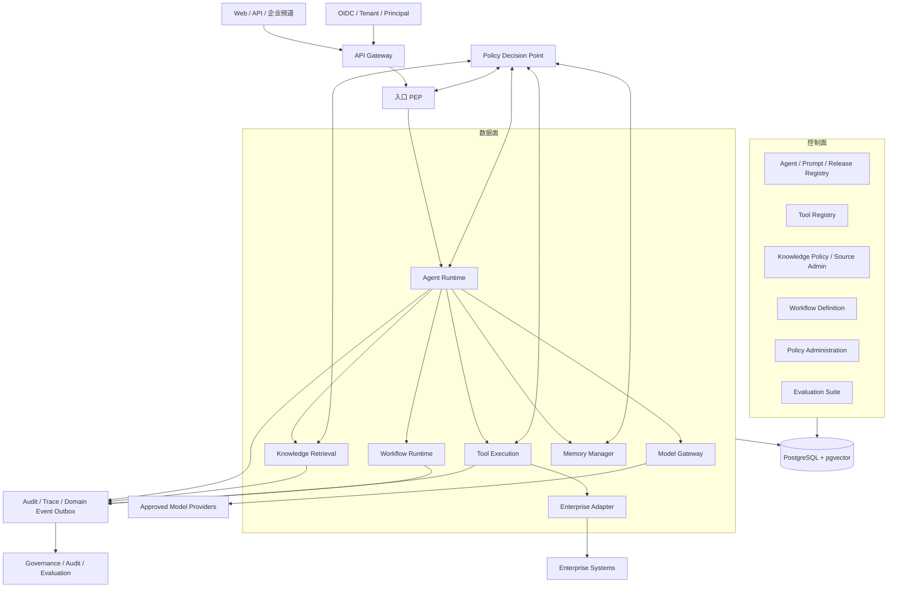
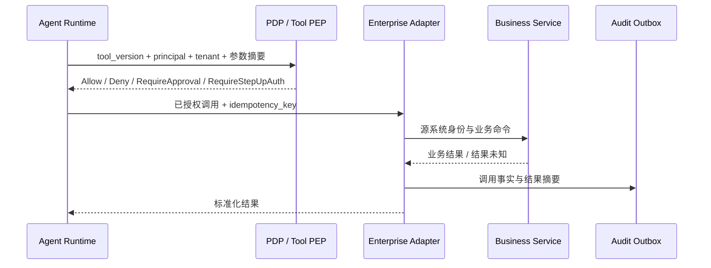

# 01 总体架构设计

> 状态：**Planned（目标设计，尚未实现）**
>
> 产品：**Enterprise AI Operating Platform**
>
> 架构阶段：Phase 0 / 一期基线

## 1. 背景与定位

企业 AI 落地的主要约束不是模型数量，而是知识分散、系统孤立、流程依赖人工，以及 AI 行为缺少身份、权限、证据和持续评测。因此本产品定位为企业 AI 操作平台，不是单一聊天机器人或通用模型训练平台。

平台将企业知识、业务工具、工作流和模型能力组织为可注册、可版本化、可授权、可审计、可评测的 Agent 能力。

## 2. 范围与非目标

### 2.1 一期范围

- Agent 定义、版本、发布和受控执行；
- 知识摄取、权限一致检索、来源引用和删除传播；
- Tool 注册、版本绑定、策略判断、审批和隔离执行；
- 长任务、人工审批和失败恢复；
- Tenant、OIDC、PDP/PEP、审计、Trace、预算和评测；
- 通过 Adapter 接入企业系统，通过 Model Gateway 接入模型供应商；
- PostgreSQL + pgvector 作为一期事务和向量数据基线。

### 2.2 一期非目标

- 不自研基础大模型或向量数据库；
- 不以微服务数量作为架构成熟度指标；
- 不允许 Agent 绕过业务服务直接修改业务数据库；
- 不承诺跨模型供应商的输出完全一致；
- 不在未经 ADR 和安全评审时开放任意代码执行、任意网络访问或跨 Tenant 共享记忆；
- 不把模型评审结果等同于确定性的安全证明。

## 3. 架构驱动与质量属性

| 驱动 | 目标设计要求 | 度量入口 |
|---|---|---|
| 安全与合规 | 默认拒绝；身份、Tenant 和策略贯穿每一步；副作用调用可审批、可追溯 | 拒绝/审批覆盖率、越权测试、审计完整率 |
| 可复现 | 每次执行固定 Agent、Prompt、ModelPolicy、ToolBinding、KnowledgePolicy 版本快照 | 可重放元数据完整率 |
| 可靠性 | 长任务可检查点恢复；副作用采用幂等键和结果对账 | 恢复成功率、重复副作用数 |
| 可解释 | 知识答案保留来源与版本；工具调用保留决策依据和参数摘要 | 引用完整率、决策可追踪率 |
| 成本 | Tenant、Agent、执行三级预算；Model Gateway 记录 token、延迟和费用 | 单次执行成本、预算终止率 |
| 可演进 | 一期模块化单体，按证据拆分热点模块 | 模块耦合、独立扩缩容需求 |
| 可运维 | Trace、指标、结构化日志、审计事件使用统一关联标识 | Trace 覆盖率、告警可行动率 |

具体容量、延迟、可用性和 RPO/RTO 数值由 SRS 与 [19 生产运维规范](19_生产运维规范.md) 确认；未确认前标记为 `TBD`，不得宣称达标。

## 4. 总体架构

一期所有逻辑模块可位于同一部署单元，但必须保持代码、数据 Schema 和契约边界。

### 4.1 API Gateway 与 Model Gateway

- **API Gateway** 面向用户、企业应用和频道，负责协议接入、OIDC 验证、限流、Tenant 解析、请求 Trace 和入口 PEP。
- **Model Gateway** 面向模型供应商，负责模型能力匹配、策略路由、凭据引用、数据区域限制、超时/重试、降级、token 与费用计量。
- 两者不得合并为含义模糊的“AI Gateway”；模型供应商凭据不得到达 Agent 或客户端。

### 4.2 控制面与数据面

| 平面 | 职责 | 关键约束 |
|---|---|---|
| 控制面 | 定义、验证、审批、发布、回滚 Agent/Prompt/Policy/Tool/Workflow/Evaluation 版本 | 发布物不可变；环境提升保留评测和审批证据 |
| 数据面 | 接收请求、构建上下文、规划、模型调用、检索、工具执行、恢复和输出 | 只消费已发布版本；执行中不跟随配置漂移 |

控制面故障不得改变正在运行执行的版本快照；数据面不得隐式发布或修改控制面定义。

## 5. 信任边界

1. **客户端边界**：所有外部输入均不可信；Tenant 从受信 Token/服务绑定解析，不接受请求体任意指定。
2. **模型供应商边界**：发送前执行数据分类、最小化和脱敏；仅使用获批供应商、区域和保留策略。
3. **企业系统边界**：Adapter 使用独立服务身份；源系统仍执行自身授权，平台策略不能代替源系统授权。
4. **工具执行边界**：网络、文件、进程、密钥和运行时资源使用显式 allowlist 与最小权限隔离。
5. **数据边界**：PostgreSQL Schema、行级 Tenant 条件、对象存储前缀和向量检索过滤共同隔离数据。
6. **运维边界**：控制面管理员、审批人、安全审计员职责分离；紧急操作同样产生审计记录。

详细威胁、策略和凭据要求见 [10 Governance与Security设计](10_Governance_Security设计.md)。

## 6. 架构不变量

以下规则从 Phase 0 起生效：

1. 所有请求必须具有 `tenant_id`、主体身份和 `trace_id`；匿名公共能力必须通过显式策略单独定义。
2. 未命中策略、PDP 不可用或身份上下文不完整时默认 `Deny`。
3. PEP 至少存在于入口、知识检索、模型调用、每次 Tool 调用、Memory 写入和管理操作。
4. Tool 每次调用重新鉴权；Plan 已获允许不代表后续参数和动作自动获准。
5. 策略结果仅为 `Allow`、`Deny`、`RequireApproval`、`RequireStepUpAuth`，并可附带脱敏、额度、网络范围等 obligations。
6. 每次执行固定 Agent、Prompt、ModelPolicy、ToolBinding、KnowledgePolicy 版本及内容摘要。
7. Agent 不直连业务数据库；写操作只经受控 Tool/Workflow 进入业务服务。
8. 高风险副作用执行前必须持久化策略决定、参数哈希和审批/增强认证证据。
9. 审计事件与业务写入通过事务 Outbox 或等效机制防止静默丢失。
10. 密钥、Token 和模型供应商凭据仅保存 Secret Reference；日志、Trace 和审计默认脱敏。
11. 检索必须先执行 Tenant/ACL 过滤，输出引用必须固定到 DocumentVersion/Chunk。
12. 预算耗尽、截止时间到达、授权撤销或安全 Kill Switch 触发时，Runtime 必须安全终止或进入补偿流程。

## 7. 企业系统接入模型

Adapter 负责协议转换、源系统身份映射、幂等与错误归一化；中央 Governance 负责平台策略和审计事实源。两者均不得伪造对方的授权结论。

接入契约见 [18 企业系统接入规范](18_企业系统接入规范.md)。

## 8. 失败与降级路径

| 故障 | 目标行为 | 禁止行为 |
|---|---|---|
| OIDC/PDP 不可用 | 新请求默认拒绝；已缓存决定仅在明确 TTL、Tenant 和资源范围内使用 | 无身份或使用过期无限期授权继续执行 |
| Model Provider 超时 | 在 ModelPolicy 允许时切换获批模型；记录路由、重试和成本 | 静默切换到数据策略不兼容的供应商 |
| Knowledge 不可用 | 返回“证据不可用”或明确降级结果 | 伪装为有依据的企业知识回答 |
| Tool 超时/断连 | 标记 `ResultUnknown`，按幂等键查询结果后再决定重试/补偿 | 对非幂等写操作盲目重试 |
| Worker 崩溃 | 从已提交检查点恢复；重新执行前验证租约和幂等性 | 从内存状态猜测并继续副作用 |
| 审计出口故障 | 只要本地事务 Outbox 可持久化即可继续；无法持久化时高风险操作失败关闭 | 丢弃审计后继续高风险操作 |
| 预算/配额耗尽 | 停止新步骤，保留部分结果并给出原因 | 超预算继续调用模型或工具 |
| 数据库不可用 | 拒绝创建需持久化的新执行；健康恢复后再受理 | 将长任务降级为不可恢复的内存执行 |

## 9. 一期部署与演进

一期采用模块化单体：一个主要应用部署单元、独立 Worker 进程是否启用由负载验证决定；模块间保持独立 Schema、端口和领域事件。逻辑模块拆为独立服务必须满足至少一个证据化条件：

- 独立扩缩容收益显著；
- 故障隔离或合规边界要求独立部署；
- 独立团队和发布节奏已形成；
- 数据主权要求独立存储；
- 性能测量确认进程内架构无法满足目标。

拆分前必须新增 ADR，说明一致性、网络故障、部署、观测和运维成本。服务边界见 [03 服务边界设计](03_服务边界设计.md)。

## 10. Phase 0 评审与验收点

- [ ] 任意请求均可追溯 Tenant、主体、AgentVersion、PromptVersion、ModelPolicyVersion、ToolBindingVersion、KnowledgePolicyVersion。
- [ ] OIDC 失败、PDP 无决定、跨 Tenant 检索均被默认拒绝。
- [ ] Tool 的四类策略结果均有自动化契约场景，审批与 Step-up 绑定具体参数哈希。
- [ ] 模型、知识、工具、工作流步骤出现在同一 Trace 中，审计记录可通过 `trace_id` 关联。
- [ ] 预算在执行前预检、执行中扣减、超限时安全终止。
- [ ] 评测门禁能够阻止不满足安全/质量阈值的 AgentVersion 发布。
- [ ] PostgreSQL 事务数据和 pgvector 检索在 Tenant/ACL 条件下通过隔离测试。
- [ ] Tool 结果未知、Worker 崩溃、模型超时、审计出口失败均完成故障注入验证。
- [ ] 所有验收结果附命令、日志或报告证据；设计通过不等于实现通过。

## 11. 关联文档

- 领域所有权：[02 DDD领域模型设计](02_DDD领域模型设计.md)
- 模块与通信：[03 服务边界设计](03_服务边界设计.md)
- 数据基线：[04 数据库模型设计](04_数据库模型设计.md)
- 外部契约：[05 API接口设计](05_API接口设计.md)
- 执行语义：[06 Agent Runtime设计](06_Agent_Runtime设计.md)
- 状态事实源：[15 Agent状态机设计](15_Agent状态机设计.md)
- 治理与安全：[10 Governance与Security设计](10_Governance_Security设计.md)

## 12. 参考来源及吸收点

- [Dify](https://github.com/langgenius/dify)：参考应用、工作流、知识和工具能力分层；本文进一步增加企业身份、策略和版本快照约束。
- [Microsoft Agent Framework](https://github.com/microsoft/agent-framework)：参考 Agent 与工作流编排职责分离，用于控制面/数据面和长流程边界设计。
- [OpenClaw README](https://github.com/openclaw/openclaw/blob/main/README.md) 与 [SECURITY](https://github.com/openclaw/openclaw/blob/main/SECURITY.md)：参考频道、网关、工具能力及安全边界意识；本文采用默认拒绝、最小权限和显式信任边界作为企业化约束。
