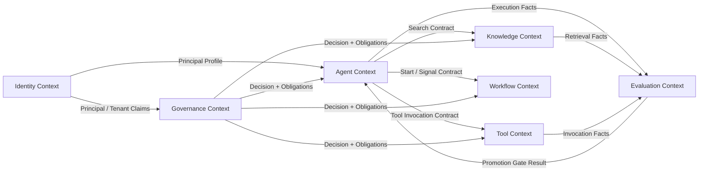

# 02 DDD 领域模型设计

> 状态：**Planned（目标设计，尚未实现）**
>
> 范围：限界上下文、所有权、聚合与领域事件概览
>
> 详细事实源：[14 DDD详细领域模型](14_DDD详细领域模型.md)

## 1. 目标与非目标

企业 AI 平台的复杂度来自身份、知识、工具副作用、长流程和持续评测之间的业务边界。本设计使用领域驱动设计（DDD）明确业务语言、数据所有权和跨模块契约，为一期模块化单体提供约束，并保留按证据拆分服务的能力。

本文不定义完整字段、物理表或部署进程；这些内容分别由 [04 数据库模型设计](04_数据库模型设计.md) 和 [03 服务边界设计](03_服务边界设计.md) 负责。逻辑 Context 不等于独立微服务。

## 2. 统一语言

| 术语 | 定义 |
|---|---|
| Tenant | 企业或隔离域；所有资源、授权、预算和审计的最高隔离键 |
| Principal | 经 OIDC 或服务身份认证的用户、服务账户或 Agent 身份 |
| Agent | 可发布的目标、指令、能力绑定和执行策略定义 |
| AgentVersion | Agent 的不可变版本，引用 Prompt、ModelPolicy、ToolBinding、KnowledgePolicy 版本 |
| Release | 将某一 AgentVersion 提升到指定环境/流量入口的控制面记录 |
| Execution | 对固定版本快照的一次运行；具有预算、截止时间、状态和 Trace |
| Plan / Step | Runtime 生成的执行计划及其最小可恢复单元 |
| Tool | 对企业能力的受控契约；可能产生外部副作用 |
| PolicyDecision | PDP 针对特定主体、Tenant、资源、动作和上下文给出的版本化决定 |
| ApprovalTask | `RequireApproval` 后由 Workflow 管理的人工任务 |
| ApprovalRequirement | Governance 作为 PolicyDecision obligation 返回的不可变审批约束，不持有任务生命周期 |
| Step-up Auth | 对具体动作和参数重新进行更强认证，不能提升为长期全局权限 |
| KnowledgePolicy | 知识库范围、ACL、分类、检索和引用要求的不可变版本 |
| ModelPolicy | 可用模型、区域、数据处理、路由、降级和预算规则的不可变版本 |
| Memory | Runtime 管理的可召回信息；会话/用户记忆归 Agent Context，企业知识归 Knowledge Context |

## 3. 限界上下文



### 3.1 Context Map 契约

| 上游 | 下游 | 集成模式 | 约束 |
|---|---|---|---|
| Identity | Governance / Agent | Published Language | 仅传主体和 Tenant Claims；不传密码或供应商 Token |
| Governance | 所有执行模块 | Open Host Service + PEP | 无决定默认拒绝；obligations 必须执行后才能视为 Allow |
| Knowledge | Agent | 查询契约 | 返回授权后的证据和版本引用，不负责生成最终答案 |
| Tool | Agent | 命令契约 | 每次调用重新鉴权；结果包含确定/未知状态和审计引用 |
| Workflow | Agent | 命令 + 事件 | Workflow 管理长流程/人工任务，Agent 管理单次 Execution |
| Agent/Knowledge/Tool | Evaluation | 版本化事实事件 | 评测不得直接修改源 Context 数据 |
| Evaluation | Agent 控制面 | Promotion Gate | 只允许经批准门禁推动发布，不直接变更 AgentVersion |

跨 Context 禁止共享可变领域对象；使用 ID、版本号和版本化 DTO/事件。Adapter 是防腐层：知识源 Connector 归 Knowledge，业务能力 Adapter 归 Tool，不在一期新增独立 Context。

## 4. Identity Context

### 4.1 职责

- Tenant、组织层级、用户、组、服务账户和外部身份映射；
- OIDC Subject 与平台 Principal 的绑定；
- Role/Permission 目录及 RoleBinding；
- 主体状态、会话撤销和身份生命周期事件。

Identity 只回答“主体是谁、具有什么静态赋权”；不负责根据资源、风险、参数和环境做最终授权决定，后者属于 Governance。

### 4.2 聚合与不变量

| 聚合根 | 关键对象 | 不变量 |
|---|---|---|
| Tenant | DataRegion、Status、QuotaRef | 停用 Tenant 不得创建新会话或执行 |
| Principal | ExternalIdentity、Membership | `(tenant, issuer, subject)` 唯一；禁用立即使新决策失败 |
| Role | Permission、RoleBinding | RoleBinding 必须具有 Scope 和有效期；跨 Tenant 绑定禁止 |

关键事件：`TenantSuspended`、`PrincipalProvisioned`、`PrincipalDisabled`、`RoleBindingChanged`、`SessionRevoked`。

## 5. Agent Context

### 5.1 职责

- Agent、Prompt、ModelPolicy、ToolBinding、KnowledgePolicy 的定义与版本；
- 验证、评测门禁、发布、环境提升、回滚和撤销；
- AgentExecution、Plan、Step、Artifact 和会话/用户记忆元数据；
- 调用 Knowledge、Tool、Workflow 的编排，不直接修改其他 Context 数据。

### 5.2 聚合与不变量

| 聚合根 | 关键对象 | 不变量 |
|---|---|---|
| Agent | AgentVersion、Owner、Status | AgentKey 在 Tenant 内唯一；已发布版本不可变 |
| Prompt | PromptVersion、Variables、ContentHash | 发布前变量必须可解析，内容摘要固定 |
| ModelPolicy | ModelPolicyVersion、Route、Fallback、Budget | 供应商、区域和数据分类必须获批；降级不得突破策略 |
| ToolBinding | ToolBindingVersion、ToolVersionRef、Scope | 只能绑定已发布 ToolVersion；权限范围不可扩张 |
| KnowledgePolicy | KnowledgePolicyVersion、KnowledgeBaseRef、Filters | 必须带 Tenant/ACL 约束和引用规则 |
| Release | Environment、AgentVersionRef、GateEvidence | 只引用已发布且通过相应环境门禁的版本 |
| AgentExecution | VersionSnapshot、Budget、Deadline、State/Reason、Cancellation、ResultCertainty | 创建后版本快照不可改变；状态及正交结果事实遵循 `15` 文档 |

每个 Execution 必须固定：

```text
AgentVersion + PromptVersion + ModelPolicyVersion
+ ToolBindingVersion + KnowledgePolicyVersion
```

运行中发布新版本不得影响既有 Execution。

关键事件：`AgentVersionPublished`、`AgentReleasePromoted`、`AgentReleaseRolledBack`、`AgentExecutionCreated`、`AgentExecutionStarted`、`AgentExecutionPaused`、`AgentExecutionWaitingExternal`、`AgentExecutionCancellationRequested`、`AgentExecutionResultReconciled`、`AgentExecutionCompensating`、`AgentExecutionCompleted`、`AgentExecutionFailed`、`AgentExecutionCancelled`、`AgentExecutionTimedOut`、`ExecutionBudgetExceeded`。

## 6. Knowledge Context

### 6.1 职责

- KnowledgeBase、Source/Connector、Document 及版本生命周期；
- 解析、切分、Embedding、索引、发布、过期和删除传播；
- 在 Tenant、ACL、分类和 KnowledgePolicy 下执行检索与重排；
- 返回 Chunk、DocumentVersion、页码/定位、分数和证据引用。

Knowledge 不负责调用生成模型形成最终答案；RAG 中“检索与证据”属于 Knowledge，“生成与回答”属于 Agent Runtime。

### 6.2 聚合与不变量

| 聚合根 | 关键对象 | 不变量 |
|---|---|---|
| KnowledgeBase | ACL、Classification、RetentionPolicy | 检索前必须应用 Tenant 与 ACL；默认不可跨 Tenant |
| Source | ConnectorVersion、SyncCursor、CredentialRef | 仅保存 Secret Reference；同步游标可恢复 |
| Document | DocumentVersion、Checksum、Lifecycle | 已索引版本内容不可原地覆盖；删除必须传播到 Chunk/Embedding |
| IngestionJob | ParserVersion、ChunkerVersion、EmbeddingModel | 同一输入和配置具备幂等键；失败可重试且不重复发布 |

关键事件：`DocumentImported`、`DocumentVersionPublished`、`KnowledgeIndexed`、`KnowledgeAccessChanged`、`DocumentDeletionRequested`、`KnowledgeTombstoned`、`KnowledgeExpired`。

## 7. Tool Context

### 7.1 职责

- ToolDefinition、ToolVersion、输入/输出 Schema、风险等级和所有者；
- ToolBinding 的可发现能力描述；
- SkillPackage 的候选、评测、签名、灰度、发布、回滚与供应链证据；
- IntegrationRegistration 对业务 Adapter、认证、网络边界和契约版本的准入与撤销；
- 调用前策略检查、审批/Step-up 证据验证、隔离执行、幂等和结果归一化；
- 产生不可变调用事实，供 Governance 构建审计视图。

### 7.2 聚合与不变量

| 聚合根 | 关键对象 | 不变量 |
|---|---|---|
| Tool | ToolVersion、RiskLevel、Owner | 已发布 ToolVersion 不可变；Schema 或副作用变化必须升版 |
| ToolExecution | PolicyDecisionRef、ApprovalRef、IdempotencyKey、ResultState | 每次调用重新鉴权；批准证据必须绑定 ToolVersion 与参数哈希 |
| SkillPackage | SkillVersion、SkillManifest、EvaluationEvidence、Signature | 只能按统一 Candidate 生命周期推进；不能自行扩权或绕过安全门禁 |
| IntegrationRegistration | AdapterVersion、AuthProfileRef、NetworkBoundary、ContractVersion | 未批准或已撤销的 Adapter 不得被发现或调用；只保存 Secret Reference |

策略结果只有：`Allow`、`Deny`、`RequireApproval`、`RequireStepUpAuth`。完成 Approval 或 Step-up 后必须带新上下文重新决策，不能把中间结果直接当作最终 Allow。

关键事件：`ToolVersionPublished`、`ToolInvocationRequested`、`ToolInvocationDenied`、`ToolApprovalRequired`、`ToolExecutionStarted`、`ToolExecutionSucceeded`、`ToolExecutionFailed`、`ToolResultUnknown`、`SkillCandidateSubmitted`、`SkillPublished`、`SkillRolledBack`、`IntegrationRegistered`、`IntegrationRevoked`。

## 8. Workflow Context

### 8.1 职责

- WorkflowDefinition/Version、WorkflowInstance、Task、Timer、Signal 和 ApprovalTask；
- 跨步骤长流程、人工任务、超时、补偿和恢复；
- 向 Agent Runtime 提供开始、等待、继续和取消契约。

Workflow 不拥有 Agent 的推理过程；AgentExecution 不拥有人工任务生命周期。二者通过 `workflow_instance_id`、`execution_id` 和事件关联。

### 8.2 聚合与不变量

| 聚合根 | 关键对象 | 不变量 |
|---|---|---|
| WorkflowDefinition | WorkflowVersion、Node、Transition | 已发布版本不可变；转换必须可验证 |
| WorkflowInstance | Task、Timer、Signal、Compensation | 同一 Signal 幂等；终态不可重新激活 |
| ApprovalTask | RequiredApprover、ActionHash、ExpiresAt | 审批人不得审批自身受职责分离约束的动作；过期后必须重建 |

关键事件：`WorkflowStarted`、`TaskActivated`、`ApprovalRequested`、`ApprovalGranted`、`ApprovalRejected`、`WorkflowCompensating`、`WorkflowCompleted`、`WorkflowFailed`。

## 9. Governance Context

### 9.1 职责

- Policy/PolicyVersion、PolicyBinding、PolicyDecision 和 obligations；
- PDP 以及入口、检索、模型、Tool、Memory、管理操作的 PEP 契约；
- 风险事件、审批策略、增强认证要求和安全 Kill Switch；
- 追加式、可校验的审计事实，以及审计查询和保留策略。

### 9.2 聚合与不变量

| 聚合根 | 关键对象 | 不变量 |
|---|---|---|
| Policy | PolicyVersion、Target、Rule、Obligation | 已生效版本不可变；未命中或计算失败默认 Deny |
| PolicyDecision | Subject、Resource、Action、ContextHash、Result | 决定绑定策略版本和输入摘要；不得事后改写 |
| RiskEvent | Severity、Evidence、Disposition | 关闭必须记录责任人和处置证据 |
| AuditStream | AuditEvent、Sequence、IntegrityProof | 追加写；敏感字段脱敏；保留策略不可由业务调用覆盖 |

Identity 提供主体，Governance 做最终上下文授权；Tool/Agent 只执行决定与 obligations，不复制策略规则。

关键事件：`PolicyVersionActivated`、`PolicyDecisionIssued`、`StepUpRequired`、`RiskDetected`、`KillSwitchActivated`、`AuditIntegrityViolationDetected`。

## 10. Evaluation Context

### 10.1 职责

- EvaluationSuite/Version、Case、Dataset、Run、Metric、Result；
- Agent、Prompt、模型、检索、工具和工作流的离线/在线质量评测；
- 发布门禁、回归比较、人工反馈和生产漂移信号；
- 只消费脱敏后的运行事实，不获取无必要的原始敏感内容。

### 10.2 聚合与不变量

| 聚合根 | 关键对象 | 不变量 |
|---|---|---|
| EvaluationSuite | SuiteVersion、CaseRef、MetricThreshold | 已用于发布门禁的版本不可变 |
| EvaluationRun | SubjectVersionSnapshot、Result、Evidence | 必须固定被测版本、数据集版本、评测器版本和随机性参数 |
| Feedback | PrincipalRef、Rating、Category | 反馈不能直接修改生产 Agent；需经分析和发布流程 |

关键事件：`EvaluationRunStarted`、`EvaluationRunCompleted`、`EvaluationGatePassed`、`EvaluationGateFailed`、`ProductionDriftDetected`、`FeedbackSubmitted`。

## 11. Memory 所有权

一期不设独立 Memory Context，避免产生新的数据所有权歧义：

- Run/Session Memory：Agent Context，随执行或会话保留策略管理；
- User Memory：Agent Context，必须具备明确用途、来源、置信度、同意和删除能力；
- Enterprise Knowledge：Knowledge Context，不称为“Enterprise Memory”；
- Memory Manager：Agent Runtime 的应用组件，不是数据所有者。

所有 Memory 写入均经过 Governance PEP；默认不把未经验证的模型输出自动写为长期记忆。

## 12. 事件与一致性规则

### 12.1 统一事件信封

```json
{
  "event_id": "uuid",
  "event_type": "ToolExecutionSucceeded",
  "schema_version": 1,
  "tenant_id": "uuid",
  "aggregate_type": "ToolExecution",
  "aggregate_id": "uuid",
  "aggregate_version": 3,
  "occurred_at": "RFC3339 timestamp",
  "actor_id": "principal id",
  "correlation_id": "execution id",
  "causation_id": "command/event id",
  "trace_id": "W3C trace id",
  "data_classification": "internal",
  "payload": {}
}
```

### 12.2 一致性策略

- 聚合内使用强一致事务和乐观并发版本；
- 跨聚合/Context 使用版本化事件和事务 Outbox；
- 消费者使用 `event_id` 幂等，支持乱序检测和死信处置；
- 外部业务副作用不纳入本地数据库事务，使用幂等键、状态查询和补偿；
- 跨 Context 引用使用 ID + Version，不建立级联删除；
- 事件 Schema 的破坏性变更必须升版并提供迁移窗口。

## 13. 失败处理

- 命令缺少 Tenant、主体、预期版本或幂等键时拒绝执行；
- 乐观并发冲突返回可识别错误，不静默覆盖；
- Outbox 失败则同事务业务写入回滚；
- 下游不可用时保留可重试状态，不伪造成功事件；
- 授权撤销事件优先使新步骤失败，正在进行的不可中断副作用进入结果对账；
- 删除事件必须传播到检索索引、缓存、Memory 和评测副本，并产生完成/失败证据。

## 14. 评审与验收点

- [ ] 每个实体、命令和事件只有一个 Context 作为事实源。
- [ ] Identity 与 Governance 的静态赋权/动态决策职责无重叠。
- [ ] Memory、Connector、ModelPolicy 均有明确所有者。
- [ ] 任意 AgentExecution 可解析完整不可变版本快照。
- [ ] 所有跨 Context 事件具备 Tenant、SchemaVersion、Trace、Correlation 和 Causation。
- [ ] Tool 的四种策略结果和 Approval/Step-up 再决策路径可通过契约测试。
- [ ] 删除、撤权、超时、结果未知和并发冲突均存在领域语义。
- [ ] `14` 的详细模型与本文 Context/聚合名称一致；差异由 ADR 解释。

## 15. 参考来源及吸收点

- [Dify](https://github.com/langgenius/dify)：参考 Agent 应用、知识、工作流和工具的能力分区；本文将其收敛为具有唯一数据所有权的企业限界上下文。
- [Microsoft Agent Framework](https://github.com/microsoft/agent-framework)：参考 Agent 与 Workflow 的协作关系；本文明确区分单次 AgentExecution 与持久业务 WorkflowInstance。
