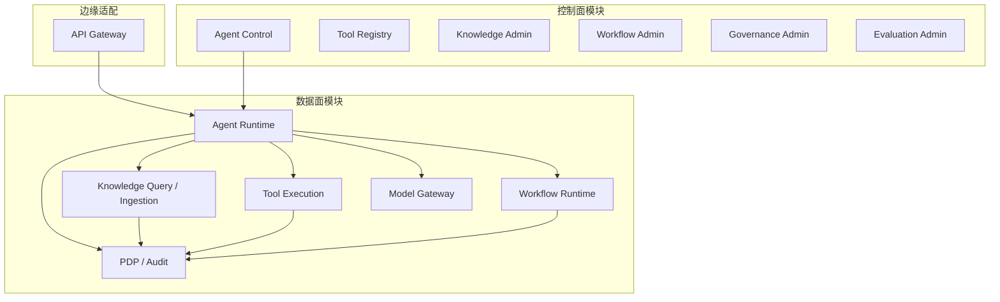
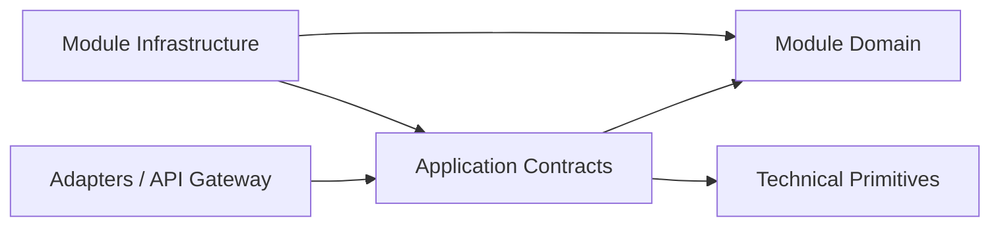
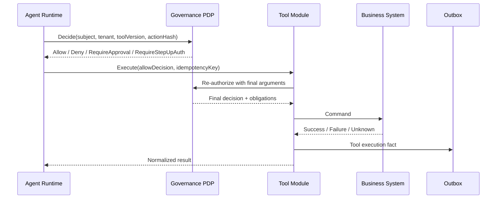

# 03 服务边界设计

> 状态：**Planned（目标设计，尚未实现）**
>
> 一期形态：**模块化单体**
>
> 术语约定：本文“服务”表示逻辑能力边界，除非明确标注，否则不代表独立进程、数据库或部署单元。

## 1. 目标与非目标

本设计将 [02 DDD领域模型设计](02_DDD领域模型设计.md) 映射为可实施的应用模块，约束依赖、数据访问、同步调用、异步事件和失败责任。

一期目标是在较低运维复杂度下实现领域自治；非目标是预先拆出大量微服务、引入分布式事务，或为尚未出现的吞吐量问题建设复杂消息基础设施。

## 2. 架构策略

### 2.1 一期模块化单体

- 业务模块编译和部署在主要应用单元中；可按负载将 Runtime Worker 作为同代码库、同契约的独立进程运行，但这不改变领域所有权。
- 每个模块拥有独立代码命名空间、应用端口和 PostgreSQL Schema。
- 模块只通过公开 Application Contract 和领域/集成事件交互，禁止跨模块直接写表。
- 模块内事务强一致；跨模块和外部系统操作采用事件、Saga、幂等和补偿。
- 一期向量检索使用 PostgreSQL + pgvector；是否拆分专用向量存储必须由测量和 ADR 决定。

### 2.2 控制面与数据面



控制面创建和发布不可变版本；数据面只消费版本快照。正在运行的 Execution 不随控制面配置更新而漂移。

## 3. 模块目录与所有权

| 逻辑模块 | 主要职责 | 拥有数据 | 不负责 |
|---|---|---|---|
| API Gateway | HTTP/MCP 接入、OIDC 验证、Tenant 解析、限流、Trace、入口 PEP | 无领域数据 | Agent 规划、业务授权规则、模型路由 |
| Identity | Tenant、Principal、组织、组、RoleBinding、会话撤销 | `identity` Schema | 动态上下文授权、工具执行 |
| Agent Control | Agent/Prompt/ModelPolicy/ToolBinding/KnowledgePolicy 版本、发布与回滚 | `agent` 中定义/版本/发布表 | 执行调度、模型供应商凭据 |
| Agent Runtime | Execution、Plan、Step、Checkpoint、Artifact、会话/用户 Memory 元数据 | `agent` 中执行表 | 企业知识所有权、业务数据库写入 |
| Knowledge | Source、DocumentVersion、摄取、ACL 检索、pgvector 索引、引用 | `knowledge` Schema | 最终答案生成、平台动态授权决定 |
| Tool | ToolDefinition/Version、发现、隔离调用、幂等、结果归一化 | `tool` Schema | 中央 Policy、长期业务流程 |
| Workflow | WorkflowVersion、Instance、Task、Timer、Signal、ApprovalTask、补偿 | `workflow` Schema | Agent 推理和 Tool 实现 |
| Governance | PolicyVersion、PDP、Decision、RiskEvent、AuditEvent、Kill Switch | `governance` Schema | 主体认证、业务系统自身授权 |
| Evaluation | Suite/Case/Run/Metric/Feedback、发布门禁结果 | `evaluation` Schema | 直接修改生产 Agent 或源业务数据 |
| Model Gateway | 模型目录适配、路由、超时/重试、供应商 Secret Reference、token/费用计量 | `platform` 中模型目录和调用计量 | Agent 业务目标、Prompt 所有权 |

`Memory Manager` 是 Agent Runtime 内应用组件，不是独立服务；企业知识归 Knowledge。Connector 按用途分别归 Knowledge Source 或 Tool Adapter。

## 4. 依赖规则



1. Domain 不依赖 HTTP、ORM、模型 SDK 或其他模块 Infrastructure。
2. 模块之间只能依赖对方的公开 Contract，不引用内部实体或 Repository。
3. `Shared` 仅包含 ID、时间、结果类型、事件信封、Trace 等技术原语，不包含领域规则。
4. Governance 的 PDP Contract 可被所有 PEP 调用，但 Governance 不反向依赖调用模块内部实现。
5. Evaluation 通过事实事件消费数据；Agent Control 通过 Gate Contract 查询门禁，不形成双向数据库依赖。
6. 循环依赖必须通过事件、编排模块或契约重构消除，不得用共享表规避。

## 5. 进程内与进程间通信

### 5.1 一期默认

| 场景 | 机制 | 原因 |
|---|---|---|
| 单次请求内的查询/命令 | 进程内 Application Port | 保留类型安全和低延迟，避免伪分布式系统 |
| 模块内领域事件 | 同事务 Domain Event Handler | 维护聚合内一致性 |
| 跨模块可靠通知 | PostgreSQL 事务 Outbox + 幂等消费者 | 业务写入与事件原子提交，可重放 |
| 长任务调度 | 持久任务/租约表 + Worker | 支持检查点、心跳和崩溃恢复 |
| 外部客户端 | REST/OpenAPI；流式事件使用 SSE | 稳定外部契约 |
| 模型供应商 | Model Gateway Adapter | 隔离 SDK、凭据、路由和数据策略 |
| 企业系统 | Tool/Knowledge Adapter | 保留源系统授权和错误语义 |

一期不要求 Kafka。若吞吐、跨部署或保留需求证明数据库 Outbox Dispatcher 不足，可通过 ADR 引入 Broker；事件 Schema 和幂等语义不得随传输设施改变。

### 5.2 服务拆分后

只有模块成为独立部署单元后，Application Port 才映射为 REST/gRPC 或消息契约。调用方必须处理网络超时、重试、熔断、版本兼容、部分失败和 Trace 传播，不能假设本地调用语义仍成立。

## 6. 事务与一致性边界

### 6.1 本地事务

- 一个命令只在其所有者模块 Schema 内开启事务；
- 业务记录、领域事件和 Outbox 消息原子提交；
- 使用 `row_version`/聚合版本进行乐观并发；
- 跨模块只保存 ID + Version 引用，不使用跨 Schema 级联删除。

### 6.2 跨模块流程



- Plan Validator 的允许结果不能替代 Tool 执行前对最终参数的重新鉴权。
- `RequireApproval` 或 `RequireStepUpAuth` 完成后必须重新调用 PDP。
- Approval/Step-up 证据绑定 `tenant_id + principal_id + tool_version_id + action_hash + expires_at`。
- 外部超时不等于失败；返回 `ResultUnknown`，先按幂等键查询源系统状态，再重试或补偿。

## 7. 身份、Tenant 与 Trace 传播

所有同步 Contract 和异步事件必须携带或可解析：

```text
tenant_id
principal_id / service_principal_id
delegation_chain（如有）
trace_id / span_id
correlation_id / causation_id
idempotency_key（命令）
data_classification
```

- Tenant 从验证后的 OIDC Claims、客户端注册或服务绑定解析，不信任自由请求字段。
- 模块不得自行扩大 Scope；代表用户调用必须保留原主体和服务主体两条身份链。
- 后台 Worker 使用服务身份，同时保留触发该任务的原始 Principal。
- 日志和 Trace 不记录明文 Secret、完整 Prompt/Document 或未经批准的工具输出。

## 8. 策略执行点

| PEP | 受保护动作 | 失败行为 |
|---|---|---|
| API Gateway | 调用 API、管理操作、Tenant 路由 | 默认 Deny |
| Agent Runtime | 启动/继续/取消执行、模型调用、Memory 写入 | 默认 Deny 或安全暂停 |
| Knowledge | KnowledgeBase/DocumentVersion/Chunk 检索 | 检索前过滤；无授权不返回候选 |
| Tool | 每一次最终参数调用 | 默认 Deny；支持 Approval/Step-up 后再决策 |
| Workflow | 创建任务、发送 Signal、审批、补偿 | 默认 Deny；职责分离 |
| Model Gateway | 模型、区域、数据分类、预算 | 不允许静默降级到不兼容供应商 |

PDP 决定和 obligations 的事实源在 Governance；PEP 必须记录决定 ID、策略版本和执行结果。

## 9. 可靠执行与故障隔离

- Runtime Worker 使用持久队列、Lease、Heartbeat 和 Checkpoint；租约过期后才允许其他 Worker 接管。
- 对模型、检索和外部工具分别设置超时、并发上限、Tenant 配额和 Bulkhead，防止单一供应商或 Tenant 拖垮平台。
- 重试策略按错误类别定义；认证失败、参数错误和 Policy Deny 不重试。
- 消费者幂等表、业务记录和处理结果在同一事务提交。
- Dead Letter 只表示需要处置，不表示业务失败已补偿；必须提供重放、忽略和人工修复审计。
- Kill Switch 可按 Tenant、AgentVersion、ToolVersion、Model Provider 和全局维度阻止新动作。

## 10. 模块拆分门槛

模块拆成独立服务前必须通过 ADR 证明收益大于分布式成本，并至少满足一项：

1. 独立扩缩容能显著改善经测量的资源瓶颈；
2. 数据驻留、合规或网络隔离要求独立部署；
3. 故障域必须隔离且进程内 Bulkhead 无法满足；
4. 团队、发布节奏和所有权已稳定分离；
5. 独立数据生命周期或技术栈有明确必要性。

ADR 必须同时说明：数据迁移、双写/停机方案、API/事件兼容、认证、网络故障、SLO、可观测、回滚和新增运维成本。

## 11. 失败路径

| 失败 | 模块责任 | 目标结果 |
|---|---|---|
| Identity/PDP 不可用 | Gateway/各 PEP | 默认拒绝；已运行步骤仅在明确策略下安全暂停 |
| Outbox Dispatcher 不可用 | 源模块 | 业务与 Outbox 仍可原子提交；积压告警并恢复投递 |
| PostgreSQL 不可用 | 所有持久模块 | 不创建不可恢复执行；健康恢复后受理 |
| Worker 崩溃 | Runtime | 租约到期后从 Checkpoint 接管，副作用先对账 |
| Model Provider 故障 | Model Gateway | 仅按 ModelPolicy 降级；否则明确失败 |
| Tool 结果未知 | Tool | 阻止盲重试，查询幂等状态或进入人工处置 |
| Evaluation 不可用 | Agent Control | 已发布版本可继续；新版本不得绕过门禁发布 |
| 审计持久化失败 | Governance/源模块 | 无本地 Outbox 证据时，高风险动作失败关闭 |

## 12. 评审与验收点

- [ ] 代码依赖检查能阻止跨模块内部引用和跨 Schema 写入。
- [ ] 模块图、数据 Schema、API/事件所有者一一对应。
- [ ] 同一部署内调用不经无必要的 HTTP/gRPC。
- [ ] Outbox、消费者幂等、乱序和 Dead Letter 完成故障场景验证。
- [ ] 所有 Contract 传播 Tenant、Principal、Trace、Correlation 和数据分类。
- [ ] Tool 最终参数重新鉴权及四类策略结果均有契约测试。
- [ ] WorkflowInstance 与 AgentExecution 的状态所有权无重复。
- [ ] 任意独立服务拆分均有 Accepted ADR，而非仅因模块名称包含 Service。

## 13. 关联文档

- 总体约束：[01 总体架构设计](01_总体架构设计.md)
- 领域事实源：[02 DDD领域模型设计](02_DDD领域模型设计.md)、[14 DDD详细领域模型](14_DDD详细领域模型.md)
- 数据边界：[04 数据库模型设计](04_数据库模型设计.md)
- API 与事件入口：[05 API接口设计](05_API接口设计.md)
- Runtime 语义：[06 Agent Runtime设计](06_Agent_Runtime设计.md)
- 状态事实源：[15 Agent状态机设计](15_Agent状态机设计.md)
- 模型供应商边界：[23 Model Gateway契约设计](23_Model_Gateway契约设计.md)
- 契约与证据门禁：[24 测试、评测与证据追踪计划](24_测试评测与证据追踪计划.md)

## 14. 参考来源及吸收点

- [LangGraph](https://github.com/langchain-ai/langgraph)：参考持久执行、检查点和人工介入机制，用于 Runtime Worker 与 Workflow 的恢复边界。
- [Microsoft Agent Framework](https://github.com/microsoft/agent-framework)：参考 Agent/Workflow 编排分工；本文增加模块化单体的进程内契约、数据所有权和拆分门槛。
