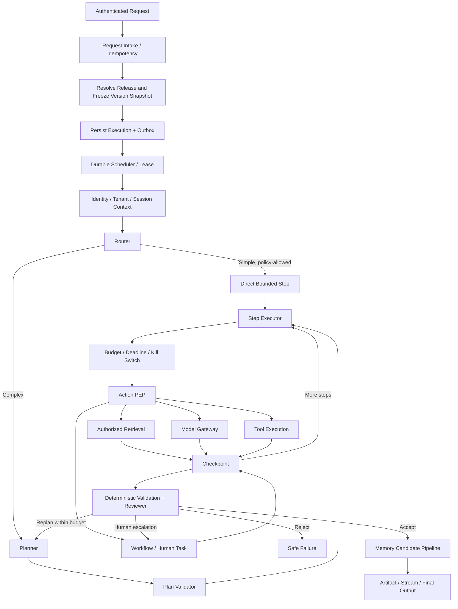
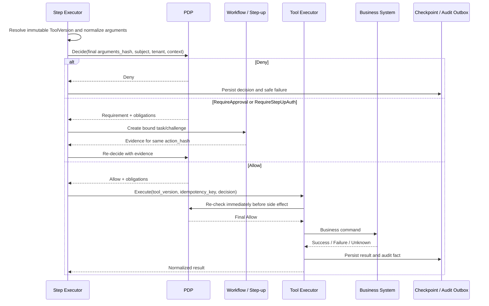

# 06 Agent Runtime 设计

> 状态：**Planned（目标设计，尚未实现）**
>
> 产品：**Enterprise AI Operating Platform**
>
> 状态事实源：[15 Agent状态机设计](15_Agent状态机设计.md)

## 1. 定位、范围与非目标

Agent Runtime 是平台数据面的执行核心，负责把一次已授权请求转化为可恢复、可预算、可审计的 AgentExecution。职责包括上下文构建、路由、规划、模型调用、知识检索、工具调度、人工等待、结果验证、Memory 候选处理和输出。

Runtime 不拥有 Agent 发布、企业知识、Tool 定义、动态授权策略或业务数据库；这些分别属于 Agent Control、Knowledge、Tool、Governance 和源业务系统。Runtime 不承诺模型推理确定性，也不宣称跨外部副作用“恰好一次”；目标语义是持久执行、至少一次调度和幂等/对账保护。

## 2. 设计原则

1. **版本固定**：每次执行固定 Agent、Prompt、ModelPolicy、ToolBinding、KnowledgePolicy 版本和内容摘要。
2. **默认拒绝**：身份、Tenant、策略上下文不完整或 PDP 不可用时不继续新动作。
3. **动作点鉴权**：Plan 验证不是永久授权；每次模型、检索、Tool、Memory 写入在动作点重新检查。
4. **持久优先**：状态、Checkpoint、租约、预算和外部调用事实持久化后再推进。
5. **副作用显式**：区分只读、幂等写、非幂等写和不可逆动作；审批绑定最终参数哈希。
6. **证据优先**：知识回答保留 DocumentVersion/Chunk 引用，工具结果保留决定和调用事实。
7. **模型不做安全事实源**：确定性 Schema、Policy、权限、预算和状态检查优先于模型 Reviewer。
8. **有界执行**：步骤、递归、并发、token、费用、时间、工具调用和 Handoff 均有上限。

## 3. 总体流程



该图表示逻辑阶段，不要求每次请求都调用 Planner、Tool 或 Reviewer 模型。简单请求可走有界快速路径，但不得跳过身份、版本快照、预算、策略、审计和输出验证。

## 4. 创建执行与版本快照

### 4.1 创建顺序

1. API Gateway 验证 OIDC、Issuer/Audience、Tenant、主体、配额和入口 Policy。
2. Runtime 校验 `Idempotency-Key` 和请求摘要；重复相同请求返回原 Execution。
3. 按 Release 或受控测试版本解析五类版本。
4. 验证所有版本已发布、未撤销、Tenant 一致且依赖兼容。
5. 计算 `snapshot_hash`，与初始预算、截止时间、Trace 一并写入 `agent_executions`。
6. Execution、初始审计/领域事件和 Outbox 在同一 PostgreSQL 事务提交。
7. 提交成功后进入持久调度；提交失败不得返回已创建。

### 4.2 快照内容

```json
{
  "agent_version_id": "uuid",
  "prompt_version_id": "uuid",
  "model_policy_version_id": "uuid",
  "tool_binding_version_id": "uuid",
  "knowledge_policy_version_id": "uuid",
  "schema_versions": {
    "input": 1,
    "output": 1,
    "event": 1
  },
  "content_hashes": {},
  "snapshot_hash": "sha256:..."
}
```

快照中的版本在执行期间不可切换。紧急撤销通过 Kill Switch 阻止后续动作，并按状态机进入暂停、取消或失败路径，而不是偷偷替换版本。

## 5. 状态与持久执行

### 5.1 状态事实源

AgentExecution 的状态名称、合法转换、终态及其取消/超时/审批/补偿语义以 [15 Agent状态机设计](15_Agent状态机设计.md) 为事实源。Workflow/Task/Approval 与 ToolExecution 结果使用各自领域事实源，Runtime 只保存引用和关联事实，不复制状态枚举。

Runtime 必须：

- 在数据库以预期状态 + `row_version` 原子转换；
- 拒绝非法或重复转换，同时保持幂等响应；
- 为每次转换产生带 `event_id`、`correlation_id`、`causation_id` 和 `trace_id` 的事件；
- 在响应/API/SSE 中使用同一状态代码；
- 将外部“结果未知”与确定失败区分开；ToolExecution `ResultUnknown` 映射为 AgentExecution `WaitingExternal + result_certainty=unknown`，不映射为 Failed/TimedOut。

### 5.2 调度、Lease 与 Checkpoint

- Worker 通过持久任务记录获取带 `lease_epoch` 的租约，并定期 Heartbeat；
- 只有租约到期或明确释放后其他 Worker 才能接管；旧 Worker 的过期 epoch 写入被拒绝；
- 每个可恢复步骤完成后写 Checkpoint、预算使用、Artifact 引用和 Outbox；
- Checkpoint 保存最小可恢复状态及内容摘要，不默认复制完整敏感上下文；
- 接管后先核对未完成 Model/Tool 调用，确认没有外部副作用或完成结果对账后再继续；
- Checkpoint 损坏或版本不兼容时安全停止并进入人工恢复，不从不可信日志猜测状态。

### 5.3 重放与恢复

“恢复”从最近可信 Checkpoint 继续；“重放”创建新的 Execution 并显式引用原 Execution，不覆盖历史。重放仍重新鉴权，使用当前可用授权和 Kill Switch，但默认固定原版本快照；如需升级版本属于新的评测/运行，不称为重放。

## 6. Context Builder

Context Builder 分阶段构建最小上下文：

1. **初始上下文**：Tenant、Principal、委托链、会话引用、请求、版本快照、预算、时间和 Trace。
2. **计划上下文**：按任务选择允许的 KnowledgeBase、Tool 能力描述和 Workflow 能力，不加载全部企业数据。
3. **步骤上下文**：每一步按 KnowledgePolicy/ToolBinding 和 Token Budget 检索必要证据。
4. **输出上下文**：只携带回答所需证据、Artifact 和已脱敏事实。

企业知识不得在 Router 之前无差别拼入 Prompt。检索内容视为不可信数据，标注来源和边界；文档中的指令不能提升为系统/开发指令。Context 裁剪必须保留 PolicyDecision、引用、关键约束和未完成副作用状态。

## 7. Router 与 Planner

### 7.1 Router

Router 可选择：直接回答、知识检索、单 Tool、计划执行、Workflow/人工任务或拒绝。路由依据输入类型、AgentVersion、能力绑定、风险、预算和策略；模型分类结果只是输入之一，必须通过确定性 allowlist 和 Schema 校验。

### 7.2 Planner

Plan 使用有版本的结构化 Schema，至少包含：

```text
plan_id, objective, steps[], dependencies[], expected_artifacts[]
step: id, type, capability_ref, input_refs, expected_output_schema,
      side_effect_class, retry_class, timeout, budget_reservation
```

规划约束：

- 只引用 ToolBinding/KnowledgePolicy 中允许的能力版本；
- 检测循环、无依赖步骤、不可满足前置条件和预算超限；
- 设置最大步骤、最大重规划次数、最大并行度和总截止时间；
- 高风险/不可逆动作必须显式标记，不允许埋在自由文本；
- 动态新增步骤再次验证能力、预算、策略和依赖；
- 简单请求可无显式多步 Plan，但仍创建可审计的单 Step。

### 7.3 Plan Validator

Validator 检查 Schema、版本绑定、依赖 DAG、预算、数据分类、区域、能力 Scope、风险和审批可能性。Validator 的结果仅表示“计划可尝试”，不替代每一步最终参数的 PDP 决策。

## 8. 策略检查点

| 检查点 | 资源/动作 | 可能 obligations |
|---|---|---|
| 启动/继续执行 | AgentVersion、Execution | 限制预算、强制评测模式、禁止 Handoff |
| 知识检索 | KnowledgeBase、DocumentVersion、Query | ACL 过滤、脱敏、禁止原文返回 |
| 模型调用 | Provider、Model、数据分类、区域 | 脱敏、禁用保留、限定 token/区域 |
| Tool 调用 | ToolVersion、最终参数哈希、副作用类型 | Approval、Step-up、参数掩码、网络范围 |
| Workflow/Signal | WorkflowVersion、Task、Signal | 职责分离、审批人范围、到期时间 |
| Memory 写入/读取 | Scope、Subject、内容分类 | 同意、TTL、脱敏、禁止长期存储 |
| 输出 | Artifact、目标频道、分类 | 水印、脱敏、禁止外发 |

策略结果固定为 `Allow`、`Deny`、`RequireApproval`、`RequireStepUpAuth`。Obligations 未完成等同未获 Allow。

## 9. Model Gateway 调用

Runtime 只提交模型能力需求和受控 Prompt 包，不直接持有供应商 SDK 凭据。Model Gateway 按固定 ModelPolicyVersion 执行：

1. 检查模型能力、供应商状态、数据区域、分类、保留策略、预算和 Kill Switch；
2. 对系统指令、用户输入、检索证据和 Tool 结果分区并标注信任级别；
3. 应用数据最小化、脱敏、超时、并发和 token 限制；
4. 调用选定模型并记录实际供应商/模型版本、token、延迟、费用和路由原因；
5. 对结构化输出执行 JSON Schema/类型验证；
6. 仅在 ModelPolicy 明确允许时按顺序重试或切换模型；区域/保留策略不兼容时禁止降级；
7. 返回可识别的成功、拒绝、超时、内容过滤、结构无效或依赖故障结果。

模型输出不得直接成为 Tool 参数、SQL、URL、文件路径或长期 Memory；必须经过解析、规范化、Schema、Policy 和业务约束验证。

## 10. Knowledge 检索与证据

- Runtime 根据当前 Step 和 KnowledgePolicyVersion 请求检索；
- Knowledge 在向量召回前执行 Tenant、KnowledgeBase、ACL、分类和有效期过滤；
- 返回 `chunk_id + document_version_id + locator + score + embedding_space_id`；
- Runtime 不把来自不同 Embedding Space 的分数直接比较；
- Reranker/Reviewer 不能恢复被 ACL 过滤的数据；
- 最终事实性回答保留与 Claim 对应的 citation；证据不足时明确说明，不能把模型常识伪装为企业知识；
- Document 撤销/删除触发的 Kill/Tombstone 在后续步骤生效，先前输出的 Artifact 按治理策略处置。

详细检索设计见 [07 Knowledge Platform设计](07_Knowledge_Platform设计.md)。

## 11. Tool Execution

### 11.1 调用流程



### 11.2 安全与可靠性

- ToolVersion 固定输入/输出 Schema、风险、副作用类型、超时、网络 allowlist、Secret Reference 和幂等模式；
- 批准证据绑定 Tenant、Principal、ToolVersion、规范化参数哈希、有效期和审批人；任何参数变化使其失效；
- 代码/浏览器/文件/网络 Tool 使用隔离 Worker、最小权限、资源配额和受控出口；
- 非幂等写调用不自动重试；超时/断连记录 `ResultUnknown` 并按幂等键查询源系统；
- 业务失败与技术失败分开，错误输出经脱敏后进入模型上下文；
- 补偿是显式业务动作，同样需要鉴权、幂等和审计；不能假设所有副作用可回滚。

## 12. Workflow 与 Human-in-the-Loop

Runtime 在需要人工任务、长等待、定时器或跨系统补偿时调用 Workflow，而不是占用 Worker 等待。

- Runtime 持久化等待原因、WorkflowInstance/Task 引用和 Checkpoint 后释放租约；
- Approval 展示动作摘要、风险、参数哈希、请求者、有效期和 PolicyDecision；
- 审批、拒绝、超时或 Step-up 结果通过幂等 Signal 唤醒；
- 唤醒时重新验证 Agent/Tool 是否撤销、预算/截止时间和当前 Policy；
- 人工批准不能覆盖源系统授权，也不能批准变化后的参数；
- AgentExecution 与 WorkflowInstance 各自拥有状态，禁止跨模块双写；审批、取消、超时和补偿通过带稳定 Event ID、预期版本与 correlation ID 的命令/Outbox 事件同步；
- Workflow 已提交决定而 Agent 尚未更新时，通过 Inbox 幂等重放收敛，不能回滚已存在的 Workflow 历史；
- 取消时按 `15` 的结果确定性规则和 Workflow 定义执行可用补偿；Tool 结果未知时 Agent 保持 `WaitingExternal`，对账完成前不得提前终态化。

详细流程见 [09 Workflow与Human-in-the-Loop设计](09_Workflow_Human_In_Loop设计.md)。

## 13. Reviewer 与输出验证

验证顺序：

1. 输出 Schema、必填字段、类型、长度和敏感数据规则；
2. Tool/Workflow 结果状态，禁止把 `ResultUnknown` 表述为成功；
3. 引用存在性、DocumentVersion 有效性和 Claim/证据对应；
4. Policy obligations、预算、数据分类和目标频道限制；
5. 业务规则/确定性计算；
6. 必要时使用版本固定的模型 Reviewer 评估完整性、冲突和幻觉风险。

Reviewer 结果可以是接受、在预算内重规划、升级人工或安全失败。模型 Reviewer 失败或意见不确定时不得自动放行高风险结果；Reviewer 使用的模型/Prompt/阈值和结果进入 Evaluation/Audit。

输出以 Artifact 保存并产生内容摘要。流式输出只能发送已通过增量安全检查的内容；最终验证失败时发送明确终止事件，不把中途文本标记为最终结果。

## 14. Memory Manager

一期 Memory 所有权遵循 [02 DDD领域模型设计](02_DDD领域模型设计.md)：Run/Session/User Memory 归 Agent，企业知识归 Knowledge。Memory Manager 仅执行受控读写。

### 14.1 写入流水线

```text
Candidate Extraction
→ Provenance / Confidence
→ Tenant and Subject Scope
→ Classification and Redaction
→ Consent / Purpose / Retention Policy
→ Poisoning and Duplication Checks
→ Memory PEP
→ Persist + Audit + Expiry Schedule
```

- 模型输出默认只是候选，不自动成为长期 User Memory；
- 每条长期 Memory 必须记录来源、用途、置信度、分类、同意引用、TTL 和删除状态；
- 不存储 Secret、认证信息、无必要 PII 或来源不明的高风险指令；
- 检索 Memory 时执行 Tenant/Subject/Agent Scope，不能跨用户或跨 Tenant；
- 用户可查询、更正、删除适用范围内的 Memory；删除传播产生验证证据；
- Memory 写入失败不应改变已完成业务 Tool 的结果，Runtime 记录独立失败并按策略决定是否影响最终输出。

## 15. Budget、配额与终止

有效预算取 Tenant、AgentVersion、ModelPolicy、调用请求和安全策略限制的最小值，至少覆盖：

- 总执行时间与单 Step 超时；
- 最大步骤、重规划、重试、并行度；
- 模型输入/输出 token 和调用次数；
- Tool、Knowledge、Handoff 次数；
- 金额成本和供应商配额；
- Context/Artifact/输出大小。

每个 Step 在开始前预留预算，完成后按实际使用结算；不可确定费用保守估计。超限时停止创建新动作，持久化部分 Artifact 和原因，并按 `15` 进入合法终止/等待路径。客户端预算只能收紧，不能扩大 Policy 预算。

## 16. Multi-Agent、Handoff 与 A2A

受控 Handoff 最早在 Phase 2 随 Agent Runtime 试点启用，且仅限进程内、同 Tenant、已发布 Agent；Phase 0 只完成身份、策略、审计、Trace、预算和评测基座。远端 A2A 为后续能力，不自动获得信任。

Handoff 信封至少包含：

```text
delegation_id, parent_execution_id, parent_step_id,
source_agent_version_id, target_agent_version_id,
tenant_id, principal_id, service_principal_id, delegation_chain,
objective, artifact_refs, delegated_scopes,
policy_decision_id, budget_slice, deadline_at,
depth, max_depth, expected_output_schema, trace_id
```

约束：

- 目标 Agent 权限是调用者可委托范围与目标自身权限的交集，不允许权限相加；
- Handoff 前后均由 PDP 决策，并限制深度、扇出、并发、预算和截止时间；
- 子 Agent 默认获得引用而非完整父 Context，按需鉴权读取 Artifact；
- 禁止循环委托；检测重复 Agent/目标链并有明确终止条件；
- 子 Agent 返回结构化 Artifact 和证据，父 Agent 不把其文本直接当作可信指令；
- A2A 对端必须固定协议版本、身份、签名、能力描述和撤销状态；远端失联时不盲目重复创建任务。

A2A 协议预留见 [05 API接口设计](05_API接口设计.md)。

## 17. Trace、审计与评测

### 17.1 Trace 层级

```text
HTTP/MCP request span
└─ agent_execution span
   ├─ route / plan / validate spans
   ├─ knowledge_search spans
   ├─ model_invocation spans
   ├─ tool_execution spans
   ├─ workflow / approval spans
   ├─ reviewer spans
   └─ memory_read/write spans
```

每个 Span 记录 Tenant、Execution/Step、版本 ID、结果类别、延迟、token/费用等低敏元数据；Prompt、Document、Tool 参数和模型输出默认不直接进入 Trace。Trace 可采样，安全审计不可因 Trace 采样丢失。

### 17.2 审计

必须审计：执行创建/状态变化、版本解析、PolicyDecision、Approval/Step-up、模型路由、知识引用、Tool 请求/结果、Handoff、Memory 写入/删除、预算终止、Kill Switch 和人工恢复。审计通过事务 Outbox 保证不静默丢失。

### 17.3 评测

- 发布前固定 Agent/Prompt/ModelPolicy/ToolBinding/KnowledgePolicy 和 EvaluationSuite 版本；
- 在线记录质量、引用、策略拒绝、Tool 结果未知、延迟、成本和人工升级信号；
- 生产反馈不能直接修改 Prompt/Agent，必须进入分析、版本和发布门禁；
- Reviewer 与被评对象使用同一模型时标记相关性风险，关键门禁结合确定性规则、独立评测器或人工抽检。

## 18. 安全威胁与控制

| 威胁 | 目标控制 |
|---|---|
| Prompt Injection | 不可信内容分区、指令层级隔离、Tool allowlist、动作点 PDP |
| Confused Deputy | 保留用户与服务双身份、委托链和最小 Scope |
| 数据外泄 | Tenant/ACL 前置过滤、ModelPolicy 区域/保留限制、输出 PEP |
| Tool 参数注入 | 类型化 Schema、规范化、ActionHash、业务校验、无 Shell 拼接 |
| SSRF/任意网络 | Artifact 引用、网络 allowlist、DNS/IP 复核、隔离 Worker |
| Memory Poisoning | 来源/置信度、长期写入默认关闭、重复/异常检测、用户纠正删除 |
| 无限循环/Agent 风暴 | 最大步骤、重规划、深度、扇出、并发、预算和 Kill Switch |
| 供应链漂移 | Agent/Prompt/Model/Tool/KnowledgePolicy 固定版本和内容摘要 |
| 审批 TOCTOU | 审批绑定规范化参数哈希，执行前再决策 |
| 日志泄密 | Secret 引用、结构化脱敏、原始内容访问分权和审计 |

## 19. 失败路径

| 故障 | Runtime 目标行为 |
|---|---|
| 身份/PDP 不可用 | 不开始新动作；在安全 Checkpoint 暂停或失败关闭 |
| Model 超时/结构无效 | 按固定 ModelPolicy 有界重试/降级；不兼容则失败 |
| Knowledge 无授权证据 | 明确证据不足；不伪造企业知识结论 |
| Tool 超时/断连 | 标记 `ResultUnknown`，对账后再决定继续/补偿 |
| Approval 拒绝/过期 | 按状态机安全终止或重建动作；原批准不得复用 |
| 授权/版本中途撤销 | Kill Switch 阻止后续动作；已发生副作用进入审计/补偿 |
| Worker 崩溃 | 租约到期后从可信 Checkpoint 接管，旧 epoch 禁止写入 |
| Checkpoint 损坏 | 停止自动恢复并人工处置，保全证据 |
| Memory 写入失败 | 单独记录；不伪造业务执行失败/成功，按 Agent Policy 决定输出 |
| Reviewer 不可用 | 高风险输出失败关闭或转人工；低风险行为按明确策略处理 |
| SSE 客户端断线 | 执行继续持久化；客户端按事件游标恢复 |
| Audit Outbox 无法持久化 | 当前事务回滚；高风险动作不执行 |
| Budget/Deadline 超限 | 停止创建新步骤；按 `15` 检查未决副作用与结果确定性，再决定 TimedOut、WaitingExternal 或 Compensating |

## 20. 实施评审与验收点

Phase 0 先交付身份、租户、PDP/PEP、审计、Trace、预算和评测前置条件；以下 Runtime 能力随 Phase 2 纵向切片验收，不因文档完备而视为已实现。

- [ ] 执行创建原子固定五类版本和 `snapshot_hash`，运行中配置发布不影响既有执行。
- [ ] Runtime API、数据库和 SSE 的 AgentExecution 状态完全来自 `15`；Workflow/Task/Approval 与 Tool result 保持各自事实源且映射可验证。
- [ ] OIDC、Tenant、默认拒绝和入口/检索/模型/Tool/Memory PEP 均有测试证据。
- [ ] Tool 每次最终参数重新鉴权；四类决定、ActionHash、Approval/Step-up 再决策均端到端验证。
- [ ] Worker Kill、租约过期、Checkpoint 恢复和旧 Worker fencing 完成故障注入。
- [ ] 非幂等 Tool 超时不会盲目重试，`ResultUnknown` 可对账和人工处置。
- [ ] Trace 贯穿 API、Execution、模型、知识、工具、Workflow、Reviewer 和 Memory；审计不依赖采样。
- [ ] Tenant/Agent/Execution 预算可预检、扣减、告警和安全终止。
- [ ] 检索结果具有 DocumentVersion/Chunk 引用，撤权后不再召回。
- [ ] 长期 Memory 默认不自动写入，具备来源、同意、TTL、删除和投毒测试。
- [ ] Handoff 权限不会相加，深度/扇出/预算/循环限制可验证。
- [ ] 所有结论附日志、Trace、审计或测试报告；设计评审通过不等于实现通过。

## 21. 关联文档

- 总体不变量：[01 总体架构设计](01_总体架构设计.md)
- 领域所有权：[02 DDD领域模型设计](02_DDD领域模型设计.md)
- 模块通信：[03 服务边界设计](03_服务边界设计.md)
- 持久模型：[04 数据库模型设计](04_数据库模型设计.md)
- 外部 API/MCP/A2A：[05 API接口设计](05_API接口设计.md)
- Tool 安全：[08 Tool Platform与AI SDK设计](08_Tool_Platform_AI_SDK设计.md)
- Workflow/HITL：[09 Workflow与Human-in-the-Loop设计](09_Workflow_Human_In_Loop设计.md)
- 状态事实源：[15 Agent状态机设计](15_Agent状态机设计.md)
- 模型调用契约：[23 Model Gateway契约设计](23_Model_Gateway契约设计.md)
- 验证与证据：[24 测试、评测与证据追踪计划](24_测试评测与证据追踪计划.md)

## 22. 参考来源及吸收点

- [LangGraph](https://github.com/langchain-ai/langgraph)：参考持久执行、Checkpoint、恢复与 Human-in-the-Loop；本文增加 Tenant、PDP/PEP、版本快照、预算和副作用对账约束。
- [OpenAI Agents SDK](https://github.com/openai/openai-agents-python)：参考 Agent Loop、Guardrails、Handoffs 和 Tracing；本文将 Guardrail 与确定性 Policy 分层，并限制 Handoff 委托权限。
- [Microsoft Agent Framework](https://github.com/microsoft/agent-framework)：参考 Agent/Workflow 编排和持久流程分工，用于 Runtime 与 Workflow 的状态所有权设计。
- [Hermes Agent](https://github.com/NousResearch/hermes-agent)：参考工具/技能驱动的 Agent 运行循环；本文将自由工具循环收敛为版本绑定、动作点鉴权和有界执行。
- [OpenClaw README](https://github.com/openclaw/openclaw/blob/main/README.md) 与 [SECURITY](https://github.com/openclaw/openclaw/blob/main/SECURITY.md)：参考网关、频道、工具和本地能力的安全边界；本文落实为双身份、网络 allowlist、Secret Reference 和显式信任边界。
