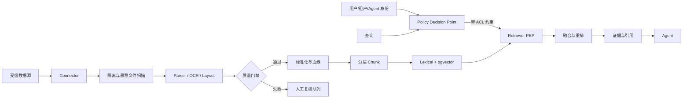
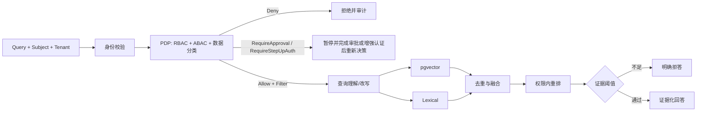

# 07 Knowledge Platform 设计

> 状态：PartiallyImplemented（仅本地 Markdown/TXT 摄取切片；目标平台仍为 Planned） ｜ 适用阶段：Phase 1 起 ｜ 责任域：Knowledge ｜ 关联：`10_Governance_Security设计.md`、`11_Evaluation_Monitoring_Cost设计.md`

## 1. 定位与边界

Knowledge Platform 是企业知识生命周期平台，而不是单一 RAG 接口。它负责权限感知摄取、解析与质量控制、可追溯切分、索引、检索、引用和知识治理；Agent 只消费检索结果，不得绕过知识权限或直接访问底层索引。

一期采用模块化单体中的 Knowledge 模块与异步 Worker。PostgreSQL + pgvector 是向量存储基线；关键词检索通过可替换的 Lexical Provider 提供。Graph RAG、多模态和专用向量数据库均为达到明确规模或质量门槛后的候选，不是一期硬依赖。

## 2. 架构与信任边界

控制面管理数据源、凭据引用、同步计划、Schema、模型/解析器版本、ACL 映射和发布状态；数据面执行摄取与检索。凭据只保存 Secret 引用，不写入 Connector 配置、日志或 Chunk 元数据。

## 3. 核心数据模型与血缘

### 3.1 Document

每个规范化文档至少包含：

- `document_id`、`tenant_id`、`source_type`、`source_uri`、`source_object_id`；
- `source_version`、`content_hash`、`ingestion_job_id`、`parser_name/version`；
- `title`、`language`、`created_at`、`effective_at`、`expires_at`；
- `classification`、`owner`、`acl_policy_id`、源 ACL 快照及同步时间；
- `lifecycle_status`：从追加式生命周期事件投影，只使用 `16_Knowledge数据治理设计.md` 定义的 Knowledge 领域状态；不可变 DocumentVersion 内容行不回写状态，解析、作业、发布和删除状态也不得混入同一枚举；
- `index_status`：`NotIndexed | Indexing | Active | Tombstoned | Failed`，只描述派生索引，不决定知识是否获准发布。

### 3.2 Chunk

Chunk 必须保留 `chunk_id`、`document_id`、`parent_chunk_id`、章节路径、页码或单元格/时间戳、原文字符范围、内容哈希、ACL 投影、分类等级、Embedding 模型与版本、索引代次。引用必须能从 Chunk 反向定位到不可变的源版本和证据片段。

稳定 ID 由租户、源对象、源版本及结构路径共同确定；重新摄取相同内容应幂等，不生成重复知识。源 ACL 变更、撤回或删除必须产生重建或 tombstone 事件，并同时作用于向量和关键词索引。

## 4. Connector 与摄取作业

Connector 合约包含 `discover`、`fetch_delta`、`get_metadata`、`get_acl`、`checkpoint` 和 `health`，并声明速率限制、支持的删除语义及最小权限范围。一期仅实现 File System；SharePoint、Email、Teams、IPMS、Ticket 和 Database 是按业务优先级评审的后续适配器。

摄取状态机为：

`Discovered → Fetching → Scanning → Parsing → Validating → Indexing → Completed`，异常分支为 `Quarantined | Retrying | ReviewRequired | Failed | Cancelled`。`Quarantined` 只用于恶意内容或策略异常，不能作为正常必经状态；摄取作业完成也不等于知识已发布，发布由 Knowledge 审核与 Release 流程决定。

作业必须具备：

- 增量游标、内容哈希去重、租约和幂等键；
- 指数退避、最大重试次数、死信队列和人工重放；
- 删除传播、版本回滚、断点续传和背压；
- 每租户并发/容量配额，以及全链路 `trace_id`。

### 4.1 当前本地摄取切片

`LocalFileIngestionService` 实现无外部依赖的 Markdown/TXT 启动同步：根目录、Source、Owner、分类和统一 Group ACL 必须显式配置；规范化相对路径生成稳定文档 ID，内容 SHA-256 生成版本。重复同步保持幂等，内容更新替换当前投影，源删除或文件损坏会立即撤出旧投影；无效 UTF-8、空文件、超限文件和重解析点仅返回最小隔离原因，不读取或记录正文。可选 `LocalStateStore` 以原子事件文件和连续哈希链持久化摄取 Checkpoint，重启后继续判定未变化和删除。

可选 `LocalFileIngestionWorker` 按显式间隔执行单实例同步，不提供匿名管理 API。每批支持取消和超时，并限制文件数、目录深度和总字节数；触发资源限制时整批拒绝，保留上一次完整投影。读取前后重新检查根目录边界与重解析点，含 NUL 的伪文本按类型不一致隔离，摄取文档 ID 不得覆盖批准快照。

Evidence Bundle 通过确定性夹具直接记录导入、更新、删除、隔离计数、删除对账结果与 Checkpoint 最终哈希；离线验证器拒绝字段缺失、计数偏离、对账失败或非法哈希。固定夹具计数只证明机制可重复，不是容量、质量或业务 SLA。

该切片的文档内容与检索投影仍在进程内，应用重启后重新扫描；本地账本只保存最小状态和哈希，不保存正文。它没有恶意文件扫描、MIME 验证、分布式租约、重试/死信、人工复核、正式 Release 或多格式解析，因此不能把本节目标 Connector 标记为已完成，也不能用于真实敏感数据。

## 5. 解析与质量门禁

支持 PDF、DOCX、XLSX、PPTX、Markdown 和图片。扫描 PDF 执行文本检测、OCR、版面分析、表格/图片提取和阅读顺序恢复。解析器输出统一结构块，而不是直接拼接纯文本。

质量门禁至少检查：

- 文件可读性、恶意内容扫描和 MIME/扩展名一致性；
- OCR 置信度、乱码率、空页率、标题层级、表格完整性；
- 页数/工作表/幻灯片覆盖率及原文字符数差异；
- ACL、分类、来源、版本等必需元数据是否齐全。

阈值按文档类型配置；关键字段缺失、疑似越权或低置信解析必须进入 `ReviewRequired`，不能静默发布。这里借鉴 [Docling](https://github.com/docling-project/docling) 的多格式结构化解析思路，以及 [RAGFlow](https://github.com/infiniflow/ragflow) 将解析、切分、索引质量作为完整摄取链路处理的方式；具体组件仍需 ADR 和基准测试后选定。

## 6. 知识抽取与发布

抽取结果首先是 `KnowledgeCandidate`，包含事实、证据范围、推断标识、置信度、抽取器版本和审核人。模型不得把推断写成事实，也不得生成源文档不存在的处置建议。

例如原文“今天设备报警，检查阀门后恢复”只能确认“设备报警”和“检查阀门后恢复”；“阀门异常”是待验证推断，“更换阀门”无证据，禁止自动写入 Published Knowledge。

跨资产通用的 `Candidate → Evaluating → Reviewing → Canary → Published` 是 `promotion_stage`（晋级阶段），不是 Document、IngestionJob 或 KnowledgeCandidate 的数据库状态枚举。Knowledge 的领域状态及两者映射以 `16_Knowledge数据治理设计.md` 为事实源；Canary 通过受限 `KnowledgeRelease`/流量策略表达，不修改 DocumentVersion 状态。Reviewing 必须包含适用的安全门禁；受监管、高影响或低置信知识必须人工审核，任何自动改进都不能跳过评测与回滚门槛。

## 7. Chunk 与索引策略

优先使用标题/段落/表格等结构边界进行 Hierarchical Chunk，再在 token 预算内做语义切分。禁止以固定“500 字”作为唯一策略。切分配置需版本化，并记录窗口大小、重叠、父子关系和表格/代码处理策略。

一期索引包括：

- PostgreSQL 元数据与全文检索能力；
- pgvector 向量索引，按 `tenant_id` 与分类/ACL 做强制约束；
- 可替换 Lexical Provider；只有评测证明需要时才引入独立 BM25 服务。

Embedding 或切分配置变更采用新索引代次并行构建、离线评测、Canary 切换和可回滚别名，禁止原地破坏性覆盖。

## 8. 权限感知检索

必须在查询进入索引时实施租户与 ACL 预过滤；后过滤仅能作为纵深防御，不能作为主要授权手段。融合算法、top-k、重排数量、阈值、缓存键和查询改写版本均需可配置、可追踪、可回放。缓存键必须包含租户、主体权限摘要和索引代次。

## 9. 引用与回答契约

每个可验证主张必须关联一个或多个证据项：`document_id`、源 URI、标题/章节、页码或单元格/时间戳、源版本、内容哈希、Chunk 与证据范围。无页码来源不得伪造页码。

若证据不足、相互冲突、已过期或用户无权读取，系统必须拒答或明确说明不确定性；不得用模型常识补齐企业事实。引用链接再次访问时仍需鉴权，日志仅记录引用标识和脱敏摘要。

## 10. 治理、可观测与验收

知识发布状态转换需要角色、原因、时间和审计事件。Owner 负责复审周期；到期、源删除、ACL 失配或严重反馈会自动暂停发布。法律保留的数据不得执行物理删除，具体规则由 Governance 域提供。

每次摄取和检索至少记录版本、耗时、结果数量、拒绝原因、引用、成本与错误分类。上线门禁由 `11_Evaluation_Monitoring_Cost设计.md` 定义，至少覆盖解析成功率、索引新鲜度、Recall@k、引用精确率、越权检索为零、P95 延迟和单请求成本预算。

## 11. 演进触发条件

Graph RAG、多模态、视频知识或独立检索集群只有在现有基线无法满足经批准的质量、容量、隔离或延迟 SLO，且完成离线评测、成本分析和 ADR 后才能引入。技术流行度不是采用理由。
