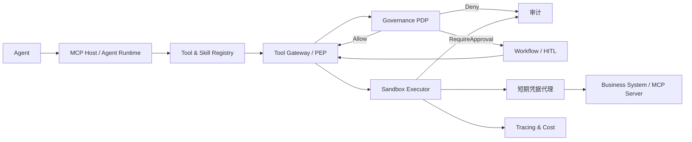
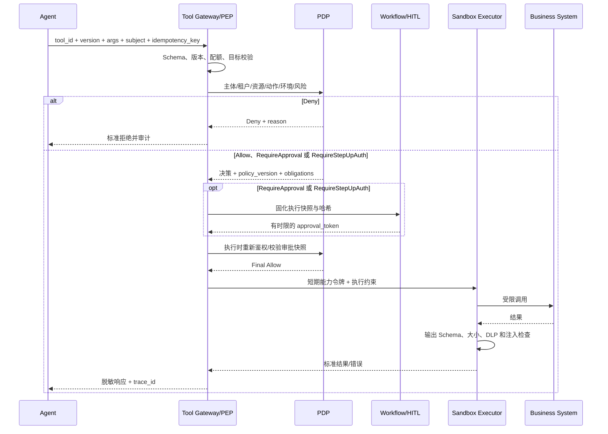

# 08 Tool Platform 与 AI SDK 设计

> 状态：Planned（目标设计，尚未实现） ｜ 适用阶段：Phase 3 起 ｜ 责任域：Tool ｜ 关联：`09_Workflow_Human_In_Loop设计.md`、`10_Governance_Security设计.md`

## 1. 定位与术语

Tool Platform 让 Agent 在企业身份、策略、审批和审计约束下调用业务能力。它不是任意脚本执行器，也不允许 Agent 直接持有业务系统长期凭据。

- **Native Tool**：平台内注册、具有稳定输入输出契约的最小能力。
- **MCP Server**：按 Model Context Protocol 暴露 Tool/Resource/Prompt 的服务端适配器。
- **Skill**：由说明、资源和可选代码组成的可版本化能力包；安装 Skill 不等于获得执行权限。
- **A2A Adapter**：未来 Agent 间互操作边界，一期只预留身份、任务、Artifact 和状态映射，不实现未评审协议依赖。

MCP 兼容基线固定为稳定规范 `2025-11-25`，升级必须通过兼容性测试和 ADR。协议角色与生命周期以 [MCP 2025-11-25 规范](https://github.com/modelcontextprotocol/modelcontextprotocol/blob/main/docs/specification/2025-11-25/index.mdx) 为准。

## 2. 总体架构



Registry 只提供发现与版本元数据；PDP 作出授权决策；Tool Gateway 是执行强制点（PEP）；Workflow 持有审批状态；Executor 负责隔离、可靠性和结果校验。任何模块不得复制或绕过上述职责。

## 3. MCP Host、Client 与 Server

面向外部消费者时，平台主要作为受管 MCP Server 暴露获准的 Tool/Resource/Prompt；平台 Agent 调用经批准的外部能力时，Agent Runtime 才作为 Host，并为每个远端 Server 建立隔离 Client。两种角色使用不同入口、凭据、会话和审计策略，不能共用通用 Token。

- **Host** 管理用户同意、租户会话、Client 生命周期、能力暴露和上下文边界。
- **Client** 与单一 Server 建立会话，执行初始化、能力协商、协议版本确认和请求关联。
- **Server** 声明 Tools/Resources/Prompts；企业平台默认只启用显式批准的能力，未知能力 fail closed。

一期支持经评审的本地 `stdio` 和远程 Streamable HTTP 适配器。远程连接必须校验 TLS、目标主机、租户、OAuth audience/scope，并禁止 token passthrough；本地 Server 使用受限工作目录、环境变量白名单和进程级资源限制。授权服务器、MCP Server 与业务 API 的信任边界不可合并。

安全实现遵循 [MCP 安全最佳实践](https://github.com/modelcontextprotocol/modelcontextprotocol/blob/main/docs/docs/tutorials/security/security_best_practices.mdx) 中关于 confused deputy、SSRF、会话和 token 处理的防护方向；任何 Server 返回的文本、链接和 Resource 均按不可信输入处理。

## 4. Tool Registry 完整契约

每个版本为不可变记录，至少包含：

- 标识：`tool_id`、命名空间、名称、语义版本、Owner、租户可见范围；
- 协议：类型、endpoint/transport、MCP 协议版本、能力和兼容范围；
- 契约：严格 JSON Schema 输入/输出、错误模型、示例、`additionalProperties` 策略；
- 安全：权限、OAuth scope、数据分类、风险等级、网络出口和 Secret 引用；
- 执行：超时、并发/速率限制、幂等支持、重试策略、补偿能力和最大响应大小；
- 生命周期：来源、内容哈希、签名/SBOM、审核、状态、弃用和替代版本；
- 运维：SLO、成本标签、健康检查、支持联系人和审计级别。

```json
{
  "tool_id": "inventory.query",
  "version": "1.2.0",
  "owner": "supply-chain",
  "transport": "https",
  "permission": "inventory.read",
  "risk": "low",
  "side_effect": "none",
  "timeout_ms": 5000,
  "idempotency": "not_required",
  "input_schema": {
    "type": "object",
    "properties": {
      "item_id": { "type": "string", "minLength": 1 }
    },
    "required": ["item_id"],
    "additionalProperties": false
  },
  "output_schema_ref": "schema://inventory/item-status/1.0",
  "egress_allowlist": ["inventory-api.internal"],
  "status": "published"
}
```

风险与副作用分开描述。`low` 不代表免鉴权；`medium` 通常需要参数确认或增强认证；`high/critical` 以及不可逆、财务、权限或敏感数据操作必须走 Workflow 审批。风险规则由 Governance 域版本化管理。

## 5. 执行协议



执行前必须重新验证审批快照、策略版本、资源版本和参数哈希，防止审批后替换参数（TOCTOU）。所有尝试，包括拒绝、超时、取消、Schema 失败和沙箱启动失败，都写入审计。

## 6. 可靠性、幂等与补偿

- 有副作用 Tool 必须声明幂等键语义；平台在租户与 Tool 版本范围内去重。
- 自动重试仅适用于明确可重试且幂等的错误，采用有上限的指数退避；业务拒绝不得重试。
- 超时不等于未执行，必须支持查询执行状态或使用业务幂等键对账。
- 跨系统事务采用 Saga/补偿；补偿动作也是独立高风险 Tool，必须审计，不能承诺“恰好一次”。
- 返回统一错误：`validation`、`permission_denied`、`approval_required`、`rate_limited`、`timeout_unknown`、`dependency`、`business_rejected`、`internal`。其中 `timeout_unknown` 是稳定错误代码，表示 ToolExecution `result_state=ResultUnknown`，不是 Agent/Workflow 状态，且默认不可重试。

## 7. 沙箱、凭据和供应链

可执行 Skill、本地 MCP Server 和脚本默认在隔离环境运行：只读基础镜像、临时工作区、非 root、CPU/内存/时长限制、文件系统和网络白名单、禁止继承宿主环境变量。业务凭据由 Secret Broker 按主体、租户、Tool 和单次调用签发短期令牌。

安装前验证来源、许可证、内容哈希、签名、SBOM、依赖漏洞、权限声明和行为测试；版本发布后不可变。下架必须支持立即禁用、会话失效、影响查询和回滚。

从 [OpenClaw](https://github.com/openclaw/openclaw) 只借鉴 Gateway、渠道适配、会话、沙箱和技能治理的工程机制，并参考其 [SECURITY](https://github.com/openclaw/openclaw/blob/main/SECURITY.md) 与 [威胁模型](https://github.com/openclaw/openclaw/blob/main/docs/security/THREAT-MODEL-ATLAS.md) 识别边界；其面向单用户/受信操作者的信任假设不适用于企业多租户，不能直接继承权限模型。

[Hermes Agent](https://github.com/NousResearch/hermes-agent) 的 Skill 管理与迭代思路仅作为能力演进参考。企业环境禁止运行时直接自修改并发布，统一采用 `Candidate → Evaluating → Reviewing → Canary → Published`，异常或替代状态为 `Rejected / Quarantined / RolledBack / Superseded`；Reviewing 包含安全门禁，且每一步保留创建者、差异、评测证据和审批记录。

## 8. AI Enablement SDK

Python 与 C# SDK 提供相同语义：契约声明、注册、身份/租户上下文、幂等键、事件发布、Trace 传播、标准错误、审计钩子、Mock Server 和契约测试。SDK 不允许应用绕过 Gateway 直连业务能力。

```python
@ai_tool(
    tool_id="device.status.get",
    version="1.0.0",
    permission="device.read",
    risk="low",
    side_effect="none",
    timeout_ms=3000,
)
def get_device_status(device_id: str, context: ToolContext) -> DeviceStatus:
    """按调用主体和租户查询设备状态。"""
```

```csharp
[AITool(
    ToolId = "device.status.get",
    Version = "1.0.0",
    Permission = "device.read",
    Risk = ToolRisk.Low,
    SideEffect = ToolSideEffect.None,
    TimeoutMs = 3000)]
public Task<DeviceStatus> GetDeviceStatusAsync(
    string deviceId,
    ToolContext context,
    CancellationToken cancellationToken);
```

SDK 与 Gateway 使用明确的兼容矩阵；破坏性 Schema 变更必须提升主版本，旧版本按弃用窗口并行运行。

## 9. 验收标准

上线一个 Tool 前必须证明：契约正反例通过；跨租户访问与未授权副作用执行为零；Deny/审批/过期审批/超时未知/重复请求均有测试；沙箱逃逸和非法出口被阻止；所有路径产生关联 Trace 与审计；回滚和紧急禁用可演练。未满足任一项时状态不得进入 `published`。
