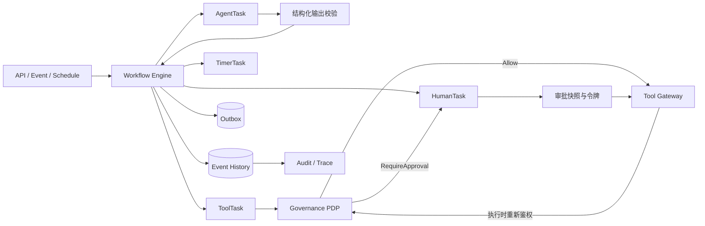

# 09 Workflow 与 Human-in-the-Loop 设计

> 状态：Planned（目标设计，尚未实现） ｜ 适用阶段：Phase 4；高风险 Tool 的最小审批能力在 Phase 3 同步交付 ｜ 责任域：Workflow

## 1. 设计原则与边界

Agent 负责生成建议、计划和结构化候选输出；Workflow 负责确定性流程、持久状态、审批、计时、重试和副作用编排。两者可以通过 `AgentTask` 协作，但 Agent 不得直接修改 Workflow 状态、跳过策略或执行有副作用 Tool。

核心原则：

- Workflow 定义和运行历史可版本化、可恢复、可审计；
- 非确定性模型调用封装为 Activity/Task，结果作为不可变事件写入历史；
- 每个副作用都显式声明幂等、超时、重试、补偿和审批要求；
- 不承诺分布式“恰好一次”，通过至少一次投递、幂等和对账获得业务一致性；
- 人工介入不只包含批准，也包含澄清、纠正、异常接管和终止。

## 2. 总体架构

Workflow Engine 不保存业务系统长期凭据；ToolTask 只能通过 `08_Tool_Platform_AI_SDK设计.md` 定义的 Gateway 执行。

## 3. 领域对象

### 3.1 WorkflowDefinition

不可变流程模板，包含 `definition_id`、语义版本、Owner、租户范围、输入/输出 JSON Schema、触发器、节点、边、超时、补偿图、风险等级和兼容信息。发布后修改必须生成新版本。

### 3.2 WorkflowInstance

运行实例包含 `instance_id`、定义版本、租户、发起主体、业务关联键、当前状态、变量快照、截止时间、策略版本、Trace 和历史游标。实例始终绑定启动时的定义版本，迁移必须由显式迁移器完成。

### 3.3 TaskInstance

节点实例类型包括 `AgentTask`、`HumanTask`、`ToolTask`、`TimerTask`、`EventTask` 和 `CompensationTask`。每个实例包含 attempt、幂等键、输入/输出哈希、领取者、租约、超时和错误分类。

### 3.4 ApprovalTask

`ApprovalTask` 是 Workflow 聚合内的独立对象，而不是布尔字段；Governance 在 `PolicyDecision` 的 obligations 中提供不可变值对象 `ApprovalRequirement`、策略版本与最终授权约束，不持有审批任务生命周期。ApprovalTask 记录执行快照哈希、审批人/代理人、职责分离、决定、理由、时间、有效期、增强认证证据和撤销状态，并把决定事实发送给 Governance/Audit。

## 4. 状态机

Workflow 状态：

`Created`、`Running`、`Paused`、`Compensating`；终态为 `Succeeded`、`Failed`、`Cancelled`、`TimedOut`、`Compensated`、`CompensationFailed`。`Cancelled` 只表示取消已确认且没有结果未知的在途副作用；`TimedOut` 只表示 Workflow 截止时间已到且无未决结果；补偿失败必须进入 `CompensationFailed` 并关联人工处置任务。

Task 状态：

`Pending`、`Ready`、`Running`、`WaitingForApproval`、`WaitingForEvent`、`RetryScheduled`、`Compensating`；终态为 `Succeeded`、`TimedOut`、`Failed`、`Cancelled`、`Compensated`。外部结果未知时使用 `WaitingForEvent` 并记录 `result_certainty=unknown`，不得把未知结果伪装为 TimedOut、Failed 或 Cancelled。

ApprovalTask 状态：

`Requested → Pending → Approved | Rejected | ChangesRequested | Expired | Cancelled | Revoked`。

所有转换必须校验预期版本并写入追加式历史，禁止直接覆盖状态。每个终态同时保存稳定 `reason_code`；同名终态不能替代拒绝、过期、用户取消或补偿失败等业务语义。并发领取采用租约和乐观并发；过期租约可重领，但 Activity 必须幂等。

### 4.1 状态所有权与同步协议

Agent 与 Workflow 不共享一列状态，也不得跨模块直接更新对方聚合：

| 事实 | 唯一 Owner / 事实源 | 跨域同步方式 |
|---|---|---|
| 推理、计划、预算、Agent 检查点和最终 Artifact | AgentExecution / `15_Agent状态机设计.md` | Agent 事务提交状态、检查点和 Outbox 事件 |
| 流程节点、Timer、Signal、补偿顺序 | WorkflowInstance/TaskInstance / 本文 | Workflow 事务提交历史和 Outbox 事件 |
| 审批请求与决定生命周期 | ApprovalTask / 本文 | Governance 只提供 `ApprovalRequirement` 和最终重新鉴权；审批决定以事件通知 Agent |
| Tool 调用结果确定性 | ToolExecution | 通过幂等查询或对账事件更新 Task/Agent 的 `result_certainty` |

映射只表达关联，不创建第二事实源：

| AgentExecution | 关联 Workflow 事实 | 收敛规则 |
|---|---|---|
| `WaitingApproval` | Workflow `Running` + ApprovalTask `Pending` | `ApprovalDecided` 经 Outbox 至少一次投递；Agent 按 `approval_task_id + decision_version` 幂等消费并重新鉴权 |
| `WaitingExternal` | Task `WaitingForEvent` 或对账任务活跃 | 外部结果已知前 Agent 不得进入终态；迟到事件按 Event ID 去重 |
| `Compensating` | Workflow `Compensating` | Workflow 决定补偿顺序；Agent 只消费进度/终态并保存引用 |
| Agent 终态 | 相关 Workflow/Task 已终态或明确脱钩 | 若 Workflow 仍有未决副作用，Agent 不能先行声明成功、取消或超时 |

同步采用命令、事件和对账，不采用跨模块双写：

1. `CancelExecution`、审批 Signal 和外部 Signal 都携带稳定 request/event ID、预期版本和 correlation ID。
2. 每个模块在本地事务中提交聚合状态与 Outbox；消费者使用 Inbox 幂等处理。Workflow 已提交审批而 Agent 更新失败时，重放同一事件即可收敛。
3. 双方同时收到取消、超时或迟到成功结果时，先保留已观察到的外部事实，再按 `15` 的结果确定性和转换优先级决定 Agent 终态；不得用最后写入者覆盖历史。
4. 对账任务周期性检查 Agent/Workflow/Tool 的关联状态；发现悬挂审批、孤儿 Task 或终态冲突时停止自动推进并升级人工处理。

### 4.2 取消、截止与结果未知决策矩阵

| 终止意图到达时的事实 | AgentExecution | Workflow / Task |
|---|---|---|
| 未产生且不存在未决副作用 | 按意图进入 `Cancelled` 或 `TimedOut` | Workflow/Task 进入对应终态 |
| 已确认产生副作用且需要处置 | `Compensating` | Workflow/Task `Compensating` |
| 外部结果未知 | `WaitingExternal`，保留 Cancel/Deadline 意图 | Workflow 保持活动；Task `WaitingForEvent` 并启动对账 |
| 已在补偿 | 保持 `Compensating` | 保持 `Compensating`；新的取消/截止只升级告警，不中断补偿历史 |

操作等待超时、ApprovalTask 过期、Task 截止时间和 Workflow/AgentExecution 截止时间是不同事件，必须使用不同 reason code 和 Timer；一个 Timer 不得替另一个聚合直接写终态。同一 Task 的 Timer、Retry 和 Compensation 只能由 Workflow 调度，Runtime 不得再调度一次。

## 5. Human-in-the-Loop

### 5.1 触发场景

- 高风险、不可逆、财务、权限、外发或敏感数据操作；
- 模型低置信、证据冲突、参数超阈值或策略要求增强认证；
- Agent 需要业务澄清、异常恢复或人工接管；
- 自动补偿失败或 ToolExecution 处于 `result_state=ResultUnknown`，需要对账或人工确认。

### 5.2 审批控制

审批任务必须显示业务目的、影响对象、变更前后差异、证据、风险、Tool/版本、完整参数、可逆性和预计成本。关键操作支持双人复核、职责分离、审批人委托、升级、截止时间和拒绝/请求修改。

批量审批只有在同一策略、同一风险和可独立回滚时允许；审批人不能批准自己发起或自己生成的高风险变更。审批意见与敏感字段按最小披露展示。

### 5.3 防止审批后换参（TOCTOU）

请求审批时生成不可变 `execution_snapshot`，包含：

- `tenant_id`、发起主体、目标资源及资源版本；
- `tool_id`、Tool 版本、输入参数哈希和幂等键；
- Policy ID/版本、风险等级、审批规则和到期时间。

批准后签发短期、单次使用的 `approval_token`。执行前 Tool Gateway 重新鉴权并逐项比对快照；任一字段变化、策略撤回、资源版本变化或令牌过期，都必须重新审批。

## 6. 长任务、重试与补偿

- **Pause/Resume**：暂停只阻止新 Task 调度，不强行中断已提交的外部副作用；恢复前重新鉴权。
- **Retry**：仅对分类为 transient 且具备幂等保证的 Task 自动重试，策略包含最大次数、退避和抖动。
- **Timeout/Cancel**：区分尚未执行、已确认取消和结果未知；Cancel/Deadline 首先记录意图和约束，只有不存在未决副作用时才进入终态。结果未知进入 `WaitingForEvent` 对账任务，禁止直接重复副作用。
- **Compensation**：按逆序或显式补偿图执行。补偿是业务动作，不保证恢复原状；失败需升级人工处理。
- **Continue-as-new/归档**：长历史达到阈值后生成可追溯的新运行段，历史按审计保留策略归档。

## 7. 事件一致性

数据库变更与领域事件使用 Transactional Outbox 原子提交；消费者使用 Inbox、事件 ID 和业务幂等键去重。事件至少包含 `event_id`、tenant、schema/version、aggregate/version、correlation/causation ID、发生时间与分类等级。

不依赖全局顺序；只在相同业务聚合键内保证顺序。未知 Schema 版本进入隔离队列，不能静默丢弃。人工重放必须记录操作者、范围和原因。

## 8. 引擎选择与演进

[LangGraph](https://github.com/langchain-ai/langgraph) 可作为有状态 Agent 编排、检查点和人工中断机制的参考；[Temporal](https://github.com/temporalio/temporal) 可作为持久工作流、Timer、重试和长任务恢复的候选。二者是不同层次的机制与候选，不是当前未经评审的硬依赖。

一期优先在模块化单体中实现最小状态机、数据库持久化、Outbox 和 Worker。只有在并发量、长流程规模、跨服务恢复或运维收益达到经批准阈值后，才通过 ADR、PoC、故障演练、迁移/回滚方案选择外部引擎。

## 9. 可观测与验收

每个 Workflow、Task、Approval 和 Tool 调用共享 trace/correlation ID，记录排队、执行、审批等待、重试、补偿耗时及状态原因。日志和 Trace 不保存明文 Secret 或未经脱敏的业务参数。

上线门禁至少验证：非法状态转换被拒绝；重复事件和重复请求不产生重复副作用；审批过期/撤销/换参均阻断执行；重试、暂停、取消、结果未知、补偿失败可恢复；双调度、重复取消、迟到审批/对账事件可幂等收敛；跨租户访问为零；历史可在故障后确定性恢复。SLO 按关键工作流分别定义完成率、P95 端到端耗时、审批超时率和积压上限。
