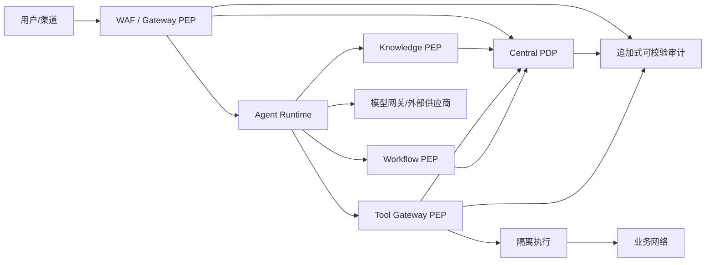

# 10 Governance 与 Security 设计

> 状态：Planned（目标设计，尚未实现） ｜ 适用阶段：Phase 0 起 ｜ 责任域：Governance ｜ 原则：默认拒绝、最小权限、纵深防御、全程可审计

## 1. 目标、范围与责任

Governance 定义企业 AI 的身份、租户、策略、风险、数据、模型、Tool/Skill、审计和事件响应控制。它提供中央 Policy Decision Point（PDP）；Gateway、Knowledge Retriever、Tool Executor、Workflow 和管理 API 是 Policy Enforcement Point（PEP）。

安全不是 Phase 5 的附加能力。Phase 0 必须交付身份、租户隔离、默认拒绝、Secret、审计与最小策略；后续阶段扩展规则与合规证据。

## 2. 威胁模型

### 2.1 保护资产

- 用户、Agent、服务和业务系统身份及短期令牌；
- 企业文档、索引、对话、Memory、Prompt、模型输入输出和审计；
- Tool/Skill/MCP Server、Workflow、Policy、模型和配置供应链；
- 业务系统副作用、财务/权限变更和平台可用性。

### 2.2 对手与失效模式

- 外部攻击者、恶意租户用户、被盗账号和越权内部人员；
- 间接 Prompt Injection、数据投毒、恶意 Skill/MCP Server 和依赖污染；
- Agent 误规划、模型幻觉、过度授权、混淆代理、SSRF 与数据外泄；
- 错误配置、跨租户缓存/索引污染、审计缺失和供应商故障。

### 2.3 信任边界



渠道内容、外部文档、模型输出、Tool/MCP 返回值和 Skill 包均默认不可信；“来自内网”不构成信任依据。

## 3. 身份、会话与代理授权

身份类型包括 User、Tenant、Agent、Service/Workload、Tool/MCP Server 和 Workflow。用户通过企业 IdP 的 OIDC/OAuth 认证；服务间使用工作负载身份和 mTLS；禁止共享账号和长期静态 Token。

Agent 必须拥有独立身份，但其权限不能超过发起用户和自身服务权限的交集。调用业务系统使用受 audience、scope、tenant、Tool、资源和时限约束的短期 on-behalf-of/capability token，禁止把用户 Token 原样传递给 Tool 或下游 MCP Server。

高风险动作要求近期认证或增强认证。会话需绑定 tenant、subject、channel、设备/环境摘要和过期时间；登出、账号禁用、角色变更或安全事件必须支持会话和能力令牌撤销。

## 4. 多租户隔离

所有业务对象、索引、缓存键、队列消息、Trace、成本和审计都必须携带 `tenant_id`，并在数据库行级策略或等效强制点校验。Tenant ID 只能来自已验证身份上下文，不能信任请求体或模型输出。

- 数据库查询默认附带租户条件；管理操作也不得绕过；
- 向量/关键词检索在召回前执行 tenant + ACL 过滤；
- 缓存键包含 tenant、主体权限摘要、资源版本和模型/索引代次；
- 对象存储、Secret、队列消费组和导出任务按租户隔离；
- 跨租户支持人员访问采用临时授权、双人审批和全量审计。

跨租户读取、写入或引用泄漏是阻断发布的 P0 安全缺陷。

## 5. 授权模型与 PDP/PEP

RBAC 表达岗位/职责，ABAC 表达主体、资源、数据分类、租户、时间、网络、风险和审批状态。两者结合使用，默认无显式允许即拒绝；高风险操作即使已授权也可能返回 `RequireApproval` 或 `RequireStepUpAuth`。

PDP 输入统一为：

```json
{
  "subject": { "id": "user-123", "tenant_id": "tenant-a", "roles": ["engineer"] },
  "agent": { "id": "agent-maintenance", "version": "2.1.0" },
  "action": "device.update",
  "resource": { "id": "device-7", "classification": "internal", "version": "42" },
  "environment": { "channel": "web", "time": "2026-07-22T09:00:00Z" },
  "risk": { "level": "high", "side_effect": "reversible" }
}
```

决策输出为 `Allow | Deny | RequireApproval | RequireStepUpAuth`，并携带 policy/version、reason、obligations、有效期和决策 ID。PEP 必须执行 obligations，例如字段脱敏、响应上限、审批、只读模式或网络出口限制。

策略以代码形式版本化，必须经过静态检查、单元测试、冲突检测、影子评估、Review、Canary 和回滚。PDP 不可用或决策过期时 fail closed；只允许预先定义的低风险、只读、短期缓存例外。实现可评估 [OPA](https://github.com/open-policy-agent/opa) 作为通用策略引擎、[OpenFGA](https://github.com/openfga/openfga) 作为关系授权候选，但选型需通过复杂度、延迟、可解释性和运维 ADR。

## 6. 风险分级与关键操作

风险由数据分类、副作用、可逆性、影响范围、金额、权限提升、外发和模型置信共同决定。

| 等级 | 典型动作 | 最低控制 |
|---|---|---|
| Low | 权限内只读查询 | 鉴权、限流、审计 |
| Medium | 可逆单对象修改 | 参数确认、幂等、增强审计 |
| High | 批量修改、敏感数据外发 | Workflow 审批、职责分离、Canary/限额 |
| Critical | 删除、财务、权限提升、不可逆操作 | 双人审批、增强认证、执行窗口、补偿/恢复方案 |

删除操作还必须检查法律保留、备份、软删除、影响预览和资源版本。审批绑定具体参数和资源快照，不能批准“任意未来操作”。

## 7. 数据安全与 DLP

数据按 Public、Internal、Confidential、Restricted 分级，并关联 Owner、用途、地域、保留、导出和模型供应商策略。摄取时同步源 ACL 和分类；ACL 变化、撤回和删除必须传播到原文、Chunk、索引、缓存和导出。

- 传输使用 TLS，存储使用平台/KMS 管理的加密；Secret 不进入代码、Prompt、日志或 Trace；
- DLP 在摄取、Prompt 构建、Tool 参数、模型出口、响应和导出处执行；
- Restricted 数据默认不得发往未批准的外部模型或区域；
- 日志使用字段级脱敏/哈希，原始 Prompt 和响应按最小必要采样和保留；
- 删除、导出、更正、保留和 Legal Hold 形成可追踪的数据生命周期。

模型供应商必须有数据使用、训练保留、地域、删除、子处理方和事件通报配置；未经批准的供应商默认不可路由。

## 8. AI、RAG 与 Prompt Injection 防护

Prompt Injection 无法靠单次“扫描”彻底消除，平台必须假定检索内容与 Tool 输出含恶意指令：

- 系统指令、用户输入、检索证据和 Tool 输出采用结构化边界，证据不得提升为系统指令；
- Agent 只能使用 Registry allowlist 内且当前主体获准的 Tool；模型选择 Tool 不等于授权；
- 对 URL、重定向、DNS/IP 和出口目标实施 SSRF 防护，禁止访问元数据端点和内网未批准地址；
- Tool 输入/输出执行 Schema、DLP、大小、内容类型和注入检测；
- 高风险副作用展示参数并由人确认，执行前重新鉴权；
- Memory 和知识写入先进入 Candidate，经来源验证、评测、Review 和回滚流程，防止持久化投毒；
- 安全评测包含直接/间接注入、越权检索、数据外泄、工具滥用和多轮诱导。

MCP 威胁控制对齐 [MCP 安全最佳实践](https://github.com/modelcontextprotocol/modelcontextprotocol/blob/main/docs/docs/tutorials/security/security_best_practices.mdx)。

## 9. Tool、Skill 与供应链治理

Tool、Skill、MCP Server、模型、Prompt、容器和依赖均登记来源、Owner、许可证、版本、哈希、签名、SBOM、漏洞和权限。安装与升级采用隔离构建、恶意行为测试、最小权限、网络出口审查和可回滚发布。

Skill 生命周期固定为 `Candidate → Evaluating → Reviewing → Canary → Published`，异常或替代状态为 `Rejected / Quarantined / RolledBack / Superseded`。Reviewing 包含代码、依赖、许可证、权限差异和对抗测试等安全门禁；运行时生成或修改的 Skill 永远从 Candidate 开始，不能自动获得权限或直接发布。

借鉴 [OpenClaw SECURITY](https://github.com/openclaw/openclaw/blob/main/SECURITY.md) 与其 [威胁模型](https://github.com/openclaw/openclaw/blob/main/docs/security/THREAT-MODEL-ATLAS.md) 的 Gateway、沙箱、扩展和信任边界分析，但明确拒绝把其单用户/受信操作者假设用于企业多租户。企业平台必须保留中央身份、租户隔离、PDP/PEP、职责分离和审计。

## 10. 审计、检测与响应

审计事件至少包含 `event_id`、时间、tenant、subject/agent/workload、会话、trace/correlation、action、resource/version、Tool/模型/Prompt/Policy 版本、决策与理由、审批、输入输出哈希/脱敏摘要、结果、错误、延迟、成本和来源网络摘要。

审计采用追加写、完整性校验、访问隔离、分级保留和安全导出；任何人包括管理员读取或导出审计也产生审计。当前基线只承诺对应用和业务角色形成追加式、可校验的防篡改证据，不宣称对数据库管理员、平台控制者或密钥持有者具有密码学意义的“不可抵赖”。若适用法规或取证要求需要更强保证，必须另行设计规范化编码、独立签名检查点、可信时间、WORM/外部锚定、签名密钥职责分离与轮换吊销、验证协议和证据保全链。告警至少覆盖跨租户尝试、异常拒绝率、权限提升、批量导出、DLP 命中、异常 Tool 目标、Skill 变更和审计中断。

事件响应流程包括检测、分级、隔离、令牌/Skill/Tool 紧急吊销、取证保全、租户通知决策、恢复、复盘和控制改进。每个 P0 场景必须有 Owner、Runbook 和定期演练。

## 11. 合规与安全门禁

根据客户、数据、行业和部署地域建立适用性矩阵，评估个人信息保护、数据安全、网络安全、等保及 GDPR 等要求；“GDPR”不是通用替代项，也不能在无适用性分析时宣称合规。

生产门禁：威胁模型已评审；跨租户与未授权副作用测试零失败；Critical 路径审批与回滚演练通过；依赖/镜像/Skill 无未豁免高危漏洞；Secret 扫描、DLP、审计完整性和恢复验证通过；所有豁免有 Owner、到期日和补偿控制。未满足即阻断发布。

## 12. 威胁、控制与证据追踪

威胁清单或控制描述本身不是安全证据。每个试点维护以下可追踪登记；一行只描述一个可验证攻击路径，证据只能在测试、演练或评审实际完成后填写。

| Threat ID | 资产/数据流与攻击路径 | Control ID / 强制点 | 检测与响应 | Verification ID / 可判定准则 | 残余风险 / Owner | 证据 |
|---|---|---|---|---|---|---|
| THR-TEN-001 | 攻击者复用其他 Tenant 的 ID、Cursor、缓存键或向量近邻读取数据 | CTL-TEN-001：Gateway Tenant 解析、RLS、检索前 ACL、Tenant 缓存键 | 跨租户拒绝与异常枚举告警；触发租户隔离事件响应 | VER-THR-TEN-001：主键猜测、Cursor/SSE 复用、缓存与向量近邻测试成功泄漏数为 0 | 错配运维权限 / Security Owner | —（未执行） |
| THR-INJ-001 | 文档、网页或 Tool 输出中的间接 Prompt Injection 诱导外发数据或调用高风险 Tool | CTL-INJ-001：信任分区、Tool allowlist、最终参数 Schema/PDP、DLP、出口限制 | 异常 Tool 目标、DLP、注入模式与高风险决策告警；支持 Kill Switch | VER-THR-INJ-001：对抗集不能扩大权限、绕过审批或泄露受限数据 | 新型诱导可能漏检 / AI Security Owner | —（未执行） |
| THR-TOOL-001 | 混淆代理、审批后换参、重放或结果未知导致未授权/重复副作用 | CTL-TOOL-001：ActionHash、短期单次审批令牌、执行前重新鉴权、幂等与对账 | 参数哈希不符、重复幂等键、ResultUnknown 积压告警；暂停 Tool | VER-THR-TOOL-001：拒绝换参/过期/撤销/重放；结果未知不盲重试 | 外部系统缺少幂等查询 / Tool Owner | —（未执行） |
| THR-SUP-001 | 恶意或被替换的 Skill、MCP Server、容器、依赖或模型进入执行链 | CTL-SUP-001：来源锁定、签名、SBOM、隔离构建、最小出口、加载时验证与吊销 | 签名/哈希漂移、漏洞、异常网络/命令告警；隔离并回滚版本 | VER-THR-SUP-001：篡改包、失效签名、恶意依赖与越权网络均被阻断 | 上游零日与信任根失陷 / Platform Security | —（未执行） |
| THR-AUD-001 | 应用、管理员或故障造成审计缺失、重排、删除或敏感内容泄漏 | CTL-AUD-001：本地事务 Outbox、仅 INSERT、完整性链、访问隔离、脱敏与外部导出 | 序号/哈希断链、出口中断和敏感字段扫描告警；停止高风险发布 | VER-THR-AUD-001：故意缺失/重排/修改可检测，授权外读取失败，敏感样本不落盘 | 当前不抵御全部平台控制者 / Governance Owner | —（未执行） |
| THR-MOD-001 | 模型路由或 Fallback 将受限数据发送到未批准供应商、区域或保留策略 | CTL-MOD-001：ModelPolicyVersion、数据分类/DLP、供应商/地域 allowlist、Fallback 兼容门禁 | 路由原因、供应商/区域漂移和数据策略拒绝告警；禁用 Route | VER-THR-MOD-001：不兼容 Route/Fallback 全部拒绝且记录 PolicyDecision | 供应商条款或模型别名漂移 / Model Platform Owner | —（未执行） |

证据至少关联代码/策略/依赖版本、环境、测试数据分类、执行时间、原始结果摘要和完整性哈希。每个残余风险必须有接受人、到期日和补偿控制；P0 风险不能以空证据标记为已缓解。新增数据流、Tool、模型供应商、Skill/MCP Server 或部署模式时，必须新增或复审对应 Threat ID。
