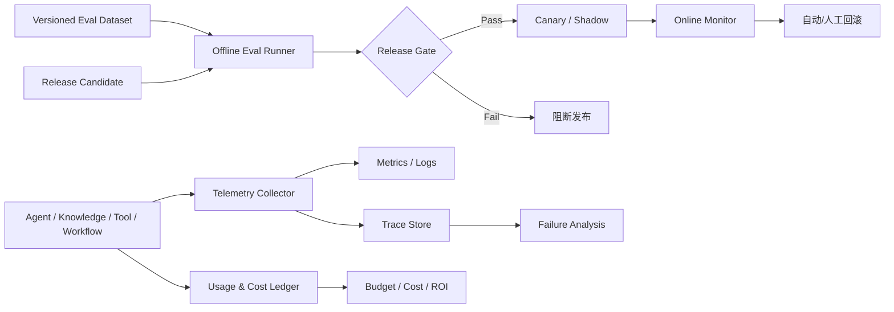

# 11 Evaluation、Monitoring 与 Cost 设计

> 状态：Planned（目标设计，尚未实现） ｜ 适用阶段：Phase 0 起 ｜ 责任域：AI Operations ｜ 原则：没有评测证据不得发布，没有可观测性不得生产运行

## 1. 目标与版本单位

平台必须回答：质量是否达标、失败发生在哪一步、安全控制是否有效、单位成功成本是多少、业务收益是否可归因。评测、Trace、监控和成本共享同一版本单位：

`release = app + agent/workflow + prompt + model/provider + retrieval config + embedding/reranker + tool/skill + policy + dataset`。

缺少任一关键版本、租户或 trace_id 的数据不得进入正式比较。Phase 0 建立最小 Eval Harness、Trace 和成本标签；后续阶段增加指标，而不是到生产末期再补。

## 2. 总体架构



评测执行与生产数据访问分离；生产样本进入评测集前必须获得用途授权并脱敏。

## 3. 评测数据集

### 3.1 数据集类型

- **Golden**：业务专家确认的常规任务与答案/证据/期望动作；
- **Regression**：历史缺陷、事故和高频失败的不可删除用例；
- **Adversarial**：Prompt Injection、越权、数据外泄、恶意 Tool/Skill、极端输入；
- **Slice**：按租户类型、语言、文档格式、权限、风险、渠道和任务复杂度分层；
- **Canary**：经脱敏、授权的代表性线上样本，用于影子或灰度比较。

每条样本包含 `case_id`、数据集版本、任务、输入、身份/租户/权限上下文、期望证据或状态、允许/禁止动作、评分规则、标签、Owner、来源和最后复核时间。数据集发布采用 Review，训练集与门禁测试集隔离，防止过拟合和反馈投毒。

### 3.2 标注与 Judge

高风险和主观样本采用双人标注或仲裁。LLM-as-a-Judge 必须固定模型、Prompt、温度和 Rubric，并与人工标注定期校准；报告一致率和不确定样本，不得把 Judge 分数当绝对真值。

## 4. 可执行指标

### 4.1 Model 与生成质量

- **Task Correctness**：按用例 Rubric 得分，不使用无定义的“准确率”；
- **Groundedness**：回答中被证据支持的事实主张数 / 可验证事实主张总数；
- **Answer Relevance**：回答是否完成用户意图，由固定 Rubric 或人工评分；
- **Abstention Accuracy**：不可回答样本中正确拒答比例，以及可回答样本的误拒答比例；
- 同时记录 P50/P95/P99 延迟、输入/输出/缓存 Token、错误率和单次成功成本。

### 4.2 RAG

- `Recall@k = 前 k 条中命中的相关文档数 / 相关文档总数`；
- `Precision@k = 前 k 条相关结果数 / k`，并报告 MRR 或 nDCG；
- **Context Precision/Recall**：进入生成上下文的证据相关性与覆盖度；
- `Citation Precision = 被证据支持的引用主张数 / 已引用主张总数`；
- `Citation Recall = 应引用且已引用的主张数 / 应引用主张总数`；
- **Citation Validity**：引用能解析到正确租户、源版本、Chunk 和证据范围；
- 单独测试权限预过滤、过期知识、冲突证据、删除传播和无答案。

### 4.3 Agent、Tool 与 Workflow

- `Task Success Rate = 满足全部业务断言的成功任务 / 有效任务`；
- Tool 选择精确率/召回率、参数 Schema 通过率、无效步骤率、平均/最大步骤数；
- 未授权 Tool 尝试与实际副作用分开统计，后者门槛恒为零；
- 幂等、超时未知、重试、恢复、审批、换参阻断和补偿成功率；
- Workflow 完成率、排队/执行/审批等待时长、Timer 延迟和积压。

### 4.4 安全与治理

跨租户泄漏、未授权副作用、绕过审批、明文 Secret 泄漏和 Critical Prompt Injection 成功数必须为零。Policy 正反例、DLP、SSRF、恶意 Skill/MCP Server、安全回滚和审计完整性均进入阻断门禁。

### 4.5 业务

在上线前记录人工基线：处理时间、错误率、完成率、返工和单任务成本。上线后按同口径计算净节省时间、质量差异、采用率、人工复核量和风险事件；没有对照或基线的指标只能标记为相关性，不能宣称因果收益。

## 5. 发布门禁

每个用例在 `EvalPolicy` 中登记绝对阈值、允许回归、样本量和置信要求。阈值缺失等同失败。以下 YAML **仅演示配置字段和单位，尚未批准**；其中质量与运营数字不是默认值、建议值、SLA 或发布依据，禁止直接复制到环境配置。只有关闭 `TBD-EVAL-001`、完成基线测量并由业务 Owner 与安全负责人批准版本化 EvalPolicy 后才生效。跨租户泄漏、未授权副作用为零以及关键安全场景全通过属于平台硬门禁，不因示例状态而放宽：

```yaml
metadata:
  example_only: true
  approval_status: unapproved
quality:
  retrieval_recall_at_5_min: 0.85
  citation_precision_min: 0.95
  groundedness_min: 0.90
  task_success_rate_min: 0.85
  max_primary_metric_regression: 0.02
security:
  cross_tenant_leakage_max: 0
  unauthorized_side_effect_max: 0
  critical_scenario_pass_rate_min: 1.0
operations:
  max_p95_latency_regression: 0.10
  max_cost_per_success_regression: 0.10
  required_trace_completeness: 1.0
```

示例中的质量、延迟和成本数值不得作为“门禁起点”。绝对值、允许回归、样本量和置信要求必须由试点数据产生并写入已批准 EvalPolicy；只有相对回归条件而没有绝对预算时不得生产发布。

跨资产统一使用 `Candidate → Evaluating → Reviewing → Canary → Published` 的 `promotion_stage`，异常或替代阶段为 `Rejected / Quarantined / RolledBack / Superseded`。它是发布门禁覆盖层，不替代 Knowledge、Agent、Tool、Skill 或 Policy 各自的领域状态机；Canary/Shadow 也不应被强行写入所有领域实体。Reviewing 包含安全门禁；Shadow 是进入 Canary 前可选的验证方式。数据集、Prompt、模型、Retriever、Tool、Skill 或 Policy 任一变更都触发其影响范围内的回归，自动优化只能生成 Candidate。

## 6. Trace 与数据治理

一次请求形成父 Trace，至少包含 Gateway、Agent、模型、Retriever、Reranker、Policy、Tool、Workflow、Approval 和响应 Span。Span 记录版本、耗时、状态、重试、Token/用量、成本、引用 ID、决策 ID 和错误分类。

Prompt/响应/Tool 参数默认只记录哈希、大小和脱敏摘要；按租户和数据分类决定是否采样正文。Trace 访问也需授权和审计，保留到期后可验证删除。评测重放使用冻结、脱敏输入，不直接依赖已变化的生产资源。

[Langfuse](https://github.com/langfuse/langfuse) 与 [Phoenix](https://github.com/Arize-ai/phoenix) 可作为 Trace、评测和数据集管理候选，[Promptfoo](https://github.com/promptfoo/promptfoo) 可作为自动化回归与对抗测试候选；选型前比较数据驻留、租户隔离、开放接口、扩展成本和自托管运维。

## 7. Monitoring、SLO 与告警

### 7.1 指标维度

- **平台**：请求量、可用率、P50/P95/P99、错误、CPU/内存、连接池、队列和饱和度；
- **模型**：供应商/模型错误、429、首 Token/总延迟、上下文溢出、Fallback 和 Token；
- **Knowledge**：摄取成功/隔离、解析质量、索引新鲜度、空检索、拒答、引用有效性；
- **Tool/Workflow**：各错误类、Schema 失败、策略拒绝、审批等待、重复去重、补偿和积压；
- **安全/业务**：DLP、跨租户尝试、异常导出、成功任务、采用率、人工接管和成本。

指标必须按 tenant、use_case、release、model/provider、tool/workflow 和 risk 可聚合，但高基数 ID 只进入 Trace，不直接作为 Metrics 标签。

### 7.2 SLO 模板

每个生产用例必须填写：可用性、成功率、质量、P95/P99 延迟、索引新鲜度、单位成功成本和错误预算；`TBD` 或未填写会阻断生产。SLO 同时定义测量窗口、排除项、数据源和 Owner。

下表用于说明 SLO 字段、单位和统计口径。前四行数字是**未批准的非规范示例**，不得作为一期默认值或生产发布依据；后两行来自安全与可追踪性硬门禁。试点必须关闭 `TBD-SLO-001`、`TBD-PERF-001`、`TBD-PERF-002`、`TBD-OPS-001` 和 `TBD-OPS-002`，用真实工作负载与基线替换示例：

| SLI | 目标示例 | 性质 | 口径 |
|---|---:|---|---|
| Knowledge Q&A API 可用性 | ≥ 99.5% / 月 | 非规范示例；待批准 | 排除已公告维护，不排除模型供应商故障 |
| Knowledge Q&A 端到端延迟 | P95 ≤ 10 秒 | 非规范示例；待批准 | 不含文件摄取；按成功与失败分别报告 |
| 非 OCR 文档索引新鲜度 | 95% ≤ 15 分钟 | 非规范示例；待批准 | 单文件 ≤ 20 MB，从上传完成到 Published |
| Tool Gateway 平台开销 | P95 ≤ 500 毫秒 | 非规范示例；待批准 | 不含审批等待和下游业务 API 时间 |
| 关键 Trace/审计完整率 | 100% | 硬门禁 | Gateway、PDP、引用、Tool/Workflow 与结果可关联 |
| 未授权副作用/跨租户泄漏 | 0 | 硬门禁 | 任一发生即 P0 事件，不受错误预算抵消 |

错误预算耗尽时停止非修复发布。告警按症状而非单实例触发，并关联 Dashboard、Runbook、Owner 和升级路径；至少覆盖可用性燃尽、越权/副作用、PDP 失败、队列积压、索引停滞、供应商限流和成本异常。

## 8. 成本台账与 Model Router

成本台账记录 tenant、用户/Agent、用例、Trace、模型/供应商/区域、价格表版本和币种，并拆分：输入/输出/缓存 Token、Embedding、Rerank、OCR、Tool、计算、向量/对象存储、网络、可观测性和人工审核。

核心指标为 `cost_per_success = 总可归属成本 / 成功业务结果数`，而非只看单 Token 价格。支持预算、配额、预测、告警、Showback/Chargeback 和异常熔断；价格更新不回写历史，历史按当时价格表计算。

Model Router 基于质量门禁、任务类型、数据地域/分类、上下文长度、延迟、预算和供应商健康选择候选模型，并记录决策原因和 Fallback。小模型不是天然适合“简单任务”，大模型也不能绕过合规策略。[LiteLLM](https://github.com/BerriAI/litellm) 可作为多供应商网关/路由候选，不构成当前硬依赖。

## 9. Feedback 与 ROI

反馈包含评分、原因分类、修正内容、期望证据、关联 Trace 和授权用途。进入训练或长期知识前执行脱敏、反投毒、去重和人工 Review；闭环必须能关联缺陷、Candidate、评测、发布版本和对用户/Owner 的处理结果。

ROI 使用 `净收益 = 可验证收益 - 平台全量成本 - 实施/运维/审核/变更管理成本`。报告采用率、时间窗口、基线、对照、假设、置信范围及风险避免价值，不把“自动任务数”直接等同业务价值。

## 10. 最小验收清单

- 同一 Candidate 可在冻结数据集上重复执行并定位到全部版本；
- 门禁能真实阻断回归，并能从 Canary 回滚；
- P0 安全用例全通过，跨租户和未授权副作用为零；
- Trace 完整关联 Policy、Approval、引用、Tool 与成本且敏感数据已脱敏；
- 每个生产用例已有非空 SLO、错误预算、告警、Runbook 和成本预算；
- ROI 明确区分测量事实、估算和尚未验证的假设。

## 11. 关联文档

- 试点场景与验收：[21 首个试点用例与验收基线](21_首个试点用例与验收基线.md)
- 组织、门禁和人工容量：[22 组织责任与RACI运营模型](22_组织责任与RACI运营模型.md)
- Model Route、用量和成本事实：[23 Model Gateway契约设计](23_Model_Gateway契约设计.md)
- Verification、数据集和 Evidence：[24 测试、评测与证据追踪计划](24_测试评测与证据追踪计划.md)
