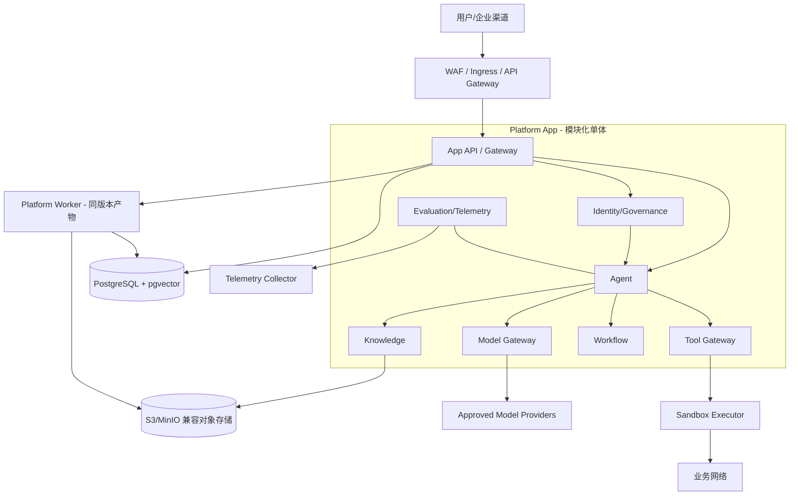
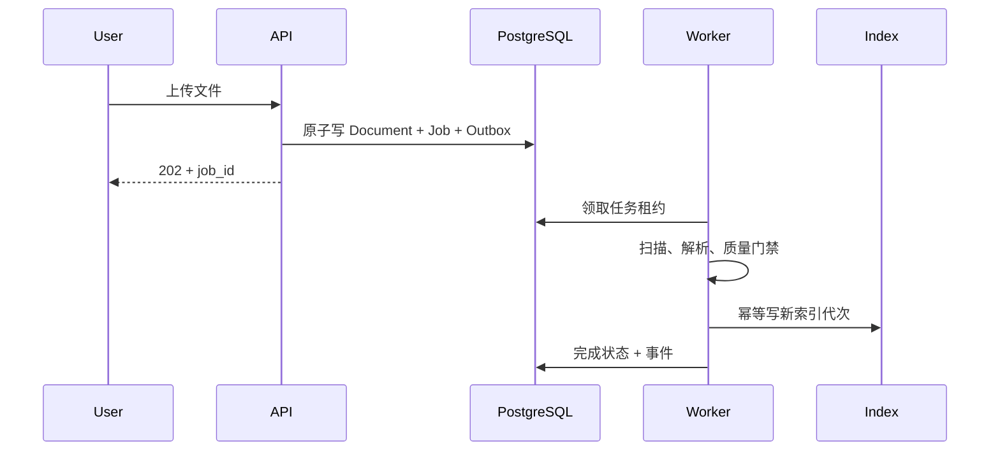

# 12 Deployment 架构设计

> 状态：Planned（目标设计，尚未实现） ｜ 一期形态：模块化单体 ｜ 部署原则：逻辑边界先行、按证据拆分、基础设施可替换

## 1. 核心决策

一期不是五个微服务。Gateway、Identity/Governance、Agent、Knowledge、Tool、Workflow、Evaluation 是同一代码库和应用宿主内的逻辑模块，通过模块 API 与事件边界隔离；异步 Worker 使用同一版本产物按角色启动。只有独立扩缩容、故障隔离、团队自治或合规隔离收益被测量并通过 ADR 后，模块才拆为独立服务。

数据基线为 PostgreSQL + pgvector；对象存储保存原始文档与大对象；事务 Outbox + Worker 提供一期异步能力。Redis、Kafka、独立向量数据库和 Workflow Engine 都是达到明确指标后的候选，不能作为尚未验证的硬依赖。

## 2. 部署模式与共享责任

| 模式 | 运行位置 | 数据/模型边界 | 责任重点 |
|---|---|---|---|
| SaaS | 平台管理环境 | 租户逻辑隔离；外部模型按租户策略路由 | 平台负责运行、升级、备份；客户负责身份配置与数据用途 |
| 私有化 | 客户网络/账户 | 数据、密钥、日志默认留在客户边界 | 客户负责基础设施；平台提供签名产物、升级/回滚和支持矩阵 |
| 混合 | 控制面与数据面分离 | 敏感数据面留在客户侧，控制面只接收最小元数据 | 双方明确连接方向、出站白名单、故障责任和断连模式 |

每个客户合同或部署清单必须明确 Tenant 隔离级别、数据地域、模型供应商、密钥所有权、SLO、RPO/RTO、升级窗口和事件响应责任。Air-gapped 环境还需离线镜像/模型/许可证包及签名验证流程。

## 3. 一期逻辑与物理拓扑

App 与 Worker 可独立扩容，但共享代码、Schema 和发布版本；这不代表微服务拆分。同步请求不得等待长时间解析或批量任务，API 返回 `job_id`，客户端查询状态或订阅事件。

## 4. 环境与容器编排

本地开发和最小试点使用容器化依赖；生产可使用 Kubernetes，但 Kubernetes 不是 Phase 0 的业务完成标准。采用 Kubernetes 时：

- dev/test/staging/prod 使用独立账户/集群或等效强隔离，不只依赖 Namespace；
- Namespace 按环境和责任划分，例如 `ai-platform-prod`、`ai-data-prod`、`ai-observability-prod`；
- 每个工作负载使用独立 ServiceAccount、最小 RBAC、NetworkPolicy、Pod Security 和资源配额；
- 配置与 Secret 分离，Secret 由外部 Secret/KMS 注入，禁止写入镜像、环境模板和日志；
- 设置 readiness/liveness/startup probe、优雅终止、PodDisruptionBudget、反亲和与容量余量；
- 数据库和对象存储优先采用经批准的托管或独立高可用形态，不与无状态 App 生命周期耦合。

## 5. 数据与存储

### 5.1 PostgreSQL + pgvector

保存业务实体、Workflow 状态、Tool Registry、Policy 元数据、审计索引、知识元数据、全文索引和向量。所有租户表包含 `tenant_id` 并启用行级策略或等效强制控制。迁移采用 expand/contract，先向后兼容再切换代码，禁止启动时由多个副本并发执行破坏性迁移。

向量索引按数据量和查询画像选择精确或近似索引参数，并通过 Recall/延迟测试确认。独立向量数据库仅在 pgvector 无法满足已批准 SLO、容量、隔离或运维要求时通过 ADR 引入。

### 5.2 对象存储

保存原始文件、解析产物、评测 Artifact 和导出包。启用版本、加密、租户前缀/策略、生命周期与不可变备份；客户端上传使用短期预签名地址、大小/MIME 限制和隔离扫描。

### 5.3 Redis 与缓存

Redis 是可选的性能优化，不作为会话、Workflow 或审批的唯一事实来源。缓存必须包含 tenant、主体权限摘要和版本，设置 TTL、容量上限和安全失效；敏感响应默认不缓存。

## 6. 异步任务与事件

一期使用 PostgreSQL Transactional Outbox、带租约的 Worker 和 Inbox 去重，先证明吞吐需求再评估 Kafka 等 Event Bus。

任务定义最大重试、退避、超时、取消、死信和人工重放。队列积压触发背压；不得以无限重试掩盖永久错误。引入外部 Event Bus 时必须补充 Schema Registry、分区/顺序、投递语义、Outbox Bridge 和灾备 ADR。

## 7. 网络与执行隔离

入口区、应用区、数据区、沙箱区、业务网络、管理面和外部模型出口是独立信任区。默认拒绝东西向和出站流量，仅按服务身份、端口、域名/IP 和用途开放。

- Internet 只能到 WAF/Ingress，管理接口走独立企业访问通道和增强认证；
- App 不能直接调用任意业务地址，Tool Gateway 经沙箱和出口代理访问 allowlist；
- 数据库/对象存储使用私有端点和 TLS，备份网络与业务网络隔离；
- 外部模型通过 Model Gateway，按数据分类执行 DLP、地域和供应商策略；
- 本地 MCP Server/Skill 运行在受限工作目录、非 root、只读镜像和资源/网络限额内。

## 8. 可用性、降级与容量

生产 App/Worker 至少跨故障域部署多个副本；数据库、对象存储和 KMS 按业务等级提供复制与故障转移。每项依赖必须定义超时、限流、熔断、隔舱和降级：模型不可用可切已评测供应商或明确失败；Retriever 不得在权限组件不可用时降级为无过滤检索；PDP 不可用默认拒绝。

容量模型至少包含并发请求、Token/秒、文档页/小时、向量数量、索引增长、对象存储、Workflow/Timer、Tool 调用和 Trace 日增量。压测使用脱敏/合成数据，输出饱和点、扩容阈值和成本，不以单实例平均值推算生产容量。

## 9. SLO 与可观测

App、Worker、数据库、模型网关、PDP、Retriever、Tool、Workflow 均输出 Metrics、Logs、Traces，统一 release、tenant、use_case、risk 和 trace/correlation 字段。高基数对象 ID 只进入受控 Trace。

每个部署登记可用性、P95/P99、错误预算、任务积压、索引新鲜度、成本与容量告警；关键告警必须关联 Owner 和 Runbook。Observability 组件部署在独立责任域，审计数据与普通诊断日志采用不同访问和保留策略。

## 10. 备份与灾难恢复

业务 Owner 在上线前按数据等级批准 RPO/RTO，未填写不得生产。至少分为：

- **Tier 1**：Identity/Policy、Workflow/Approval、Registry、审计和业务状态；采用高频备份/日志归档与优先恢复；
- **Tier 2**：知识元数据、Prompt/Agent 配置和评测数据；恢复后验证版本与引用；
- **Tier 3**：可由原文重建的向量/全文索引；保留重建工具、代次和预计恢复时间。

一期候选数值、保护方式和恢复顺序以 `19_生产运维规范.md` 的“备份与灾难恢复”为统一运行基线；本章只定义架构分层，不另设一套相互冲突的 RPO/RTO。候选值转为外部承诺前仍需业务 Owner 和部署责任方签字。

备份覆盖 PostgreSQL、对象、审计、Policy、Agent/Prompt、Tool/Skill Registry、Workflow、价格表、配置和密钥恢复材料。备份加密、异地或跨故障域、不可变并定期做完整恢复演练；“备份成功”不等于“恢复可用”。Runbook 包括故障判定、failover、DNS/连接切换、数据校验、索引重建、failback 和沟通。

## 11. 发布、回滚与供应链

CI 生成签名镜像、SBOM、迁移包和版本清单；部署采用环境晋级、不可变 Artifact、Canary/蓝绿和自动门禁。应用回滚前检查数据库兼容性，Policy/Prompt/Tool/Skill/模型配置也必须能按 release 回滚。

生产发布需通过安全扫描、离线评测、契约/迁移测试、容量基线、Canary、SLO 和成本门禁。紧急变更记录批准人、原因、范围、验证和补做 Review，不得形成永久旁路。

## 12. 拆分触发条件与验收

只有当某逻辑模块存在持续且可测的独立扩缩容、故障隔离、发布节奏、数据合规或团队所有权需求，并且拆分收益大于网络、数据一致性和运维成本时，才拆为服务。

部署验收至少包括：从空环境可重复安装；Secret/网络/租户隔离测试通过；数据库迁移和应用回滚演练成功；节点、可用区、模型供应商和 Worker 故障可降级恢复；备份完成全量恢复；PDP 故障不会放宽权限；关键 SLO、告警、Runbook 和容量预算均有有效 Owner。
