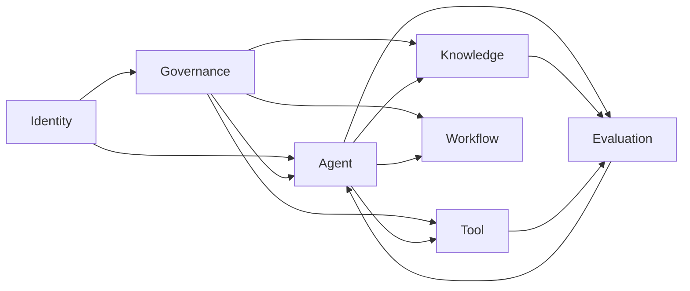

# 14 DDD 详细领域模型

> 状态：**Planned（目标设计，尚未实现）**。本文定义逻辑限界上下文与一致性边界；逻辑模块不等于独立微服务，一期按模块化单体部署。

## 1. 建模原则

- 所有业务数据必须带 `TenantId`；跨租户读取、关联、缓存复用和事件消费默认拒绝。
- 聚合内保持强一致，聚合间通过领域事件、Outbox 和幂等处理器最终一致；禁止跨聚合长事务。
- 领域对象不依赖 PostgreSQL、Kafka、MCP 等基础设施类型；适配器负责协议和持久化转换。
- 定义、版本和运行实例分离。已发布版本不可原地修改，新配置必须产生新版本。
- 权限判断采用“用户授权 ∩ Agent 授权 ∩ Tool 授权 ∩ 数据授权”，高风险副作用还必须满足审批策略。
- 原始提示词、凭据、个人信息和完整 Memory 不得写入领域事件或普通日志。

## 2. 限界上下文地图



| 上下文 | 核心职责 | 主要聚合根 |
|---|---|---|
| Identity | 租户、人员/服务/Agent 身份及成员关系 | `Tenant`、`Principal`、`Role` |
| Agent | Agent/Prompt/ModelPolicy 定义、执行、发布及会话/用户 Memory | `Agent`、`Prompt`、`ModelPolicy`、`ToolBinding`、`KnowledgePolicy`、`Release`、`AgentExecution` |
| Knowledge | 来源、文档版本、审核、发布和撤回 | `KnowledgeBase`、`Source`、`Document`、`IngestionJob` |
| Tool | Tool/Skill 契约、版本、风险、调用和业务 Adapter 注册 | `Tool`、`ToolExecution`、`SkillPackage`、`IntegrationRegistration` |
| Workflow | 确定性流程定义、实例、任务与审批生命周期 | `WorkflowDefinition`、`WorkflowInstance`、`ApprovalTask` |
| Governance | 策略、授权决定、风险和追加式可校验审计 | `Policy`、`PolicyDecision`、`RiskEvent`、`AuditStream` |
| Evaluation | 数据集、评测套件、运行结果、反馈和发布门禁 | `EvaluationSuite`、`EvaluationRun`、`Feedback` |

一期只有上述七个限界上下文。Agent Execution 与 Memory 属于 Agent Context；Skill 与业务能力 Adapter 属于 Tool Context；知识源 Connector 属于 Knowledge Context。它们可以是独立组件或聚合，但不新增数据所有权不清的 Context。

## 3. 核心聚合与不变量

### 3.1 Agent Context

| 聚合根 | 成员和值对象 | 必须保持的不变量 | 关键事件 |
|---|---|---|---|
| `Agent` | `AgentVersion`、Owner、Status | AgentKey 在租户内唯一；版本不可变；只有评测通过且审批完成的版本可发布 | `AgentVersionPublished`、`AgentDeprecated` |
| `Prompt` | `PromptVersion`、Variables、ContentHash | 已发布内容不可变；变量必须可解析，Secret 不得内嵌 | `PromptVersionPublished` |
| `ModelPolicy` | `ModelPolicyVersion`、Route、Fallback、Budget | 供应商、区域、数据分类和 fallback 均须获批 | `ModelPolicyPublished` |
| `ToolBinding` | `ToolBindingVersion`、ToolVersionRef、Scope | 只能绑定已发布 Tool；绑定不得扩大 Agent Grant | `ToolBindingPublished` |
| `KnowledgePolicy` | `KnowledgePolicyVersion`、KnowledgeBaseRef、Filters | 必须带 Tenant/ACL 与引用规则 | `KnowledgePolicyPublished` |
| `Release` | Environment、AgentVersionRef、GateEvidence | 只提升已发布且通过目标环境门禁的版本 | `AgentReleasePromoted`、`AgentReleaseRolledBack` |

### 3.2 Agent Execution

`AgentExecution` 保存 `AgentId`、`AgentVersion`、`WorkflowInstanceId`、`PolicySnapshotId`、状态/原因、取消传播、结果确定性、人工处置标记、检查点版本、重试预算、租约和输出引用。其状态与恢复规则以 `15_Agent状态机设计.md` 为唯一基线。

不变量：

- 创建时固定 AgentVersion、PromptVersion、ModelPolicyVersion、ToolBindingVersion 和 KnowledgePolicyVersion 五类版本，并另存 Governance PolicySnapshot；运行中不得静默漂移。
- 同一时刻最多一个有效执行租约；状态更新必须使用乐观并发版本。
- 完成、失败、取消等终态不可恢复为运行态，只能创建新执行或显式重放。
- 外部副作用必须携带 `IdempotencyKey`；检查点提交不得先于副作用结果登记。
- `ResultUnknown` 属于 ToolExecution 结果事实；必要结果未解析时 AgentExecution 保持 WaitingExternal，禁止进入终态。

事件：`ExecutionCreated`、`ExecutionStarted`、`ExecutionWaitingApproval`、`ExecutionWaitingExternal`、`ExecutionCheckpointed`、`ExecutionRetryScheduled`、`ExecutionCancellationRequested`、`ExecutionResultReconciled`、`ExecutionCompensationStarted`、`ExecutionCompensated`、`ExecutionCompleted`、`ExecutionFailed`、`ExecutionCancelled`、`ExecutionTimedOut`。

### 3.3 Knowledge

`Document` 包含 `SourceRef`、不可变 `DocumentVersion`、`ChunkRef`、`Provenance`、`AccessPolicySnapshot`、`Classification`、`KnowledgeScore` 和审核记录。`KnowledgeBase` 拥有 ACL、分类和保留策略；`Source` 拥有 Connector 版本、同步游标和 Secret Reference；`IngestionJob` 固定 Parser、Chunker、Embedding 和输入版本。

不变量：

- 每个版本必须可追溯至来源 URI、内容哈希、采集时间、Connector 版本和 Owner。
- 发布前必须完成权限继承、恶意内容/提示注入检测、冲突检查和适用审核路径。
- 更新产生新版本；撤回立即阻断检索，随后异步清理索引和缓存。
- Chunk 只能引用一个确定的文档版本，并继承其租户、分类和访问策略。

事件：`DocumentIngested`、`KnowledgeReviewRequested`、`KnowledgePublished`、`KnowledgeSuperseded`、`KnowledgeWithdrawn`、`KnowledgeExpired`、`KnowledgeReindexRequested`。

### 3.4 Tool、Skill 与业务 Adapter

`Tool` 管理不可变 `ToolVersion`，其契约含输入/输出 Schema、权限、风险、副作用、超时、幂等、审批和数据分类。`ToolExecution` 独立建模高频调用，不放入定义聚合。

`IntegrationRegistration` 固定业务系统、Adapter、认证方式、契约版本、允许的网络边界和下线状态。未经批准或已撤销的注册不得被发现或调用。

`SkillPackage` 包含不可变 `SkillVersion`、`SkillManifest` 和 `EvaluationEvidence`。状态只能按 Candidate→Evaluating→Reviewing→Canary→Published 推进，异常或替代状态为 Rejected/Quarantined/RolledBack/Superseded；Reviewing 包含安全门禁，且 Skill 不得自行扩大 Agent 或 Tool 权限。

事件：`ToolVersionRegistered`、`ToolInvocationRequested`、`ToolInvocationApproved`、`ToolInvocationSucceeded`、`ToolInvocationFailed`、`IntegrationRevoked`。

### 3.5 Workflow 与 Governance

- `WorkflowDefinition` 的已发布版本不可变；`WorkflowInstance` 负责确定性步骤、定时器和补偿进度，不复制 Agent 的推理上下文。
- Workflow 聚合内的 `ApprovalTask` 负责请求、待审、批准、拒绝、过期、撤销等生命周期；Governance 的 `PolicyDecision` 通过 obligations 给出不可变值对象 `ApprovalRequirement`、策略版本与授权约束，不持有审批任务。任务必须记录请求者、执行者、审批者、风险、执行快照、有效期和决策，请求者不得审批自己的高风险动作。
- `Policy` 及 `PolicyVersion` 版本化发布，`PolicyDecision` 固定输入摘要、结果、obligations 与策略版本。策略不可用时，高风险和写操作默认拒绝。
- `AuditStream` 只追加，记录主体、动作、资源、决策、理由、关联 Trace 和结果；敏感载荷只保存受控引用或摘要。

### 3.6 Identity、Agent Memory 与 Evaluation

- `Principal` 区分 Person、Service、Agent；停用主体后必须撤销会话、令牌和未使用审批。
- Agent Context 中的 `MemoryRecord` 必须声明 scope、purpose、classification、owner、consent、TTL 和删除状态；跨用户或跨租户召回禁止。企业事实知识归 Knowledge Context，不称为长期 Memory。
- `EvaluationRun` 固定数据集、评测器、模型、Prompt、Agent、Skill 和 Policy 版本；只有满足发布门禁的结果才能关联生产发布。

## 4. 领域事件信封

```json
{
  "event_id": "uuid",
  "event_type": "ExecutionCheckpointed",
  "event_version": 1,
  "occurred_at": "2026-07-22T10:00:00Z",
  "tenant_id": "tenant-a",
  "aggregate_id": "execution-id",
  "aggregate_version": 7,
  "actor_id": "agent-principal-id",
  "correlation_id": "business-request-id",
  "causation_id": "command-id",
  "trace_id": "trace-id",
  "data": {}
}
```

事件通过同事务 Outbox 发布；消费者以 `event_id` 去重，Schema 采用向后兼容演进。事件只表达已发生事实，不承载 Secret、原始文档或完整 Prompt。

## 5. 一致性与验证清单

- [ ] 聚合、表、API 和事件均能映射到 `TenantId` 与版本字段。
- [ ] Agent/Skill/Knowledge/Tool 的发布均有评测、审批和回滚路径。
- [ ] 状态机、工作流和外部副作用只有一个事实源，并通过关联 ID 串联。
- [ ] 所有写 Tool 完成权限、风险、审批、幂等和审计验证。
- [ ] 撤权、撤回、删除和租户停用可在约定时限内传播到缓存、索引与执行面。
