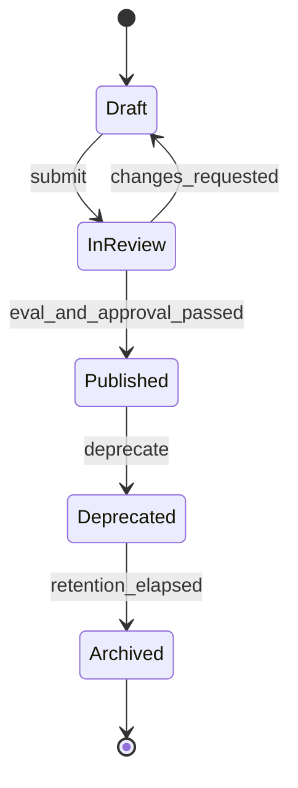
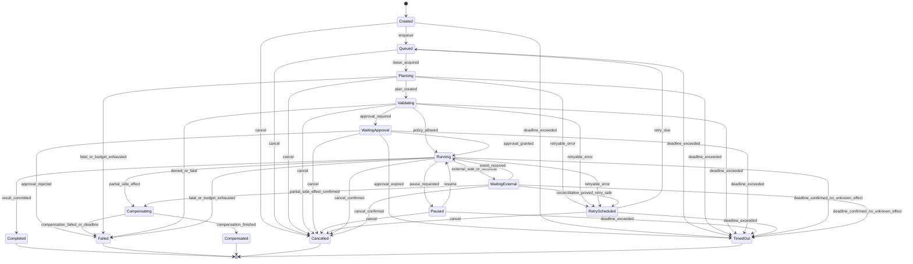

# 15 Agent 状态机设计

> 状态：**Planned（目标设计，尚未实现）**。本文只定义状态语义；持久工作流引擎和存储产品由 ADR 决定。

## 1. 目标与边界

企业任务需要长时间运行、人工审批、外部事件等待、故障恢复、取消和完整审计。必须区分：

- `AgentDefinition/AgentVersion`：描述“发布了什么能力”，不因一次任务而进入 Running。
- `AgentExecution`：描述“某个确定版本的一次运行”，保存检查点、租约和重试预算。
- `WorkflowInstance`：承载确定性步骤、定时器和补偿进度；通过 `workflow_instance_id` 与执行关联，不复制推理状态。

## 2. AgentDefinition 版本生命周期



| 转换 | Guard | 必须动作 |
|---|---|---|
| Draft→InReview | Schema 完整、引用的 Tool/Knowledge/Policy 版本存在 | 冻结候选内容并创建评测运行 |
| InReview→Published | 质量、安全、成本门禁通过且审批有效 | 生成不可变版本、签名并登记发布审计 |
| Published→Deprecated | 已指定替代版本或记录无替代原因 | 阻止新建执行；既有执行按策略完成或取消 |
| Deprecated→Archived | 无活跃执行且满足保留期 | 撤销发现入口，保留审计和版本证据 |

已发布内容不可原地修改；任何 Prompt、Model、Tool、Skill、Policy 变更都生成新版本并重新评测。

## 3. AgentExecution 状态机

`state` 只描述执行进度；取消意图、外部结果确定性和是否需要人工处置是正交事实，不得通过增加含糊的同义状态表达：

- `cancellation_status`：`none | requested | propagating | confirmed | not_cancellable`；
- `result_certainty`：`not_applicable | known | unknown | reconciled`；
- `intervention_required`：是否已创建并关联人工处置任务；
- `terminal_reason_code`：终态原因，例如 `user_cancelled`、`approval_rejected`、`approval_expired`、`deadline_exceeded`、`policy_denied`、`budget_exhausted` 或 `compensation_failed`。

`ResultUnknown` 是 Tool/外部 Activity 的结果确定性，不是新的 AgentExecution 状态。需要对账时，Execution 使用 `WaitingExternal` 并将 `result_certainty=unknown`，在结果查明前不得标记为 `Completed`、`Cancelled` 或 `TimedOut`。下图展示合法转换；第 4 节转换矩阵是规范性事实源。



`Completed`、`Compensated`、`Failed`、`Cancelled`、`TimedOut` 是终态，不允许改回 Running。进入任何终态前必须证明不存在 `result_certainty=unknown` 的必要 Tool/Workflow 结果。`Cancelled` 只表示取消已经确认且不存在结果未知的在途副作用；审批拒绝进入 `Failed`，审批过期进入 `TimedOut`，并分别记录原因码。人工修复后应创建带 `replay_of_execution_id` 的新执行。

## 4. 关键转换规则

| 当前状态 | 触发 | Guard | 下一状态 | 审计/副作用 |
|---|---|---|---|---|
| Queued | Worker 取任务 | 租约不存在或已过期，未超过截止时间 | Planning | 记录 lease owner 与期限 |
| Planning | 计划完成 | 计划有界、步骤 Schema 有效 | Validating | 保存计划摘要和检查点 |
| Validating | 策略决策 | 身份、租户、权限、数据、风险、预算均允许 | Running/WaitingApproval | 固定 `policy_snapshot_id` 和理由 |
| WaitingApproval | 审批批准 | 审批人有权、职责分离、未过期、请求内容未变化 | Running | 保存审批证据和范围 |
| WaitingApproval | 审批拒绝/过期 | 决定或计时器与当前审批请求匹配 | Failed/TimedOut | 分别记录 `approval_rejected` / `approval_expired`，不得混入用户取消 |
| Running | Tool 调用 | 契约版本可用；副作用操作有幂等键 | Running | Tool 结果先登记，再提交检查点 |
| Running/WaitingExternal | 外部结果未知 | 调用可能已到达外部系统且无法确认结果 | WaitingExternal | `result_certainty=unknown`，创建对账任务，禁止盲重试和提前终态化 |
| WaitingExternal | 外部事件 | correlation 匹配、Schema 合法、事件未消费 | Running | 以 event_id 去重 |
| Planning/Validating/Running/WaitingExternal | 暂时错误 | 错误可重试、结果已知且预算和截止时间允许 | RetryScheduled | 记录次数、退避和 `next_attempt_at` |
| Created/Queued/Planning/Validating/WaitingApproval/Paused/RetryScheduled | 取消请求 | 无未决外部副作用 | Cancelled | `cancellation_status=confirmed` 并记录发起者和原因 |
| Running/WaitingExternal | 取消请求 | 可能存在未决外部副作用 | 保持当前状态 | 标记 `requested/propagating`；确认无副作用后才进入 Cancelled，否则继续对账或补偿 |
| Created/Queued/Planning/Validating/WaitingApproval/Paused/RetryScheduled | 截止时间到达 | 无未决外部副作用且无有效延期 | TimedOut | 记录 `deadline_exceeded` 并取消后续调度 |
| Running/WaitingExternal | 截止时间到达 | 下游已停止且不存在结果未知 | TimedOut | 若结果未知则保持 WaitingExternal；确认部分副作用后进入 Compensating |
| Compensating | 补偿失败/超过补偿期限 | 自动补偿不可继续 | Failed | `intervention_required=true`，创建人工处置任务并保留残余影响 |

并发触发按以下优先级裁决：先以 `row_version/lease_epoch` 接受唯一状态写入；再确认外部副作用及结果确定性；最后决定终态。Cancel 和 Deadline 首先是意图/约束，不得覆盖已经提交的成功、部分副作用或结果未知事实。

策略服务不可用时，写操作、高风险操作和跨边界数据访问默认拒绝；只读低风险能力是否降级由版本化策略显式允许。

## 5. 持久状态与检查点

```json
{
  "execution_id": "exec-uuid",
  "tenant_id": "tenant-a",
  "agent_id": "maintenance",
  "agent_version": "3.2.0",
  "workflow_instance_id": "wf-uuid",
  "state": "waiting_approval",
  "state_reason": "purchase_order_requires_approval",
  "terminal_reason_code": null,
  "cancellation_status": "none",
  "cancel_requested_at": null,
  "cancel_requested_by": null,
  "result_certainty": "not_applicable",
  "unresolved_tool_execution_id": null,
  "intervention_required": false,
  "current_node": "create_purchase_order",
  "checkpoint_version": 8,
  "row_version": 13,
  "lease_owner": null,
  "lease_expires_at": null,
  "lease_epoch": 4,
  "attempt": 2,
  "retry_budget_remaining": 1,
  "next_attempt_at": null,
  "policy_snapshot_id": "policy-42",
  "approval_request_id": "approval-uuid",
  "input_ref": "secure://execution-input/uuid",
  "output_ref": null,
  "error": null,
  "correlation_id": "business-request-id",
  "trace_id": "trace-id",
  "created_at": "2026-07-22T10:00:00Z",
  "updated_at": "2026-07-22T10:02:00Z",
  "deadline_at": "2026-07-22T10:30:00Z"
}
```

- 状态写入采用比较并交换 `row_version`，冲突方重新加载，不覆盖新状态。
- 检查点保存确定性恢复所需的最小数据和受控引用；不得保存 Secret、访问令牌或无界完整对话。
- Worker 使用短租约和 heartbeat；租约过期只代表可重新调度，不代表前一次外部副作用未发生。
- 状态、Outbox 事件和检查点在同一数据库事务提交。

## 6. 重试、恢复与补偿

错误分类：

| 类型 | 示例 | 处理 |
|---|---|---|
| Transient | 限流、短暂网络故障 | 指数退避 + 抖动，尊重 `Retry-After` |
| Business | 库存不足、审批拒绝 | 不重试，返回可解释业务结果 |
| Policy | 无权限、数据策略拒绝 | 不重试；策略版本变更后创建新执行 |
| Contract | Schema 不兼容、缺少字段 | 隔离 Integration/Tool 版本并告警 |
| Fatal | 数据损坏、不可恢复状态 | 进入 Failed，保留诊断证据 |

- 重试预算由 Agent/Tool 契约和全局上限共同限制；不得无限循环。
- 系统不承诺跨外部系统的 exactly-once。通过至少一次交付、幂等键、结果查询和对账降低重复副作用。
- 补偿是显式业务动作，不等同数据库回滚。补偿成功进入 Compensated；补偿失败进入 Failed 并创建人工处置任务。
- Resume 必须从已提交检查点开始，重新校验租户、权限、审批有效期和外部契约版本。

## 7. 暂停、取消与人工介入

- Pause 停止调度新步骤，不撤销已提交副作用；Resume 前重新获取租约并检查策略。
- Cancel 必须传播到 Worker、Workflow 和可取消 Tool；不可取消调用通过 `cancellation_status=requested/propagating` 与 `result_certainty=unknown` 表达，在 WaitingExternal 中对账后再决定终态，不另造“取消待确认”状态。
- 人工介入只能通过受控命令修改允许字段，所有修改记录 before/after、操作者、理由和工单号。
- 审批内容、参数、风险或策略快照变化后，旧审批自动失效。

## 8. 验证场景

- [ ] Worker 在副作用成功、检查点提交前崩溃，恢复后不会重复创建业务对象。
- [ ] 租约过期造成双 Worker 竞争时，只有一个状态更新成功。
- [ ] 审批过期、被拒或参数被篡改时，执行不能进入 Running。
- [ ] 审批拒绝、审批过期和用户取消分别产生 Failed、TimedOut、Cancelled 及稳定原因码。
- [ ] 重试预算耗尽、截止时间到达和取消请求均遵循结果确定性规则；结果未知时不会提前进入终态。
- [ ] Cancel 与 Deadline 竞态、迟到成功结果和部分副作用均可通过对账或补偿收敛。
- [ ] 任一终态无法通过普通更新恢复为 Running。
- [ ] Trace 可串联计划、策略、审批、Tool、Workflow 和最终结果。
