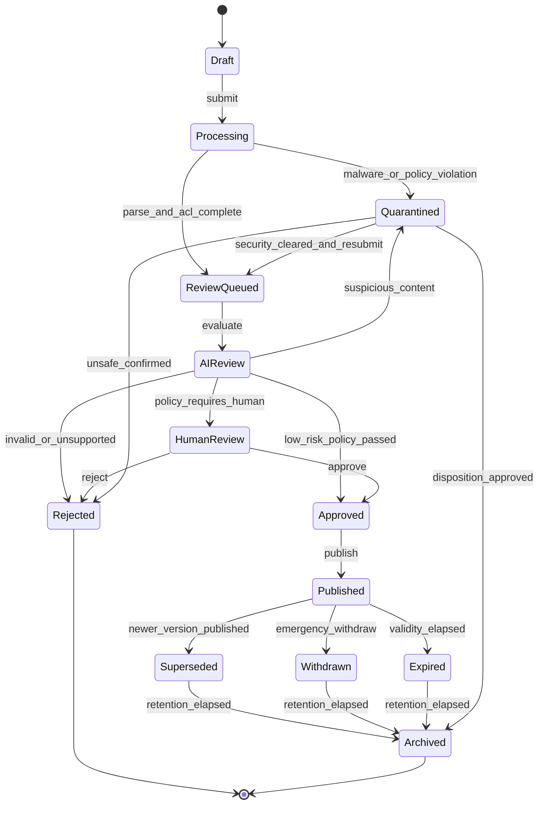

# 16 Knowledge 数据治理设计

> 状态：**Planned（目标设计，尚未实现）**。治理目标是让每条可检索知识都具备来源、权限、版本、责任人和可撤回路径，而不是只提高入库数量。

## 1. 治理原则

- **先授权再检索**：源系统 ACL 必须随内容进入平台，查询时再次按当前身份过滤；向量相似度不能绕过授权。
- **版本不可变**：已发布版本不原地覆盖；修订产生新版本，旧版本进入 Superseded 并保留审计。
- **来源不等于真相**：即使来自“官方目录”，仍须验证发布者身份、文件完整性、有效期、权限和冲突。
- **内容不是指令**：文档中的 Prompt、脚本和链接默认视为不可信数据，不能直接驱动 Tool 或扩大 Agent 权限。
- **自动化受策略约束**：AI 只生成候选、评分和证据；发布路径由版本化策略决定，允许人工否决和紧急撤回。

## 2. 知识生命周期



上述状态机是 Knowledge 领域事实源。每次转换写入追加式 `document_version_lifecycle_events`；不可变 DocumentVersion 内容行不回写状态，当前 `lifecycle_status` 由事件序列投影。跨资产通用晋级流程使用独立的 Release 事件投影 `promotion_stage`，用于发布门禁编排，不能替代或复制领域状态：

| 通用 `promotion_stage` | Knowledge 领域映射 |
|---|---|
| Candidate | `KnowledgeCandidate` 或 `DocumentVersion.Draft` |
| Evaluating | `Processing`、自动质量/安全检查和 `AIReview` |
| Reviewing | `ReviewQueued`、`HumanReview`、`Approved` |
| Canary | 可选受限 `KnowledgeRelease` 与流量策略；不作为 DocumentVersion 状态 |
| Published | `DocumentVersion.Published` |
| Rejected | `Rejected` |
| Quarantined | 独立安全处置状态 `Quarantined` |
| RolledBack | 撤回当前 Release、恢复上一有效版本；问题版本进入 `Withdrawn` |
| Superseded | `Superseded` |

`Expired`、`Archived` 以及删除流程的 `Tombstoned/Purged` 是 Knowledge 专属状态，不强行映射为通用晋级阶段。对外只能暴露一个由追加式事件投影的有效 `lifecycle_status`；`promotion_stage` 由独立 Release 事件投影，两者不允许互相覆盖，投影表可以重建且不能反向修改历史事件。

`Quarantined` 不是正常路径，也不是无出口的隐式终态。安全人员确认误报且原内容未变化时可重新进入 ReviewQueued；确认不安全时进入 Rejected；按批准的保留/处置策略进入 Archived。若需要修改内容，必须创建新的 Draft/DocumentVersion，不能原地修复被隔离版本。

用户反馈是 `KnowledgeFeedbackRecorded` 事件，不是内容状态。反馈、来源变化或冲突会创建新的 Draft 或触发紧急撤回，不直接修改 Published 内容。

## 3. 策略驱动审核

审核策略至少输入以下维度：

| 维度 | 示例 | 对审核路径的影响 |
|---|---|---|
| 来源身份 | 受管 Connector、人工上传、外部网页 | 未验证来源不得自动发布 |
| 数据分类 | 公开、内部、机密、受限 | 机密/受限内容必须人工审核并限制索引 |
| 内容用途 | 参考知识、制度、操作指令、安全规范 | 会驱动业务动作的知识采用更严格门禁 |
| 解析质量 | OCR 置信度、表格/版面完整度 | 低于阈值转人工或拒绝 |
| 冲突与新鲜度 | 同主题多个有效版本 | 冲突未解决不得发布为权威答案 |
| 安全信号 | 恶意文件、提示注入、敏感信息 | 隔离并创建安全事件 |

阶段策略：

1. **初期**：所有内容人工审核，先建立金标集和误差基线。
2. **辅助期**：AI 给出重复、冲突、来源、敏感和风险证据；人工作最终决策。
3. **受控自动期**：只有低风险、已认证来源、结构和 ACL 完整、评测持续达标的类别可自动发布；按比例抽检并支持一键停用。

自动发布不是项目默认能力，必须由单独策略版本、评测报告和责任人审批启用。

## 4. 来源、血缘与版本

每个 `DocumentVersion` 至少保存：

```json
{
  "tenant_id": "tenant-a",
  "asset_id": "asset-uuid",
  "version_id": "version-uuid",
  "source_system": "controlled-files",
  "source_uri": "source://document/123",
  "source_revision": "rev-18",
  "content_hash": "sha256:...",
  "connector_version": "1.4.0",
  "ingested_at": "2026-07-22T10:00:00Z",
  "effective_from": "2026-07-01T00:00:00Z",
  "effective_to": null,
  "classification": "internal",
  "owner_id": "principal-id",
  "access_policy_snapshot_id": "acl-uuid",
  "review_policy_version": "knowledge-policy-7"
}
```

- 原文件、解析产物、Chunk、Embedding 和索引条目必须通过 `version_id` 串联。
- Chunk 保存页码/Sheet/Slide/章节等定位信息；引用必须能回到用户有权访问的原始位置。
- 相同哈希可消除完全重复；近似重复只生成候选，不自动合并。
- 权威冲突由 Owner 选择有效版本或明确并列适用条件，模型不得自行裁决制度冲突。

### 4.1 Gate F 本地证据边界

当前 PoC 用 `Data\approved-source.json` 登记合成来源的固定 Tenant、Owner、分类、版本、相对路径、Group ACL 和 SHA-256。加载器在检索前验证清单与文件一致性，并拒绝路径越界、重解析点、哈希不符或 ACL 缺失。Gate F.1 另以进程内投影验证 Group/ACL 变更、撤回、过期和删除；最小本地摄取切片验证 Markdown/TXT 内容哈希幂等、无效文件隔离和源删除撤出。它们只证明本地确定性契约；Owner 是测试占位身份，状态没有持久化事件历史，也未实现真实 Connector ACL、恶意文件扫描、Legal Hold、正式审核或发布审批。

## 5. ACL、隐私与保留

- 采集时保存源 ACL 快照，查询时结合实时身份和撤权事件重新判定；无法确认权限时默认拒绝。
- 缓存、Embedding、摘要、评测样本和备份继承原内容的 Tenant、分类、地域和保留约束。
- 删除请求采用“立即禁止检索 + 后台清理派生数据 + 完成证明”；备份按既定保留期自然淘汰并记录例外。
- PII、凭据、密钥、健康/财务等敏感字段在解析前识别，按策略遮蔽、分区或拒绝入库。
- Owner 离职、部门撤销或来源失联时，内容进入待接管队列；超过 SLA 自动暂停发布或撤回。

## 6. 内容安全与投毒防护

入库链路依次执行：文件类型和大小校验、反恶意软件、解压限制、解析沙箱、敏感数据检测、提示注入/异常链接检测、来源签名与哈希校验。

检索与生成阶段：

- 把检索内容放入明确的数据边界，不允许其覆盖系统策略或发起 Tool 调用。
- 对跨文档冲突、低置信和来源不足的答案触发拒答或人工确认。
- 引用展示来源、版本、适用时间和定位；撤回版本不得继续出现在缓存答案中。
- 对异常上传量、异常引用增长、相似内容批量污染和检索分布漂移告警。

## 7. Knowledge Score

评分用于排序、复审优先级和风险提示，不能替代权限或审核。维度包括 `provenance`、`review_evidence`、`freshness`、`feedback`、`task_effectiveness` 和 `conflict_penalty`。

```text
quality_score = Σ(weight_i × calibrated_dimension_i) - conflict_penalty
Σ(weight_i) = 1
```

权重、阈值和计算代码必须版本化，并用人工标注集校准。报告同时展示各维度、样本量和置信区间，禁止只展示一个看似精确的总分。低使用量内容不得因缺少负反馈自动获得高分。

## 8. Gap、Evolution 与反馈闭环

- `Knowledge Gap Agent` 只创建补充候选：高频无答案、低满意度、拒答和缺失来源。
- `Knowledge Evolution Agent` 只创建版本比较、冲突和过期候选，不直接发布或删除。
- 用户反馈记录答案、引用、模型/Prompt/检索版本和可见范围；敏感反馈不得进入公共评测集。
- 所有候选继续走本文定义的 `Draft → Processing/Review → Approved → Published` 合法转换；跨资产晋级由 `promotion_stage` 编排，并支持撤回问题 Release、恢复最近有效版本。

## 9. 责任、指标与验收

每类知识必须有 Owner、Reviewer、所属部门、复审周期和升级联系人。至少监控：入库成功率、审核时长、撤权传播时间、引用正确率、过期率、冲突积压、拒答率、投毒拦截和撤回完成时间。

- [ ] 任意答案可追溯到有权访问的原文件版本与位置。
- [ ] 源 ACL 撤销后，检索、缓存和 Agent 执行面在约定 SLA 内同步失效。
- [ ] 新版本发布不会覆盖旧版本证据，且能回滚。
- [ ] 恶意文件、提示注入和受限数据不会进入普通索引或日志。
- [ ] 自动发布策略可停用、可审计，并持续通过离线评测与人工抽检。
