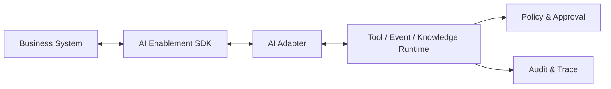

# 17 AI Enablement SDK 规范

> 状态：**Planned（目标设计，尚未实现）**。SDK 是业务系统接入契约的语言封装，不是绕过 Adapter、Policy、Approval 或 Audit 的快捷通道。

## 1. 目标与非目标

SDK 让业务系统以一致方式声明 Tool、发布 Event、提交 Knowledge，并传播身份和 Trace。它负责客户端校验、序列化、认证适配、遥测和契约测试。

SDK 不负责：自动推断权限或风险、保存平台密钥、替业务系统实现业务事务、把数据库直接暴露给 Agent、保证跨系统 exactly-once。

## 2. 逻辑架构



业务系统仍是业务规则和数据的事实源。Adapter 负责协议转换、身份映射、网络边界和向后兼容；Runtime 负责发现、策略执行、限流、调用编排与审计。

## 3. 通用契约信封

所有请求和事件必须携带可追踪且不包含凭据的信封：

```json
{
  "contract_version": "1.0",
  "message_id": "uuid",
  "tenant_id": "tenant-a",
  "actor": {
    "subject_id": "user-or-service-id",
    "actor_type": "person",
    "delegated_by": "agent-principal-id"
  },
  "correlation_id": "business-request-id",
  "causation_id": "parent-message-id",
  "traceparent": "00-...",
  "occurred_at": "2026-07-22T10:00:00Z",
  "data_classification": "internal",
  "payload": {}
}
```

`tenant_id` 必须从已验证身份和注册关系得到，禁止信任调用者任意传入的租户值。`message_id` 用于去重，不作为授权凭证。

## 4. Tool Contract

### 4.1 显式描述

```yaml
tool:
  name: query_device
  version: 1.2.0
  description: 查询调用者有权查看的设备状态
  input_schema:
    type: object
    additionalProperties: false
    required: [device_id]
    properties:
      device_id: { type: string, maxLength: 64 }
  output_schema:
    $ref: "schemas/device-status-1.0.json"
  error_schema:
    $ref: "schemas/tool-error-1.0.json"
  permissions: [device.read]
  risk_level: low
  side_effect: none
  idempotency: not_required
  timeout_ms: 3000
  retry:
    allowed_on: [rate_limited, temporarily_unavailable]
    max_attempts: 2
  approval: none
  data_classification: internal
  owner: device-platform-team
```

写操作还必须声明：

- `side_effect`、业务幂等键、预览/dry-run、审批策略、补偿或对账入口。
- 可重试错误范围；未声明或结果未知时不得盲目重试。
- 输入、输出、错误 Schema 和最大载荷；禁止 `additionalProperties` 无界透传。

权限、风险、审批、数据分类和审计字段必须由 Owner 显式声明并经平台审核，SDK 不得从方法名自动推断。

### 4.2 调用语义

调用流程固定为：验证契约→验证身份/租户→Policy→必要时 Approval→Adapter→Business→结果校验→Audit。同步超时不代表业务失败；对可能已提交的写操作，调用方必须先按幂等键查询结果再决定重试。

统一错误至少包括：`invalid_argument`、`unauthenticated`、`permission_denied`、`approval_required`、`conflict`、`rate_limited`、`temporarily_unavailable`、`deadline_exceeded`、`contract_mismatch`、`internal`。错误响应不得返回堆栈、SQL、凭据或敏感业务数据。

## 5. Event Contract

事件表示已发生事实，名称采用过去时，例如 `device.alarm_raised.v1`。事件至少声明 Schema、Owner、分区键、敏感级别、保留时间和兼容策略。

```json
{
  "event_type": "device.alarm_raised.v1",
  "event_id": "uuid",
  "source": "device-system",
  "subject": "device/A001",
  "tenant_id": "tenant-a",
  "occurred_at": "2026-07-22T10:00:00Z",
  "schema_version": 1,
  "correlation_id": "alarm-correlation-id",
  "data": { "alarm_code": "E302" }
}
```

- 默认采用至少一次投递；消费者按 `event_id` 幂等。
- 只在同一 `partition_key` 内承诺顺序；跨分区不得依赖全局顺序。
- 重试耗尽进入 DLQ，并提供受控重放；重放保留原 `event_id` 和发生时间。
- Event 不应直接赋予 Agent 权限。触发执行时重新完成身份、策略、预算和风险检查。
- Schema 的新增可选字段可向后兼容；删除、改名或语义变化必须发布新主版本。

## 6. Knowledge Contract

业务系统提交的是知识候选，不是直接可检索的已发布知识：

```yaml
knowledge_candidate:
  source_uri: "device-system://case/123"
  source_revision: "8"
  content_hash: "sha256:..."
  title: "E302 报警处理记录"
  effective_from: "2026-07-01T00:00:00Z"
  classification: internal
  owner_id: "principal-id"
  acl:
    mode: source_managed
    policy_ref: "device-system://acl/case/123"
  retention_policy: "maintenance-case-v1"
  content_ref: "signed-upload://uuid"
```

平台必须验证来源、哈希、ACL、Owner 和内容安全，再进入 `16_Knowledge数据治理设计.md` 定义的领域状态机；SDK 只提交 Candidate，不能直接指定 Approved/Published 或通用 `promotion_stage`。SDK 不接受内嵌凭据、任意本地路径或跨租户 ACL。

## 7. Identity、Secret 与 Trace

- 人员操作采用短期用户委托令牌；后台任务采用独立服务身份；Agent 使用可撤销 Agent Principal。
- 令牌只授予目标系统、目标 Tool 和最短有效期，不得写入日志、事件、状态或 Knowledge。
- SDK 从受控 Secret Provider 获取凭据，不在配置文件中保存明文密钥；支持轮换和吊销。
- 传播 W3C Trace Context；Span 至少标识 contract、tool/event、版本、租户伪匿名标识、策略结果、审批等待和耗时。
- Prompt、Tool 参数和结果默认不进入 Trace；需要采样时执行字段级脱敏和保留策略。

## 8. 版本与兼容

- SDK 包、Contract 和具体 Tool/Event 各自使用语义化版本，不共享一个隐式版本号。
- SDK 支持当前主版本和上一主版本的迁移窗口；具体期限由发布策略批准并公开。
- Registry 在注册时执行兼容性检查；破坏性变更必须并行发布新版本，禁止静默替换。
- Python、C#、Java、JavaScript SDK 均为 Planned；先以语言中立 Contract 和 conformance suite 为基线，各语言 GA 状态单独公布。
- 每个 SDK 发布物必须生成依赖清单、校验和及签名，并经过漏洞和许可证检查。

## 9. MCP 兼容边界

平台 Planned 支持 MCP Server，基线规范固定为 **2025-11-25**。面向外部消费者时平台作为受管 Server；调用经批准的外部 Server 时，Agent Runtime 作为 Host 并为每个远端建立隔离 Client。映射范围为 Tool、Resource 和授权后的发现；是否兼容某个客户端必须通过测试矩阵证明，不能仅凭“支持 MCP”宣称兼容 ChatGPT、Claude 或 OpenClaw。

MCP 暴露仍经过租户隔离、身份委托、Policy、Approval、限流和 Audit。协议内容不能成为可信指令，远端 Server 也不能获得平台通用凭据。规范来源：[Model Context Protocol 官方仓库](https://github.com/modelcontextprotocol/modelcontextprotocol)（核查日期：2026-07-22）。

## 10. Conformance Suite

接入上线前必须自动验证：

- [ ] Contract Schema、示例和错误响应均可解析，未知字段策略一致。
- [ ] 缺失/伪造 Tenant、过期令牌、越权和跨租户访问均被拒绝。
- [ ] 写 Tool 在超时、重复投递和 Worker 重启下不会产生未识别的重复副作用。
- [ ] Event 可去重、进入 DLQ、受控重放并保持关联链路。
- [ ] Knowledge 候选保留来源、ACL、版本和撤回能力。
- [ ] Trace 能串联 Runtime、Policy、Approval、Adapter 和 Business，且不泄露 Secret/PII。
- [ ] 新旧主版本按兼容矩阵运行；不兼容变更在注册阶段被阻断。
