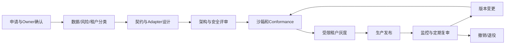
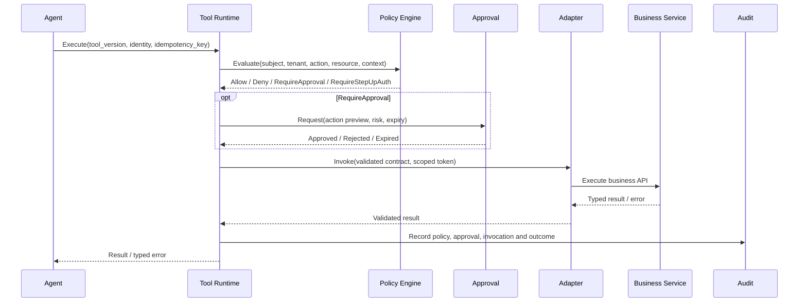

# 18 企业系统接入规范

> 状态：**Planned（目标设计，尚未实现）**。接入资格来自安全评审和 conformance 证据，不以“能连通”为上线标准。

## 1. 目标与强制边界

企业系统通过受管契约向 AI 平台暴露最小必要能力。无论 REST、gRPC、MCP 或 Event，调用路径必须是：

```text
Agent → Runtime → Policy / Approval → Adapter → Business → Audit
```

- Agent 禁止直连业务数据库、消息中间件、内部管理端口或共享管理员凭据。
- Adapter 不得绕过业务服务中的领域校验，也不得把平台身份替换为超级用户。
- 所有生产能力必须有 Owner、租户范围、契约版本、风险等级、数据分类、SLO、停用和回滚入口。

## 2. 接入方式与适用范围

| 方式 | 适用场景 | 必须约束 |
|---|---|---|
| REST | 通用同步查询和短时命令 | TLS、版本化路径、Schema、幂等、限流、超时和统一错误 |
| gRPC | 内网低延迟、强类型服务调用 | TLS、Proto 兼容、deadline、消息大小和错误映射 |
| MCP | Tool/Resource 的标准发现与调用 | 固定协议版本、逐主体授权、Server 信任分级、会话隔离 |
| Event Bus | 事实通知、异步触发 | Schema、至少一次投递、分区顺序、去重、DLQ、重放和保留 |
| File/Knowledge | 批量文档和业务知识候选 | 来源、哈希、ACL、分类、Owner、保留与撤回 |

不得用 Event 替代需要即时结果的命令，也不得用同步 API 承载不可控的长任务。长任务返回 `operation_id`，由轮询、回调或 Workflow 跟踪。

## 3. 接入生命周期



### 3.1 申请与分类

接入申请记录业务目标、Owner、支持联系人、用户群、租户、数据分类、地域、预计 QPS、延迟目标、上下游依赖和故障影响。写操作、高风险数据、跨境或跨租户能力必须走增强评审。

### 3.2 契约注册

Registry 保存：系统和 Adapter 身份、Tool/Event/Knowledge Schema、权限、风险、副作用、超时、重试、幂等、审批、数据分类、版本、SLO、健康检查和下线日期。Registry 只接受签名且通过兼容检查的 Contract。

### 3.3 沙箱与灰度

沙箱使用合成或脱敏数据，运行 `17_AI_Enablement_SDK规范.md` 的 conformance suite、安全测试、负载测试和故障注入。通过后只向批准的测试租户和 Agent 版本可见；灰度期间设置更低配额和自动停用阈值。

### 3.4 生产、变更与退役

生产发布必须关联评审、测试、Owner 和回滚版本。破坏性变更并行发布新主版本；旧版本按公告窗口弃用。退役先禁止发现和新调用，再等待在途任务结束或补偿，撤销身份/Secret，最后保留规定期限的审计证据。

## 4. 标准调用路径



Audit 同时记录拒绝、超时和未知结果。若 Audit 暂时不可用，高风险写操作默认拒绝；允许降级的低风险只读调用必须进入本地耐久缓冲并在恢复后补交。

## 5. 身份、授权与租户隔离

- 人员请求保留原始用户身份；Agent 是委托执行者，不得把所有调用归为同一服务账号。
- 有效权限为用户、Agent、Tool 和数据授权的交集；任一层拒绝即拒绝。
- Adapter 使用目标系统认可的短期、限受众令牌；禁止共享长期管理员密钥。
- Tenant 从受信身份映射得到，必须与 Registry、资源和 Contract 的 Tenant 一致。
- 审批采用职责分离；请求者、Agent 和 Tool Owner 不得自动审批自己的高风险动作。
- 撤权、离职、系统隔离或安全事件必须能立即阻断发现和新调用。

## 6. 契约、版本与错误

- API、Proto、Event 和 Tool 均采用 Schema-first；示例不能替代正式 Schema。
- 同一主版本只允许向后兼容变更；字段语义变化、权限扩大和副作用变化必须升主版本并重审。
- 所有调用设置 deadline、最大载荷、并发和速率限制；Adapter 不能无限等待或无界缓存。
- 统一错误映射到 `invalid_argument`、`permission_denied`、`approval_required`、`conflict`、`rate_limited`、`temporarily_unavailable`、`deadline_exceeded`、`contract_mismatch`、`internal`。
- 错误日志和响应不得包含 Token、Secret、SQL、内部地址、完整个人数据或未授权资源存在性。

## 7. 可靠性与副作用控制

- 只对明确列入 Contract 的暂时错误重试，并采用指数退避、抖动和总重试预算。
- 写操作必须有业务幂等键；超时后先查询操作状态，不能直接重复提交。
- Event 消费按 `event_id` 去重；DLQ 重放需审批、影响预览、速率限制和完整审计。
- Adapter 实现熔断、背压和健康状态；Runtime 在依赖异常时停止把流量放大到业务系统。
- 部分成功必须返回已提交步骤和补偿/对账入口，禁止只返回笼统的 `500`。

## 8. AI Adapter 职责

Adapter 只负责：

- 平台 Contract 与业务 API/事件之间的确定性转换。
- 身份委托、Tenant 映射和最小权限 Token 获取。
- 输入/输出 Schema 校验、错误映射、幂等和 Trace 传播。
- 协议兼容、限流、熔断、健康检查和脱敏遥测。

Adapter 不负责业务决策、自动审批、动态扩大权限或把数据库表包装成通用查询 Tool。适配逻辑必须可测试、可版本化、可回滚。

## 9. 示例：库存系统

| 能力 | 风险与约束 |
|---|---|
| `query_inventory@1` | `inventory.read`；只返回调用者有权查看的仓库和字段 |
| `create_purchase_order@2` | `inventory.purchase.create`；写副作用、强制幂等、金额阈值审批、支持按业务键查询 |
| `inventory.stock_low.v1` | 以仓库为分区键；至少一次投递；消费者去重 |
| 维修案例 Knowledge | 继承工单 ACL、分类和保留策略；只提交候选，不直接发布 |

## 10. 可观测性与运营

指标至少包括调用量、成功率、p95/p99 延迟、限流、熔断、重试、重复抑制、未知结果、审批等待、DLQ、Contract 不兼容和撤权传播。Trace 串联 Agent、Runtime、Policy、Approval、Adapter、Business 和 Audit；载荷默认不采集。

每个接入必须提供 Runbook：Owner/值班、依赖、健康检查、常见错误、限流策略、降级方式、Kill Switch、对账、回滚和升级路径。

## 11. 上线验收清单

- [ ] Agent 无法绕过 Runtime/Policy/Approval/Adapter 直达 Business 或数据库。
- [ ] 正常、拒绝、审批、超时、重复请求、部分成功和依赖故障均通过测试。
- [ ] 跨租户、越权、过期令牌、伪造身份和 Contract 篡改均被拒绝。
- [ ] 写操作可预览、可幂等、可对账、可补偿或明确不可补偿边界。
- [ ] Event 可去重、重放和隔离，Knowledge 可追溯、撤权和撤回。
- [ ] 指标、告警、Runbook、Owner、回滚和退役方案已完成评审。
