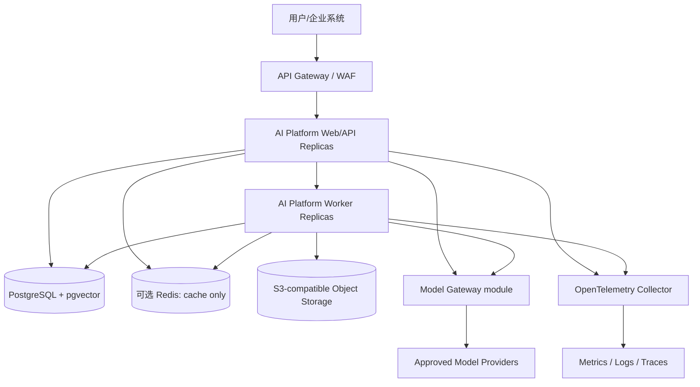
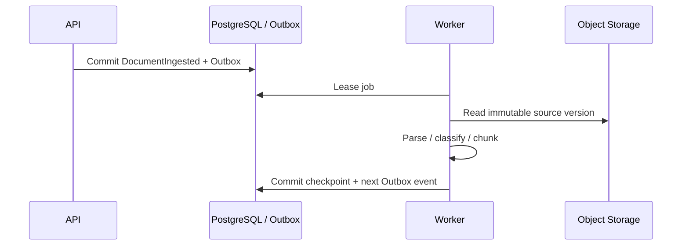
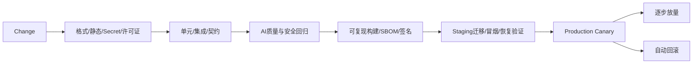

# 19 生产运维规范

> 状态：**Planned（生产目标基线，尚未部署或验证）**。本文件中的数值是一期候选门槛，必须在容量测试、业务影响分析和上线评审后批准；未通过证据验证前不得宣称达标。

## 1. 生产原则

- 一期采用模块化单体：Agent、Knowledge、Tool、Workflow、Governance、Evaluation 是逻辑模块，不默认拆成独立微服务。
- Web/API 与 Worker 可使用同一版本化制品、按进程角色独立扩缩；数据库 Schema 仍按模块隔离所有权。
- 一期向量能力固定为 PostgreSQL + pgvector，不同时维护独立 VectorDB。
- PostgreSQL/Outbox 是业务状态和事件事实源；Redis 只用于可重建缓存、短期会话和协调，不作耐久队列或审计事实源。
- 所有变更可观测、可回滚、可审计；安全和 AI 质量门禁与传统可用性门禁同等重要。

## 2. 一期部署拓扑



`Web/API` 和 `Worker` 内都可包含多个逻辑模块；图中的副本不是微服务边界。Kafka、独立向量库、多区域和 GPU 集群不属于一期必需依赖，只有满足 ADR 复审条件后才引入。

### 2.1 采用 Kubernetes 时的安全与可用基线

Kubernetes 是通过部署 ADR 后才启用的生产候选，不是 Phase 0 或一期业务完成的前提；采用时必须满足以下最低要求：

- 环境使用独立集群或至少独立账号、Namespace、数据库和密钥边界；Production 不与 Development 共用节点或凭据。
- 工作负载使用非 root、只读根文件系统、最小 Linux capabilities、资源 request/limit、NetworkPolicy 和受控 egress。
- Web/Worker 至少两个副本，配置 readiness/liveness/startup probe、PodDisruptionBudget 和跨故障域分散。
- HPA 基于 CPU、队列积压、并发执行和延迟扩缩；设置最大副本数，防止模型或下游故障时无限放大成本与流量。
- 镜像使用 digest 固定，配置和 Secret 与镜像分离；禁止 `latest` 标签进入生产。

## 3. 环境与数据隔离

| 环境 | 用途 | 数据要求 | 发布要求 |
|---|---|---|---|
| Development | 本地开发和组件调试 | 合成数据，禁止生产凭据 | 可快速迭代 |
| Testing | 自动集成、契约、安全和 AI Evaluation | 固定测试集/脱敏样本 | CI 自动部署 |
| Staging | 生产等价验证、迁移和恢复演练 | 最小化脱敏快照或合成数据 | 与生产同制品、人工准入 |
| Production | 真实业务 | 强租户隔离、加密、审计和最小权限 | 审批、Canary、自动回滚 |

跨环境访问默认拒绝。生产数据进入非生产必须经过数据 Owner 和安全审批、脱敏验证、限时授权和销毁证明。

## 4. SLI、SLO 与错误预算

一期候选目标如下；最终值由需求基线确认：

| 用户旅程/组件 | SLI | 候选 SLO（月度） |
|---|---|---|
| 身份验证后的控制面 API | 非计划维护外成功响应比例 | ≥ 99.9% |
| 执行创建/状态查询 | p95 服务端延迟，不含外部模型/Tool | ≤ 500 ms |
| Knowledge 检索 | p95 检索与重排延迟，按基准语料 | ≤ 1.5 s |
| 流式回答 | p95 首 Token 时间，按基准模型和标准请求 | ≤ 4 s |
| 已接受异步任务 | 未丢失且最终进入终态比例 | ≥ 99.99% |
| 高风险 Tool | 未经有效审批执行次数 | 0 |
| 跨租户数据泄露 | 已确认事件数 | 0 |

- 外部模型和业务 Tool 的延迟、错误率单独计量，同时报告端到端体验，禁止用“外部依赖”隐藏用户影响。
- 错误预算按月计算；预算消耗超过 50% 触发发布收紧，耗尽后停止非修复发布。
- AI 质量另设发布门禁：任务成功、groundedness、引用正确、安全违规、拒答、成本和回归差异；具体阈值由 Evaluation 基线版本管理。

## 5. 异步任务与状态恢复



- API 不在请求事务内执行长任务；提交业务状态和 Outbox 后返回 `operation_id`。
- Worker 使用租约、heartbeat、检查点和幂等键；租约过期后可重调度。
- Outbox 发布失败可重试；消费者按 `event_id` 去重。不得用 Redis List 作为唯一耐久队列。
- 每个队列设置并发、租户公平配额、最大尝试、退避、DLQ 和受控重放。
- 长期 Workflow 引擎的具体产品选择由 ADR 控制，不改变 `15_Agent状态机设计.md` 的领域状态语义。

## 6. 数据层运维

### 6.1 PostgreSQL + pgvector

负责业务数据、状态机、Metadata、Embedding、索引元数据、Outbox 和审计索引。基线要求：

- 高可用托管实例或自动故障转移架构；使用“主实例/只读副本”术语，不依赖手工主从切换。
- 持续归档/WAL 与时间点恢复，备份加密，季度执行隔离环境恢复演练。
- 每次迁移提供向前/向后兼容窗口、耗时估算、锁影响、回滚或前滚方案；禁止应用与破坏性 Schema 同时发布。
- pgvector 索引参数用真实租户规模和检索基准验证；召回、延迟或容量超过 ADR 门槛后才评估专用向量库。
- TenantId 进入主键/索引或强制过滤路径；行级策略不能替代应用层授权测试。

### 6.2 Redis

仅保存可重建缓存、短期会话和限时协调数据，必须设置 TTL、租户前缀、内存上限和淘汰策略。缓存失效不能造成权限放宽；源 ACL 撤销时主动失效相关条目。Redis 数据丢失不得导致业务状态、审批、审计或任务永久丢失。

### 6.3 Object Storage

保存原文件、解析产物、图片和附件的不可变版本。启用加密、版本控制、生命周期、恶意文件隔离、租户前缀和最小权限签名 URL。对象、数据库元数据和派生索引通过 `version_id` 对账。

## 7. 可观测性

统一使用 OpenTelemetry 语义传播 Trace，Metrics、Logs、Traces 通过 Collector 输出到经批准的后端。

### 7.1 指标

- 平台：请求率、错误率、p50/p95/p99、饱和度、队列深度、租约过期、重试、DLQ、数据库连接与锁。
- Agent：执行终态、节点耗时、恢复/取消、模型错误、首 Token、Token、成本、预算拒绝。
- Knowledge：入库阶段耗时、解析失败、ACL 拒绝、检索延迟、引用正确率、撤权传播、过期/冲突积压。
- Tool：策略拒绝、审批等待、调用成功、未知结果、重复抑制、熔断、下游延迟。
- 安全：认证失败、跨租户拒绝、策略异常、Secret 使用异常、恶意文件和提示注入信号。

“命中率”不能作为单独质量结论；必须结合标注集、groundedness、引用正确性和用户任务结果。

### 7.2 日志与 Trace

```json
{
  "timestamp": "2026-07-22T10:00:00Z",
  "level": "INFO",
  "event": "tool_invocation_completed",
  "deployment": "production",
  "module": "tool",
  "tenant_key": "pseudonymous-tenant-key",
  "actor_type": "agent",
  "tool": "query_device",
  "tool_version": "1.2.0",
  "policy_decision": "allow",
  "status": "success",
  "duration_ms": 120,
  "trace_id": "trace-id",
  "correlation_id": "business-request-id"
}
```

禁止记录 Token、Secret、原始 Prompt、完整 Tool 参数/结果和未脱敏 PII。调试采样需工单、期限、字段白名单和审计；日志保留、访问和删除遵循数据分类。

## 8. 告警与事件响应

| 等级 | 示例 | 初始响应目标 | 要求 |
|---|---|---|---|
| SEV-1 | 跨租户泄露、未经审批的高风险动作、全站不可用 | 15 分钟 | 立即 Kill Switch、通知安全与业务负责人 |
| SEV-2 | 核心旅程严重降级、任务持续丢失风险 | 30 分钟 | 值班接管、停止发布、执行降级/回滚 |
| SEV-3 | 单租户或非核心能力异常 | 4 小时 | Owner 处理并跟踪 SLA |

每次 SEV-1/2 必须保留时间线、影响租户、数据范围、处置证据和无责复盘；行动项有 Owner、截止日期和验证方式。安全事件还需按适用法规和合同执行通知。

## 9. CI/CD 与发布门禁



门禁包括：

- 依赖、SAST、容器、IaC、Secret、许可证与供应链扫描；生成 SBOM 并签名镜像和部署清单。
- 单元、集成、数据库迁移、Contract、租户隔离、权限、幂等和故障恢复测试。
- 固定数据集上的 Agent/Knowledge/Tool 质量、安全、成本和延迟回归；数据集与评测器版本化。
- Staging 数据迁移演练、冒烟、回滚/前滚验证；Production 使用不可变制品。
- Canary 以错误预算、质量、安全和成本阈值自动判定；回滚同时覆盖应用、配置、Prompt、Agent/Skill 和 Policy 版本。

## 10. 备份与灾难恢复

一期候选目标：

| 数据类别 | 保护方式 | 候选 RPO | 候选 RTO |
|---|---|---:|---:|
| PostgreSQL 业务状态、Outbox、审计索引 | PITR + 每日全量 + 异地加密副本 | ≤ 5 分钟 | ≤ 60 分钟 |
| 原文件与解析产物 | 对象版本控制 + 跨故障域复制 | ≤ 15 分钟 | ≤ 2 小时 |
| Agent/Prompt/Tool/Workflow/Policy 配置 | PostgreSQL 版本 + 签名发布制品 | ≤ 5 分钟 | ≤ 60 分钟 |
| Redis 缓存 | 不作为事实源，故障后重建 | 不适用 | ≤ 15 分钟恢复服务 |

恢复顺序：身份与密钥→PostgreSQL→对象存储→配置一致性验证→索引重建/校验→Web/Worker→积压重放→业务验收。Embedding 可重建不代表无需恢复元数据和来源版本。

- 备份使用独立凭据、加密和不可变保留；生产管理员不能同时删除在线数据和所有备份。
- 每季度执行完整恢复演练，每月抽样恢复；记录实际 RPO/RTO、数据校验和和未达标整改。
- 灾难切换后先以只读或低风险模式开放，完成租户、权限、审计和队列对账后恢复写操作。

## 11. 安全运维

- 身份：企业 OIDC/SSO、服务身份、短期 Token、强制 MFA（管理员）、定期访问复核和紧急账号双人控制。
- Secret：使用受控 Secret Manager/KMS、信封加密、自动轮换和访问审计；Kubernetes Secret 仅是分发载体，不是完整密钥管理方案。
- 网络：默认拒绝 NetworkPolicy、受控 egress、管理面隔离、数据库私网访问和远端 Tool/MCP Server allowlist。
- 数据：传输/静态加密、分类、脱敏、地域和保留策略；Embedding、缓存、日志、Trace 和备份同样受控。
- 供应链：固定依赖、最小基础镜像、SBOM、签名验证、漏洞修复 SLA 和第三方模型/插件评审。
- AI 安全：Prompt injection 隔离、Tool 最小权限、高风险审批、内容安全、模型供应商数据使用约束和全局 Kill Switch。

## 12. FinOps 与容量

- 对 Tenant、Agent、模型、Tool 设置 Token、并发、调用次数和金额预算；预算接近阈值时告警，超过阈值按策略降级或拒绝。
- 模型路由同时考虑质量、数据驻留、延迟、上下文长度和成本，禁止只按最低价格切换。
- 缓存键必须包含 Tenant、身份/权限快照、模型、Prompt 和知识版本；不得通过缓存跨租户复用敏感结果。
- 展示单位任务成本、无效重试、长上下文、Embedding 重建和闲置资源；异常增长触发熔断和 Owner 复核。
- 容量评审基于峰值并发、文档增长、Embedding 数、索引构建、备份窗口和供应商配额，并保留故障余量。

## 13. 必备 Runbook

生产前至少完成并演练：

- 平台/API 高错误率、模型供应商故障、Tool 下游故障和数据库故障转移。
- 队列积压、重复副作用、卡住的审批/Workflow、索引损坏和 Knowledge 紧急撤回。
- Secret/证书轮换、主体撤权、跨租户安全事件、恶意文档和 Prompt injection 事件。
- 应用/配置/Agent/Skill/Prompt/Policy 回滚，数据库恢复和对象存储恢复。
- Token/成本异常、配额耗尽、限流、降级模式和全局 Kill Switch。

每份 Runbook 包含触发条件、影响判断、Owner/值班、只读诊断、处置步骤、回滚、验证、升级和沟通模板。

## 14. 上线就绪清单

- [ ] 架构、存储和部署与已接受 ADR 一致，无未说明的独立微服务或 VectorDB。
- [ ] SLO、RPO/RTO、容量和成本目标已获业务/安全批准并有测试证据。
- [ ] 租户隔离、审批、撤权、审计、备份恢复和 Kill Switch 已演练。
- [ ] CI/CD 可阻断质量、安全、成本和兼容性回归，且 Canary 可自动回滚。
- [ ] Dashboard、告警、值班、Runbook、Owner、供应商升级和事故沟通均已就绪。
