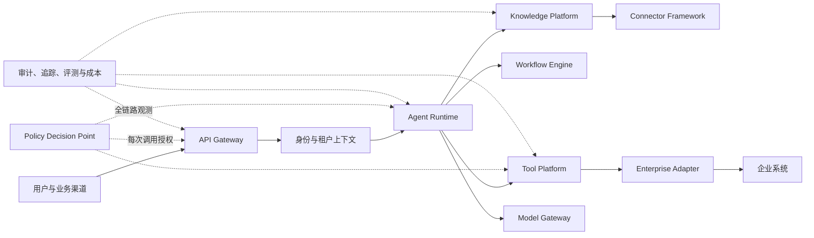
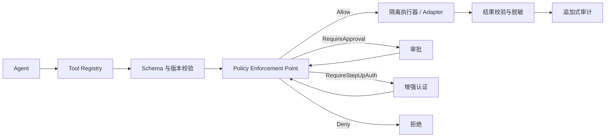
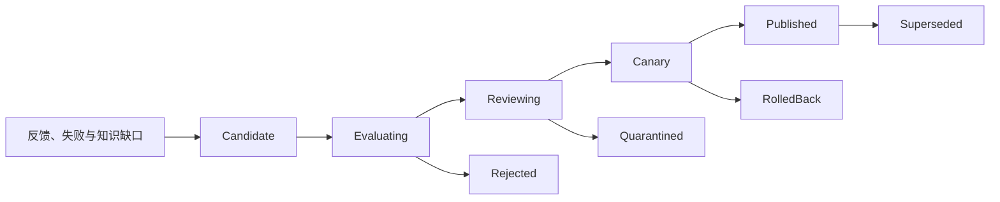

# Enterprise AI Operating Platform 总体设计阶段需求规格说明书（SRS V1.0）

版本：V1.0

状态：评审稿（目标态 / Planned）

基线日期：2026-07-22
适用范围：总体设计、技术选型、详细设计与验收策划

------------------------------------------------------------------------

## 0. 文档定位

本文档是 Enterprise AI Operating Platform（企业 AI 操作平台）的总体设计阶段需求基线。“Operating System”仅作为愿景隐喻，不代表当前已形成操作系统级产品或已实现以下能力。

规范性约定：

- “必须”表示进入相应阶段发布门禁前必须满足；“应”表示原则上满足，偏离时必须记录 ADR；“可”表示候选能力。
- 本文所有功能均为目标态，实施状态以版本计划、验收记录和部署证据为准。
- 本文定义“要实现什么”；架构文档定义“如何实现”。发生冲突时，需求变更须先更新本文件并建立追踪关系。
- 具体待决项统一使用不可复用的精确 ID `TBD-<DOMAIN>-NNN`。`TBD-*` 只表示命名规则；规范性条款禁止使用通配符、斜杠缩写或 ID 范围。每项须登记唯一 Accountable、批准角色、关闭判据、证据和时点；被替代时标记 `Superseded` 并关联新 ID，不得删除历史。

用途：

-   项目立项
-   产品规划
-   架构评审
-   技术选型
-   后续详细设计输入

文档关系：

    需求规格说明书(SRS)

            ↓

    总体架构设计

            ↓

    DDD详细设计

            ↓

    技术设计

            ↓

    开发实现与验收证据

关联基线：`00_Index.md`、`01_总体架构设计.md`、`04_数据库模型设计.md`、`14_DDD详细领域模型.md`、`20_ADR技术决策.md`、`Enterprise_AI_Platform_总体设计阶段_需求与参考分析.md`。

------------------------------------------------------------------------

## 1. 项目概述

### 1.1 项目背景

企业已经积累大量数字资产：

-   技术文档
-   产品资料
-   SOP规范
-   项目文件
-   维修经验
-   培训资料
-   邮件记录
-   业务系统数据

但是存在：

#### 1.1.1 知识孤岛

资料分散：

-   文件服务器
-   公共盘
-   SharePoint
-   邮件
-   Teams
-   业务系统

员工难以快速获取正确知识。

------------------------------------------------------------------------

#### 1.1.2 经验无法复制

大量关键经验存在：

-   专家脑中
-   项目过程中
-   现场处理记录

人员变化会造成知识损失。

------------------------------------------------------------------------

#### 1.1.3 企业软件无法被 AI 安全利用

传统系统：

-   ERP
-   MES
-   IPMS
-   自研系统

主要服务人工操作。

未来需要：

系统天然支持AI调用。

------------------------------------------------------------------------

## 2. 产品定位

Enterprise AI Operating Platform 不定位为：

-   聊天机器人
-   PDF问答工具
-   简单RAG系统

定位：

### 2.1 企业 AI 操作平台（Enterprise AI Operating Platform）

目标：

    企业知识大脑

    +

    Agent员工体系

    +

    AI系统连接层

    +

    自动化流程平台

### 2.2 一期组织与 Tenant 边界

一期是**单一企业内部平台**，不以对外 SaaS 或多个客户组织为交付目标。唯一企业 Tenant 由受信部署配置和企业 IdP Issuer 固定，客户端、模型和请求体均不能选择或覆盖。部门、项目组和岗位属于组织单元、Group、资源 ACL 或 ABAC 属性，不建模为 Tenant。

保留 `tenant_id` 是为了明确企业安全边界、避免缓存/索引缺少归属，并为未来独立治理域演进留出迁移路径；它不证明当前具备多租户产品能力。若未来出现独立子公司治理、数据驻留或外部客户场景，必须重新评审 ADR-012、隔离强度、运维模型和迁移证据。

------------------------------------------------------------------------

## 3. 用户角色

### 普通员工

需求：

-   查询制度
-   查询技术资料
-   获取解决方案

### 专家人员

需求：

-   沉淀经验
-   分享知识
-   查询历史案例

### 管理人员

需求：

-   查看AI价值
-   审批高风险操作
-   管理知识质量

### IT 管理员

需求：

-   用户管理
-   权限管理
-   Agent管理

### 开发人员

需求：

-   接入业务系统
-   注册AI能力

------------------------------------------------------------------------

## 4. 核心业务需求

| 编号 | 业务需求 | 最小业务验收证据 |
|---|---|---|
| BR-001 | 企业知识统一入口 | 试点用户可在权限边界内检索多源知识；回答携带可定位引用；无足够证据时明确拒答或请求澄清。 |
| BR-002 | 企业经验资产化 | 专家经验可形成带来源、责任人、有效期和版本的知识候选；经人工审核后方可发布，并可撤回。 |
| BR-003 | 企业系统 AI 化 | 试点业务系统可通过版本化 Tool、Event、Knowledge、Permission 和 Audit 契约接入；平台不得绕过源系统授权。 |
| BR-004 | 安全的任务自动化 | Agent 可在预算、时限、步骤数、权限和审批约束内执行任务；高风险或不可逆操作必须暂停并取得有效授权。 |
| BR-005 | 可治理、可追责 | 用户、Agent、服务和工具调用均可关联身份、策略决策、版本快照、Trace 与追加式、可校验且具防篡改能力的审计记录。 |
| BR-006 | 价值可衡量 | 每个试点在上线前定义业务基线、目标、数据口径和责任人，上线后可复算收益与质量变化。 |

示例：用户询问“设备 E302 报警如何处理？”时，系统只能组合该用户可访问的维护手册、历史案例和已发布经验；不得用模型推断替代权限校验或事实证据。

------------------------------------------------------------------------

## 5. 总体架构需求

架构约束：

- 第一阶段采用模块化单体作为交付基线；图中的逻辑模块不等同于独立微服务或独立部署单元。
- 控制面负责定义、版本、策略、评测和发布；数据面负责检索、推理、工具执行与工作流运行。两者必须通过版本化契约关联。
- API Gateway 处理入口流量与身份上下文；Model Gateway 处理模型路由、配额、预算、密钥和供应商差异，两者不得混为一体。
- Gate F 以固定企业 Tenant、合成身份、部门 Group/源 ACL、默认拒绝和最小 Trace 验证权限检索契约；Gate P 前必须接入真实 IdP、审计、预算和正式评测，不得用 PoC 身份头晋级。
- 核心领域通过 Ports/Adapters 隔离外部框架；LangGraph、Temporal、Microsoft Agent Framework 等仅可作为经过 ADR 和 PoC 的实现候选。

------------------------------------------------------------------------

## 6. 功能需求

本节给出跨模块最低功能基线；第 7—13 节补充专项约束。

| 编号 | 必须满足的需求 | 验收证据 |
|---|---|---|
| FR-IAM-001 | 请求必须携带可验证的用户/服务身份、固定企业 Tenant、会话与用途上下文；部门访问通过 Group/源 ACL/策略表达，缺失或冲突时默认拒绝。 | 伪造 Tenant/令牌、跨部门越权、身份缺失和权限撤销测试。 |
| FR-KNOW-001 | 接入 PDF、DOCX、XLSX、PPTX、Markdown 和图片，并记录来源、哈希、解析器版本、ACL、数据分类和处理状态。 | 每类样本文档的解析报告、失败隔离记录与可追踪引用。 |
| FR-KNOW-002 | 检索前必须应用租户和 ACL 过滤；删除、撤权和源版本变化必须传播到派生索引。 | 越权检索为零；删除与撤权传播测试。 |
| FR-AGENT-001 | 每次执行锁定 Agent、Prompt、ModelPolicy、ToolBinding、KnowledgePolicy 的不可变版本快照。 | 任一运行可重放并定位全部版本及配置哈希。 |
| FR-AGENT-002 | 运行必须受最大步骤、时限、模型/工具预算、取消和递归委派深度约束。 | 超限、取消、超时和循环任务测试。 |
| FR-TOOL-001 | 工具注册必须包含输入/输出 Schema、版本、所有者、风险、数据范围、副作用、幂等性、超时和审计规则。 | 契约校验与不兼容版本拒绝测试。 |
| FR-TOOL-002 | 每次工具调用必须重新授权，策略结果仅可为 Allow、Deny、RequireApproval 或 RequireStepUpAuth。 | 四种策略路径、撤权竞态和参数篡改测试。 |
| FR-WORK-001 | 长任务必须支持持久状态、重试、补偿、暂停、恢复、取消及人工介入。 | 故障恢复、重复投递、补偿和人工接管演练。 |
| FR-INT-001 | SDK/适配器必须传播身份、租户、Trace、幂等键和审计上下文；不得自行推断权限。 | 契约一致性和旧版本兼容测试。 |
| FR-GOV-001 | 所有高风险决策和副作用操作必须生成追加式审计事件，并关联主体、策略、参数摘要、批准和结果。 | 审计完整性抽样与篡改检测。 |
| FR-EVAL-001 | Prompt、模型、检索策略、Agent 或 Skill 发布前必须通过版本化数据集、阈值和回归门禁。 | 评测报告、差异说明、批准及回滚记录。 |
| FR-OPS-001 | 每次请求必须产生统一 Trace，并记录延迟、错误、Token、模型与工具成本、策略结果和引用质量。 | Trace 关联率、指标面板和告警演练。 |

------------------------------------------------------------------------

## 7. RAG 详细需求

### 7.1 RAG 目标

RAG解决：

企业知识增强。

不是简单搜索。

------------------------------------------------------------------------

### 7.2 文档解析需求

#### PDF

必须考虑：

-   文本PDF
-   扫描PDF
-   OCR
-   表格
-   图片
-   多栏布局
-   页眉页脚

参考：

-   RAGFlow
-   Docling
-   MinerU

------------------------------------------------------------------------

#### Word

需要保留：

-   标题层级
-   章节关系
-   表格

不能简单转换为纯文本。

------------------------------------------------------------------------

#### Excel

必须理解：

-   Sheet
-   Table
-   Row
-   Column

适用于：

-   产品参数
-   BOM
-   报价
-   数据表

------------------------------------------------------------------------

#### PPT

保留：

-   页面结构
-   标题
-   图片信息

------------------------------------------------------------------------

#### 图片

支持：

-   OCR
-   多模态理解

------------------------------------------------------------------------

### 7.3 Knowledge Pipeline

Pipeline 必须满足：

- 每个阶段记录输入/输出哈希、版本、耗时、责任组件和失败原因，支持幂等重放。
- 解析失败、恶意文件、低质量 OCR 和数据分类不明的内容进入隔离区，不得静默进入生产索引。
- 原文、结构化内容、Chunk、Embedding 与索引记录使用稳定标识关联，支持删除、重建和血缘追踪。
- Prompt Injection、文档内指令和外部链接均按不可信数据处理，不得改变系统策略或直接触发工具。

------------------------------------------------------------------------

### 7.4 Chunk 设计

Chunk 策略必须可配置、可版本化、可评测。固定长度、结构化、语义和层级切分均可作为候选，不以主观偏好一概禁止；生产策略由文档类型、召回质量、延迟和成本评测决定。

每个 Chunk 至少保存：来源与稳定文档 ID、页码/单元格/幻灯片定位、源版本与内容哈希、层级路径、租户与 ACL、数据分类、有效期、解析器与切分策略版本。

------------------------------------------------------------------------

### 7.5 Retrieval 设计

默认评测混合检索（向量、关键词、元数据过滤与重排），但不得把某种算法写成不可变前提。检索必须先应用租户、ACL、用途和数据分类过滤，再执行召回与重排；不得先召回敏感内容后在展示层过滤。

回答必须返回可定位引用、证据版本和置信信息。无足够证据、来源冲突或权限变化时，应拒答、降级为搜索结果或请求人工澄清。检索质量至少评估 Recall@K、nDCG/MRR、引用正确性、拒答正确性、越权率、延迟与单次成本；阈值在 `TBD-EVAL-001` 中关闭。

------------------------------------------------------------------------

## 8. Agent 需求

Agent Runtime 的目标是“受约束地完成任务”，不是让模型拥有无限循环、自主扩权或直接修改生产配置的能力。

### 8.1 定义与运行

- Agent 定义包含目的、所有者、输入/输出契约、允许的工具与知识范围、模型策略、预算、委派上限、风险等级和版本状态。
- 定义生命周期不得与运行状态混用；`AgentExecution` 的状态枚举和合法转换以 `15_Agent状态机设计.md` 为唯一事实源，包括 Created、Queued、Planning、Validating、Running、WaitingApproval、WaitingExternal、Paused、RetryScheduled、Compensating 及其终态，API、数据库和事件不得另造同义状态。
- 运行开始时锁定不可变版本快照；中途发布的新 Prompt、模型或工具绑定不得影响在途任务。
- 结构可包含 Router、Planner、Executor 和 Reviewer，但它们是职责而非必须拆成独立 Agent。优先使用确定性校验，再使用模型 Reviewer。

### 8.2 安全与人工介入

- 每个模型、检索、工具、委派和输出动作均经过当前身份与策略重新判定；不得沿用启动时的一次授权。
- 人工介入不仅包括批准，还包括澄清、修正、拒绝、接管和终止。批准必须绑定工具版本、规范化参数哈希、主体和有效期，防止审批后换参。
- Agent Memory 仅保存经分类、最小化和保留策略允许的数据；模型总结不得自动成为事实或长期记忆。
- 多 Agent 委派必须限制深度、并发、预算和能力传递；子 Agent 权限不得超过父任务与发起人有效权限交集。

### 8.3 可观测与质量

每次运行必须关联 Trace、状态迁移、模型调用、工具调用、引用、策略结果、人工动作、Token/成本和终止原因。离线评测、影子流量和小流量金丝雀通过后方可扩大范围。

------------------------------------------------------------------------

## 9. Tool Platform 需求

目标：让 Agent 通过受治理契约调用企业能力，而非获得主机、数据库或业务系统的隐式访问权。

### 9.1 工具契约

Tool 注册至少包含：稳定 ID、名称、说明、所有者、输入/输出 JSON Schema、语义版本、认证方式、所需权限、数据分类、风险等级、副作用、幂等性、超时/重试、并发限制、网络出口、密钥引用、Dry-run/补偿能力、弃用日期和审计规则。

### 9.2 执行链路

- 高风险、外部写入或不可逆操作必须支持预览/Dry-run、参数确认、幂等键和必要时补偿。
- 执行器默认最小权限，限制文件系统、进程、网络出口和资源；密钥通过受控代理按调用注入，不得进入 Prompt、日志或 Skill 文件。
- MCP Server 与本地/第三方 Skill 均视为供应链组件，必须固定版本、验证来源、扫描依赖、声明能力并通过准入评测。
- 工具返回内容仍属不可信输入，必须做 Schema 校验、大小限制、敏感信息处理和 Prompt Injection 防护。

------------------------------------------------------------------------

## 10. AI Enablement SDK 需求

目标：通过稳定契约把业务系统能力接入平台，同时保留源系统作为权限与业务事实的最终权威。

SDK/Adapter 必须支持：

- Tool 注册与版本协商；Event 发布与消费幂等；Knowledge 输出、删除和版本变更；Permission 映射与撤销；Audit 与 Trace 传播。
- 在所有调用中传播用户/服务身份、租户、用途、Trace、幂等键和截止时间；SDK 不得根据名称、描述或模型输出推断权限。
- 明确定义兼容策略、弃用窗口、错误码、超时、重试边界和速率限制；自动重试不得重复不可幂等副作用。
- 提供契约测试套件、示例 Adapter 和最小权限配置；每个接入系统在上线前通过正向、越权、撤权、重放和故障注入测试。

MCP 可用于标准化工具/资源交互，A2A 可用于跨 Agent 互操作探索；二者均不得替代企业身份、授权、审计或数据治理。

------------------------------------------------------------------------

## 11. Workflow 需求

Agent 负责非确定性推理与候选计划；Workflow 负责持久、确定、可审计的业务状态迁移。关键业务规则、金额/阈值、审批链和补偿逻辑不得只存在于 Prompt 中。

Workflow 必须支持：

- 版本化定义、持久状态、定时器、信号、Retry、Resume、Cancel、幂等、补偿和 Dead-letter 处理。
- Human-in-the-loop 的澄清、修正、批准、拒绝、接管、重新分派和超时升级。
- 恢复后继续使用原执行快照，或通过显式迁移进入新版本；不得因部署升级静默改变在途流程。
- 每个状态转换记录触发者、前后状态、业务键、版本、策略结果和 Trace；外部副作用使用 Outbox/Inbox 或等价机制保证一致性。

Temporal、Camunda 等仅为待 ADR 验证的实现候选。第一阶段若模块化单体内置简单状态机已满足需求，不得仅为“微服务化”提前引入复杂基础设施。

------------------------------------------------------------------------

## 12. Governance 需求

Governance 是横切控制面，从 Phase 0 建设，不是最终阶段的附加模块。

### 12.1 身份、租户与授权

- 用户、服务、Agent、Workflow 和 Tool Executor 使用不同类型的可验证主体；Agent 身份不能替代发起用户身份。
- 外部身份采用 OIDC/OAuth 2.0 或等价企业协议，服务间采用短期凭证与 mTLS 等机制；不得长期共享静态密钥。
- RBAC 管理稳定职责，ABAC 处理租户、资源分类、用途、环境、风险和时间等动态属性。Policy Decision Point 集中决策，API/Agent/Tool/Knowledge 的 Policy Enforcement Point 就地强制，默认拒绝。
- 每次调用的有效权限是用户、Agent 定义、工具策略和资源 ACL 的交集；审批只授权被批准的具体动作，不产生永久扩权。

### 12.2 数据与模型治理

- 数据必须有所有者、租户、分类、用途、保留期、区域和删除策略；敏感数据进入模型前执行最小化、脱敏或阻断。
- Prompt、模型策略、评测集、Agent、Skill 和 Tool 都是版本化资产，具有 Draft、Review、Approved、Deprecated/Revoked 等受控状态。
- 外部模型的训练使用、日志保留和跨境处理必须符合组织政策；供应商切换通过 Model Gateway 与策略隔离。

### 12.3 审计与安全运营

- 审计采用追加式、可校验存储，覆盖登录、检索、模型、策略、审批、工具、副作用、发布、回滚和管理员操作。
- 审计记录不得保存明文密钥或无必要的完整 Prompt/敏感数据；需要留存时采用分级访问和保留策略。
- 建立 Prompt Injection、数据外泄、越权、滥用、供应链和异常成本检测；安全事件必须能定位影响范围、吊销版本并回滚。

------------------------------------------------------------------------

## 13. 持续学习机制

“持续学习”指基于反馈提出受治理的改进候选，不代表模型在线自训练、自动扩权、自动修改生产 Prompt/Skill 或未经评审直接发布。

该图描述跨资产的 `promotion_stage`，不是 Knowledge、Agent、Tool、Skill 或 Policy 共用的数据库状态枚举。各领域对象仍以所属设计文档的状态机为事实源；Canary/Shadow 可由 Release 记录和流量策略表达。

- Knowledge Gap Agent、Knowledge Evolution Agent、质量评分和 Hermes 式 Skill 生成只能产出 Candidate。
- Candidate 必须带来源、变更差异、作者/生成器、风险、适用范围、评测集和回滚目标；高风险资产需要双人或职责分离审批。
- 发布前执行安全扫描、离线回归、对抗测试和成本评测；金丝雀监测不达标自动停止，回滚不依赖生成该候选的同一模型判断。
- 用户反馈属于信号而非事实；进入知识库前必须验证、去重、归属和审核。

------------------------------------------------------------------------

## 14. 参考项目与 GitHub

完整核验日期、机制、采用边界和链接见 `Enterprise_AI_Platform_总体设计阶段_需求与参考分析.md`。本 SRS 仅保留影响需求的来源：

| 来源 | 吸收的机制 | 明确不照搬的边界 |
|---|---|---|
| [RAGFlow](https://github.com/infiniflow/ragflow)、[Docling](https://github.com/docling-project/docling)、[MinerU](https://github.com/opendatalab/MinerU) | 结构化解析、可解释切分、引用与解析质量管理 | 不把单一解析器或切分算法绑定为平台标准。 |
| [LangGraph](https://github.com/langchain-ai/langgraph)、[Microsoft Agent Framework](https://github.com/microsoft/agent-framework)、[OpenAI Agents SDK](https://github.com/openai/openai-agents-python) | 状态化执行、检查点、人工介入、Handoff、Guardrail 与 Trace | 先定义领域契约，再通过 ADR/PoC 选择框架；AutoGen 已进入维护模式，不作为新基线。 |
| [Temporal](https://github.com/temporalio/temporal) | 长任务持久化、故障恢复与重试语义 | 第一阶段不因参考项目而预设独立集群。 |
| [OpenClaw](https://github.com/openclaw/openclaw) | Gateway、渠道路由、Skill、会话与沙箱的产品化经验 | 官方安全边界是单用户/可信操作者，不可直接充当企业多租户共享运行时。 |
| [Hermes Agent](https://github.com/NousResearch/hermes-agent) | 会话记忆、Skill 创建/改进、计划任务与子 Agent 的学习闭环 | 自我改进只能生成 Candidate，禁止绕过评测、审批、金丝雀和回滚直接进入生产。 |
| [MCP](https://github.com/modelcontextprotocol/modelcontextprotocol)、[A2A](https://github.com/a2aproject/A2A) | 工具/资源协议与 Agent 互操作契约 | 协议不替代企业身份、授权、审计、数据隔离或供应链治理。MCP 基线固定为稳定版 `2025-11-25`，草案须另立 ADR。 |
| [LiteLLM](https://github.com/BerriAI/litellm)、[OPA](https://github.com/open-policy-agent/opa)、[OpenFGA](https://github.com/openfga/openfga) | 模型网关、策略决策和细粒度关系授权 | 通过 Ports/Adapters 接入，不让外部产品的数据模型侵入核心领域。 |
| [Langfuse](https://github.com/langfuse/langfuse)、[Phoenix](https://github.com/Arize-ai/phoenix)、[Promptfoo](https://github.com/promptfoo/promptfoo) | Trace、评测、红队与发布门禁 | 生产遥测需脱敏、分级访问并受保留策略约束。 |

------------------------------------------------------------------------

## 15. 风险分析

| 编号 | 风险 | 概率/影响 | 领先指标 | 责任角色 | 主要缓解与残余风险 |
|---|---|---|---|---|---|
| R-001 | 低质量或过期知识导致错误回答 | 中/高 | 引用错误、冲突来源、拒答异常 | Knowledge Owner | 审核、有效期、质量评测和撤回；残余风险由显式引用与人工升级控制。 |
| R-002 | Agent 误操作或审批后换参 | 中/极高 | 高风险调用、重复副作用、参数哈希不符 | Agent/Tool Owner | 最小权限、逐次授权、Dry-run、参数绑定审批、幂等和补偿；不可逆动作保留人工确认。 |
| R-003 | 跨租户或敏感数据泄露 | 中/极高 | 越权探测、异常导出、DLP 告警 | Security & Data Owner | 检索前 ACL、数据分类、脱敏、出口限制、密钥代理和红队；跨租户成功率必须为 0。 |
| R-004 | Prompt/Skill/MCP 供应链攻击 | 中/高 | 未固定版本、异常网络/命令、签名失败 | Platform Security | 来源准入、固定版本、扫描、沙箱、最小出口和吊销；第三方内容始终按不可信处理。 |
| R-005 | 模型/供应商漂移导致质量或成本失控 | 高/中 | 回归下降、Token/延迟/费用异常 | Model Platform Owner | Model Gateway、版本固定、离线门禁、预算、金丝雀和回滚。 |
| R-006 | 过早微服务化导致交付复杂度失控 | 中/高 | 服务数、跨服务事务、环境维护成本 | Architecture Owner | 模块化单体基线；仅以容量、组织边界或可靠性证据拆分。 |
| R-007 | 审计记录包含敏感内容或无法复盘 | 中/高 | Trace 断链、明文密钥、事件缺字段 | Governance Owner | 追加式审计、字段最小化、脱敏、完整性校验和抽样复盘。 |

------------------------------------------------------------------------

## 16. ROI 指标

ROI 不使用未经基线支持的百分比承诺。每个试点必须填写下表并经业务、财务/运营和产品共同确认口径。

| 编号 | 指标 | 基线 | 目标 | 数据来源 / 责任人 |
|---|---|---|---|---|
| KPI-BIZ-001 | 完成目标任务的中位耗时 | `TBD-BIZ-001` | `TBD-BIZ-002` | 业务流程日志 / Process Owner |
| KPI-BIZ-002 | 专家重复答疑工时 | `TBD-BIZ-003` | `TBD-BIZ-004` | 工单与工时 / Knowledge Owner |
| KPI-BIZ-003 | 一次解决率或返工率 | `TBD-BIZ-005` | `TBD-BIZ-006` | 工单/质量系统 / Business Owner |
| KPI-AI-001 | 有证据回答的引用正确性与拒答正确性 | `TBD-AI-001` | `TBD-AI-002` | 版本化评测集 / Evaluation Owner |
| KPI-AI-002 | Agent 任务成功率（排除人工取消） | `TBD-AI-003` | `TBD-AI-004` | Trace 与业务结果 / Agent Owner |
| KPI-OPS-001 | 单次成功任务全成本与 P95 延迟 | `TBD-OPS-001` | `TBD-OPS-002` | Model Gateway/Telemetry / SRE |
| KPI-RISK-001 | 越权成功、高风险漏审批、不可追踪操作 | 0 | 0 | 安全测试与审计 / Security Owner |

------------------------------------------------------------------------

## 17. 交付与范围状态

当前仓库仅包含总体设计文档，不包含可运行源码、自动化测试、构建配置或部署产物。因此本 SRS 的状态是“评审稿”，不能据此宣称任何功能已经实现。

进入实施前必须完成：

1. 通过 `21_首个试点用例与验收基线.md` 和 `22_组织责任与RACI运营模型.md` 关闭第 20 节中影响试点范围、安全边界、责任和验收口径的 P0 TBD。
2. 统一总体架构、DDD、数据库、API、部署与 ADR 的模块边界和术语。
3. 批准一个低风险、数据边界清晰的业务试点，完成威胁建模和数据影响评估；推荐方案见 `21_首个试点用例与验收基线.md`。
4. 建立最小纵向切片：身份/租户 → 检索或工具 → 策略 → 审计/Trace → 评测 → 回滚；Verification 与 Evidence 按 `24_测试评测与证据追踪计划.md` 管理。
5. 对候选框架执行可替换性 PoC；选择结果必须写入 ADR，不得仅依据 GitHub 热度。

## 18. 非功能需求

| 编号 | 类别 | 需求与验收门槛 |
|---|---|---|
| NFR-SEC-001 | 隔离 | 跨租户未授权访问、检索和工具执行成功数必须为 0；覆盖身份缺失、令牌混淆、撤权竞态和间接 Prompt Injection。 |
| NFR-SEC-002 | 密钥 | 密钥不得写入代码、Prompt、日志、Skill 或审计正文；必须支持轮换、吊销和最小范围短期凭证。 |
| NFR-PRIV-001 | 隐私 | 数据采集、模型发送、记忆和遥测遵循用途限定、最小化、保留和删除传播；上线前完成数据影响评估。 |
| NFR-REL-001 | 可靠性 | 关键流程必须定义幂等、重试、超时、补偿、恢复点与降级；`19_生产运维规范.md` 的候选 RTO/RPO 仅作测量起点，最终值分别在 `TBD-REL-001`、`TBD-REL-002` 中按试点等级批准并演练。 |
| NFR-PERF-001 | 性能 | 分别定义交互请求、检索、模型首 Token、工具和长任务的 SLI；`11`/`19` 中的候选值不是 SLA，须在容量测试前分别关闭 P95/P99 目标 `TBD-PERF-001` 与工作负载/并发/吞吐目标 `TBD-PERF-002`。 |
| NFR-AI-001 | AI 质量 | 发布门禁至少覆盖任务成功、引用正确、拒答正确、越权、幻觉、工具选择、安全对抗、延迟和成本；阈值版本化。 |
| NFR-OBS-001 | 可观测 | 生产请求 Trace 关联率与高风险操作审计覆盖率必须为 100%；遥测不得泄露密钥或超范围敏感内容。 |
| NFR-COST-001 | 成本 | 租户、Agent、模型和任务均可配置软/硬预算；超预算按策略降级、暂停或拒绝，并告警。 |
| NFR-PORT-001 | 可替换 | 模型、向量检索、Agent 框架、Workflow、Policy 和观测产品通过 Ports/Adapters 接入；替换验证使用契约测试。 |
| NFR-ACC-001 | 可用性 | 面向员工的关键界面与审批流程应满足组织确定的无障碍和本地化基线，具体标准在 `TBD-ACC-001` 中确定。 |

## 19. 验收门禁与需求追踪

### 19.1 发布门禁

发布候选必须同时具备：批准的版本快照、威胁模型、数据分类、契约/权限/故障测试、AI 回归与红队报告、性能和成本报告、监控告警、回滚演练、操作手册和责任人。任一 P0 安全门禁失败即停止发布，不得以业务审批豁免越权、密钥泄露或审计缺失。

### 19.2 业务覆盖概览

下表只用于检查 BR 是否覆盖主要设计域，不是验收账本，也不证明任何测试已经执行。

| 业务需求 | 功能需求 | 主要设计文档 | 必需证据 |
|---|---|---|---|
| BR-001、BR-002 | FR-KNOW-001、FR-KNOW-002、FR-EVAL-001 | `07_Knowledge_Platform设计.md`、`16_Knowledge数据治理设计.md`、`11_Evaluation_Monitoring_Cost设计.md` | 解析、ACL、引用、拒答、删除传播和质量评测。 |
| BR-003 | FR-INT-001、FR-TOOL-001 | `05_API接口设计.md`、`08_Tool_Platform_AI_SDK设计.md`、`17_AI_Enablement_SDK规范.md`、`18_企业系统接入规范.md` | 契约、兼容、撤权、幂等与故障测试。 |
| BR-004 | FR-AGENT-001、FR-AGENT-002、FR-TOOL-002、FR-WORK-001 | `06_Agent_Runtime设计.md`、`15_Agent状态机设计.md`、`09_Workflow_Human_In_Loop设计.md`、`10_Governance_Security设计.md` | 快照、预算、策略、审批、恢复和补偿测试。 |
| BR-005 | FR-IAM-001、FR-GOV-001、FR-OPS-001 | `01_总体架构设计.md`、`10_Governance_Security设计.md`、`18_企业系统接入规范.md`、`19_生产运维规范.md` | 越权、审计完整性、Trace 与事件响应演练。 |
| BR-006 | FR-EVAL-001、FR-OPS-001 | `11_Evaluation_Monitoring_Cost设计.md`、`13_开发路线规划.md`、`19_生产运维规范.md` | 业务基线、AI 门禁、成本与收益复算。 |

### 19.3 原子需求与证据追踪规则

实施前按 `24_测试评测与证据追踪计划.md` 建立独立追踪账本，每行只能包含一个 FR 或 NFR，覆盖全部功能与非功能需求，并精确定位到设计章节。验证规格可以预先创建；证据只能在真实测试、评测、演练或批准后登记，未执行必须明确标记，不能以“见设计文档”代替证据。

| Trace ID | 上游 BR | 原子需求 ID | 精确设计定位 | 验证规格 ID | 验证方式 | 可判定准则 | 证据 ID/路径 | Owner | 状态 |
|---|---|---|---|---|---|---|---|---|---|
| TR-FR-IAM-001 | BR-005 | FR-IAM-001 | `10_Governance_Security设计.md` §3 身份、会话与代理授权；§4 企业安全域与未来多租户 | VER-FR-IAM-001-01 | Test | 身份缺失、客户端 Tenant 注入、跨部门越权、伪造令牌和撤权请求全部被拒绝 | —（未执行） | Security Owner | Planned |
| TR-NFR-REL-001 | BR-004 | NFR-REL-001 | `19_生产运维规范.md` §10 备份与灾难恢复 | VER-NFR-REL-001-01 | Exercise | 达到已关闭的 `TBD-REL-001` 与 `TBD-REL-002` 批准值 | —（未执行） | SRE | Planned |

追踪证据至少关联代码提交/制品版本、环境、数据集、模型/Prompt/Policy 版本、执行时间、原始结果和完整性摘要。汇总 BR、多个 FR/NFR 或整份文档的行只能作为覆盖视图，不能作为发布门禁证据。

## 20. 待决事项登记

状态限定为 `Open | InReview | Closed | Superseded`。只有决议内容、单位、适用范围、测量口径、批准人和证据链接完整时才可标记 `Closed`；表中的责任角色在立项后必须映射到真实人员或组织账号。

| 编号 | 优先级 | 状态 | 原子待决项 | 关联项 | Accountable | 批准/协作角色 | 关闭判据与最小证据 | 关闭时点 | 决议/证据 |
|---|---|---|---|---|---|---|---|---|---|
| TBD-SCOPE-001 | P0 | Open | 试点流程、用户、规模、数据源、风险等级及明确排除项 | 立项/BR | Product Owner | Business Sponsor | 已批准试点用例包和范围基线 | 立项评审前 | — |
| TBD-EVAL-001 | P0 | Open | 数据集、统计方法、样本量/置信要求及门禁治理规则；不承载具体 KPI 数值 | FR-EVAL-001 | Evaluation Owner | Business Owner、Security Owner | 版本化 EvalPolicy 与数据集治理决议 | 架构冻结前 | — |
| TBD-IAM-001 | P0 | Open | 目标 IdP、主体、组织 Group 与源系统权限映射；Tenant 已按单一企业内部平台收敛 | FR-IAM-001 | Security Architect | Security Owner、Data Owner | 身份/权限矩阵和批准的 ADR-012 | Gate P 前 | — |
| TBD-DATA-001 | P0 | Open | 数据分类、保留、地域及模型供应商数据边界 | NFR-PRIV-001 | Data Owner | Legal、Security Owner | 数据处理清单、适用性评估和批准策略 | 数据接入前 | — |
| TBD-SLO-001 | P0 | Open | 可用性等级、服务时段和支持升级窗口；不重复承载 RTO/RPO/性能数值 | 生产门禁 | SRE | Business Owner | 已批准服务等级与支持模型 | 试点上线前 | — |
| TBD-TECH-001 | P0 | Open | Agent/Workflow/Policy/Observability 候选组件 PoC 结论 | ADR | Architecture Owner | Security、Data、SRE | PoC 报告、退出方案和 Accepted/Rejected ADR | 实现选型前 | — |
| TBD-APPROVAL-001 | P1 | Open | 动作风险等级、审批、增强认证和职责分离矩阵 | FR-TOOL-002 | Risk Owner | Business Owner、Security Owner | 已批准动作分级与审批矩阵 | 首个副作用 Tool 上线前 | — |
| TBD-ROI-001 | P0 | Open | 收益归因、核算周期及 Go/Hold/Stop/Retire 规则；不重复承载各 KPI 数值 | BR-006 | Product Owner | Finance/Operations、Business Sponsor | 批准的收益核算与投资决策规则 | 试点启动前 | — |
| TBD-BIZ-001 | P0 | Open | 目标任务耗时基线 | KPI-BIZ-001 | Process Owner | Product Owner | 含期间、样本和查询口径的基线报告 | 试点启动前 | — |
| TBD-BIZ-002 | P0 | Open | 目标任务耗时目标 | KPI-BIZ-001 | Process Owner | Business Owner | 批准目标和判定规则 | 试点启动前 | — |
| TBD-BIZ-003 | P0 | Open | 专家重复答疑工时基线 | KPI-BIZ-002 | Knowledge Owner | Product Owner | 含期间和工时口径的基线报告 | 试点启动前 | — |
| TBD-BIZ-004 | P0 | Open | 专家重复答疑工时目标 | KPI-BIZ-002 | Knowledge Owner | Business Owner | 批准目标和判定规则 | 试点启动前 | — |
| TBD-BIZ-005 | P0 | Open | 一次解决率或返工率的指标选择、定义与基线 | KPI-BIZ-003 | Business Owner | Product Owner | 指标定义和可复算基线报告 | 试点启动前 | — |
| TBD-BIZ-006 | P0 | Open | 一次解决率或返工率目标 | KPI-BIZ-003 | Business Owner | Business Sponsor | 批准目标和判定规则 | 试点启动前 | — |
| TBD-AI-001 | P0 | Open | 引用正确性与拒答正确性的基线指标集 | KPI-AI-001 | Evaluation Owner | Knowledge Owner | 版本化数据集和基线评测报告 | Phase 1 发布门禁前 | — |
| TBD-AI-002 | P0 | Open | 引用正确性与拒答正确性的目标指标集 | KPI-AI-001 | Evaluation Owner | Business Owner、Security Owner | 批准的版本化 EvalPolicy | Phase 1 发布门禁前 | — |
| TBD-AI-003 | P1 | Open | Agent 任务成功率基线 | KPI-AI-002 | Agent Owner | Evaluation Owner | 版本化评测或影子运行报告 | Phase 2 发布门禁前 | — |
| TBD-AI-004 | P1 | Open | Agent 任务成功率目标 | KPI-AI-002 | Agent Owner | Business Owner、Evaluation Owner | 批准的版本化 EvalPolicy | Phase 2 发布门禁前 | — |
| TBD-OPS-001 | P0 | Open | 单次成功任务全成本与 P95 延迟基线指标集 | KPI-OPS-001 | SRE | Model Platform Owner | Telemetry 基线报告和价格表版本 | 试点上线前 | — |
| TBD-OPS-002 | P0 | Open | 单次成功任务全成本与 P95 延迟目标指标集 | KPI-OPS-001 | SRE | Business Owner、Finance/Operations | 批准目标、预算与告警规则 | 试点上线前 | — |
| TBD-REL-001 | P0 | Open | RTO | NFR-REL-001 | SRE | Business Owner | 批准值与恢复演练证据 | 试点上线前 | — |
| TBD-REL-002 | P0 | Open | RPO | NFR-REL-001 | SRE | Data Owner、Business Owner | 批准值与数据恢复证据 | 试点上线前 | — |
| TBD-PERF-001 | P0 | Open | 各请求类型 P95/P99 目标 | NFR-PERF-001 | SRE | Business Owner | SLI/SLO 表与容量测试报告 | 容量测试前 | — |
| TBD-PERF-002 | P0 | Open | 工作负载、并发和吞吐目标 | NFR-PERF-001 | SRE | Product Owner、Architecture Owner | 工作负载模型与容量测试报告 | 容量测试前 | — |
| TBD-ACC-001 | P1 | Open | 无障碍与本地化基线 | NFR-ACC-001 | Product Owner | UX、Legal/Compliance | 批准标准和检查清单 | 用户界面验收前 | — |
